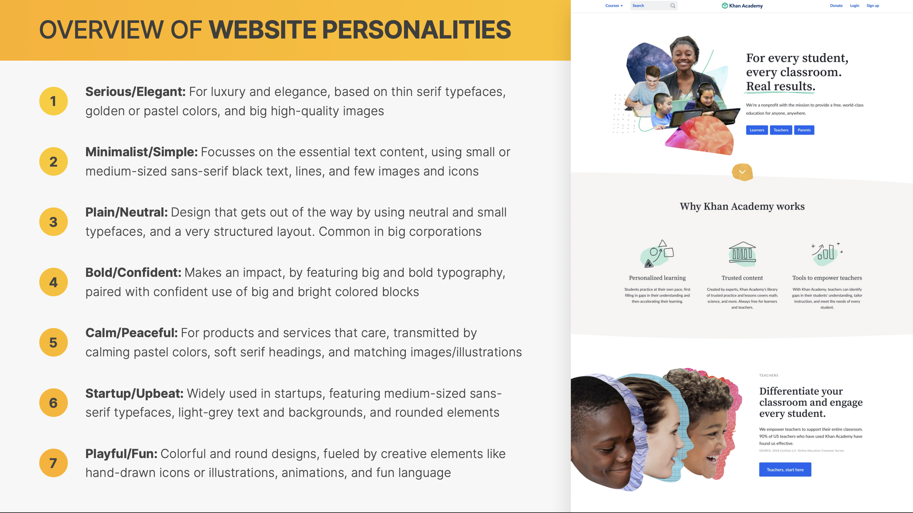

# **CSS**

_Styling, designing & layouts._

<br>

## Overview

This file will contain all of the common CSS terminology and concepts with brief descriptions and examples.

<br>
<br>

___

<br>

## **Quick notes**

This section is a quick reference point for certain CSS guidelines that I'll need to review often, such as font-size scales or safe and reliable fonts.

<br>

#### **`Spacing system` _(px)_**
2 / 4 / 8 / 12 / 16 / 24 / 32 / 48 / 64 / 80 / 96 / 128

<br>

#### **`Font size system` _(px)_**
10 / 12 / 14 / 16 / 18 / 20 / 24 / 30 / 36 / 44 / 52 / 62 / 74 / 86 / 98

<br>


<br>

#### **`Reminders`**

<br>

> _"Anchors are inline elements, so vertical spacing doesn't work. It would need to be an inline-block, but not block because then it would take up all of the available space."_
>
> \- Jonas

<br>

___

## **Fundamentals**

<br>


<br>

___

## **Property references**

<br>


<br>

### **Design**

<br>




<br>

___

## **Knowledge base**

<br>

## Selectors

One of the key initial concepts in CSS is selectors and how they work. From there you can move into advanced selectors and pseudoselectors, as well as understanding the various types of properties you can manipulate. But without selectors, you have no way to apply the things you learn, so this is where you start.

<br>

#### **`ID selector`**

ID selectors are the most powerful type of selector in terms of CSS specificity. Meaning that they beat out other types of selectors and the styles defined within win. That sounds good, but that’s typically considered bad, because it’s nice to have lower-specificity selectors that are easier to override when needed.

<br>

#### **`Class selector`**

Class selectors are your friend. They are probably the most useful and versatile selectors out there. In part because they are well supported in all browsers. In part because you can add multiple classes (just separated by a space) on HTML elements. In part because there are JavaScript things you can do specifically for manipulating classes.

<br>

#### **`Tag selector`**

<mark>Tag selectors are at their most useful when changing properties that are unique to that HTML element.</mark> Like setting the list-style on a \<ul> or tab-size on a \<pre>. Also in reset stylesheets where you are specifically trying to unset styles that browsers apply to certain elements. Don’t rely on them too much though. It’s typically more useful to have a class define styling that you can use on any HTML element.

<br>

#### **`Attribute selector`**

You might argue that attribute selectors are even more useful than classes because they have the same specificity value, but can be any attribute not just class, plus they can have a value you can select by. Hardly an issue anymore, but attribute selectors aren’t supported in IE 6.

<br>

Example:
```
/* CSS */
[data-modal="open"] {

}


<!-- HTML -->

<!-- WILL match -->
<div data-modal="open"></div>

<!-- WILL match -->
<aside class='closed' data-modal='open'></aside>

<!-- Will NOT match -->
<div data-modal="false">Wrong value</div>

<!-- Will NOT match -->
<div data-modal>No value</div>

<!-- Will NOT match -->
<div data-modal-open>Wrong attribute</div>
```

<br>

#### **`Positional selectors`**

There are several different positional selectors beyond :nth-child. Using simple expressions (like 3n = “every third”) you can select elements based on their position in the HTML. You can play with that idea here or check out some useful recipes.

<br>

Example:
```
<style>
    :nth-child(2) {

    }
</style>

<ul>
  <li>nope</li>
  <!-- WILL match -->
  <li>yep, I'm #2</li>
  <li>nope</li>
</ul>

```

<br>

#### **`Other pseudo selectors`**

:empty is one of many pseudo selectors, which you can recognize by the colon (:) in them. They typically represent something that you couldn’t know by just the element and attributes alone.

Note that these are slightly different than pseudo elements, which you can recognize by the double colon (::). They are responsible for adding things to the page by the things they select.

<br>

```
<style>
    :empty {

    }
</style>

<!-- WILL match -->
<div></div>

<!-- WILL match -->
<aside data-blah><!-- nothin' --></aside>

<!-- Will NOT match -->
<div> </div>

<!-- Will NOT match -->
<div>
</div>
```

<br>

#### **`Combinator selectors`**

Combinator selectors are used to select child elements, as well as siblings, and have been around for quite a while now.

<br>

- General child selector (space): `A B`
- Direct child selector: `A > B`
- Adjacent sibling selector: `A + B`
- General sibling selector: `A ~ B`

<br>

The adjacent selector `A + B` should be familiar to you. It selects the element `B`, which immediately follows `A`. But what about the general sibling selector `A ~ B` ? This selects all sibling elements `B` that follow `A`.

<br>

```
<!-- HTML -->

<table>
  <thead>
    <tr>
      <th>Location</th>
      <th>Temperature</th>
    </tr>
  </thead>
  <tbody>
    <tr>
      <td>London</td>
      <td>21&deg;C</td>
    </tr>
    <tr>
      <td>New York</td>
      <td>16&deg;C</td>
    </tr>
    <tr>
      <td>Rome</td>
      <td>23&deg;C</td>
    </tr>
    <tr>
      <td>Berlin</td>
      <td>14&deg;C</td>
    </tr>
    <tr>
      <td>Sydney</td>
      <td>25&deg;C</td>
    </tr>
    <tr>
      <td>Reykjavik</td>
      <td>10&deg;C</td>
    </tr>
  </tbody>
</table>
```
```
/* CSS */

table {
  border-collapse: collapse;
}

table td, table th {
  border : 1px solid #555;
  padding: 0.5em 0.5em 0.4em;
}

table thead th {
  color: white;
  background: #333;
}

-table tbody td {
  text-align: center;
}

table tbody tr:first-child + tr {
  color: red;
}

table tbody tr:nth-child(4) ~ tr {
  color: blue;
}
```

Output:


The New York row is selected because it immediately follows the first row, and the last two cities are highlighted, as the general sibling selector matches all cities after the fourth one.


<br>

#### **`Structural selectors`**

Structural selectors are very powerful and match elements based on their position in the DOM. They give you the flexibility to match elements purely with CSS that would otherwise require JavaScript to do the same thing.

This type of selector is a little different from basic selectors as some of them allow you to pass in a parameter to modify how the selector works.

For example, `:nth-child()` has an argument that is used to match a specific child element relative to it. The value can be an index _(beginning at 1)_ or an expression.

So, if we had a list of items the following selector would match the third item: `ul:nth-child(3)`

It can be a simple expression instead that makes the pseudo-class even more powerful.

<br>

**Valid expressions are:**

- `ul:nth-child(2)`: matches the second child element
- `ul:nth-child(4n)` : matches every fourth child element (4, 8, 12, …)`
- `ul:nth-child(2n + 1)` : matches every second child element offset by one (1, 3, 5, …)
- `ul:nth-child(3n — 1)` : matches every third child element offset by negative one (2, 5, 8, …)
- `ul:nth-child(odd)` : matches odd-numbered elements (1, 3, 5, …)
- `ul:nth-child(even)` : matches even-numbered elements (2, 4, 6, …)

<br>

The expression variable `n` always starts as zero, so to work out exactly what elements will be matched, start with `n` as zero, then `n` as 1, and so on to compile a list of elements.

You can use `:nth-last-child()` to match child elements counting backward (starting from the last child element). If you want to match child elements of a certain type, you can use `:nth-of-type()` that counts forward (starting from the first sibling element), and `:nth-last-of-type()` that counts backward.

You can use an index or an expression as the parameter for all of these structural selectors `:nth-last-child()` and `:nth-last-of-type()` are very similar to `:nth-child()` and `:nth-of-type()`, except that they match from the last element rather than the first. You can get quite creative with selectors by playing around with various combinations.

<br>

For example:
```
ul:last-of-type li:nth-last-of-type(2)::after {
  content: “ (2nd from end)”;
  /* Other styles… */
}
```

<br>

This matches the pseudo-element that comes after the second from the last list item inside the last unordered list. If you’re ever struggling to decode a complicated selector, then it’s <mark>best to read it from right to left</mark> so it can be deconstructed logically.

The next set of selectors are specialized structural selectors as they match specific child elements only. You can’t pass expressions to them to modify their behavior.

<br>

- `:first-child`
- `:last-child`
- `:only-child`
- `:first-of-type`
- `:last-of-type`

<br>
<br>

#### **`Content selectors`**

Content selectors belong to a specialized set of selectors for matching content. The ones available for us to use right away are:

<br>

- `::first-line`: matches the first line of a block-level element

- ::`first-letter`: matches the first letter of the first line of a block-level element

- ::`selection`: matches the part of a document that has been highlighted by the user (such as clicking and dragging the mouse across text)

<br>

`::first-line` and `::first-letter` only work if applied to block-level elements. Also, be careful to use `::first-letter` only on specific elements, otherwise, every single paragraph would have a drop cap, which is probably not what you want!

There are some exciting content selectors in the works which aren’t available right now, but when they are supported they’ll open up all sorts of possibilities. Here’s a list of content selectors to watch out for:

<br>

- `::spelling-error`: check spelling and grammar for editable elements

- `::grammar-error`: matches grammatical errors

- `::target-text`: the text directly targeted by the URL fragment. This is currently available as an experimental feature in Chrome and Edge

<br>


<br>
<br>

## FAQ

<br>

## What is Span in CSS and what is it used for?

Span is a pretty simple, but useful tool for developers and designers. It's very similar to visisions, with on key difference: no linebreak is created when a span is used. Spans are an inline element and not a block level element. Yu can use the span tag to augment certain areas of text in your content.

<br>

Exmaple:  
```
/* CSS */

.italic {
    font-style: italic;
}


<!-- HTML -->

<span class="italic">This text shall be italic!</span>
```

Output:
> _This text shall be italic!_

<br>

## What are the different types of CSS?

<br>

### 1. Inline Styles

These are the tags that are used within the actual HTML as opposed to an external CSS stylesheet.

<br>

### 2. Embedded Styles

These are the tags that are used in the head section of your HTML document. These only affect the tags on the page they’re embedded in.

<br>

### 3. External Styles

Finally, we have the codes that are used in a separate style sheet that is externally saved and attached to your website.

<br>

<br>
<br>

_For a more complete guide with more examples, visit: https://zendev.com/ultimate-guide-to-learning-css.html#comprehensive-resources_

Or visit the slides for the Udemy HTML / CSS course.
___
