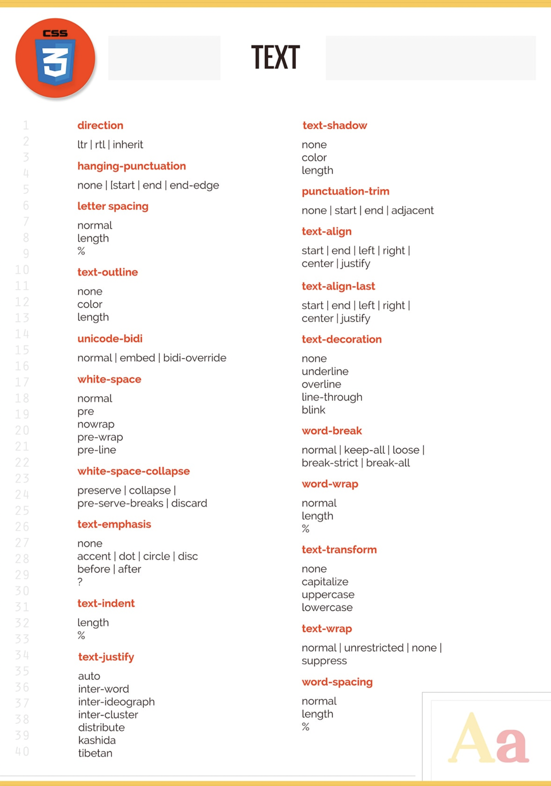
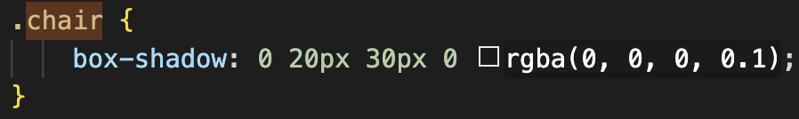

# **CSS**

> _"A big part of conquering responsive layouts is a change of mindset. Afterall, all websites are perfectly responsive if you turn off the CSS."_
>
> Kevin Powell

<br>
<br>

## Overview

This guide is **massive** and constantly growing. There are several main focuses here.

1. A _knowledge base_ of all selectors with a brief description

2. Reference points for designing best practices and strategies

3. Measurement guidelines (common px scales and breakpoints, etc.)

<br>

The material I've found is a mixture of:

-   Udemy - HTML/CSS course [Check it out](https://www.udemy.com/course/design-and-develop-a-killer-website-with-html5-and-css3/)

-   MDN docs

-   Stackoverflow

-   Other various websites

---

<br>

## **Tips & tricks**

This section is a quick reference point for certain CSS guidelines that I'll need to review often, such as font-size scales or safe and reliable fonts.

<br>
<br>

#### **`Spacing system` _(px)_**

Using a spacing system is highly recommended, it helps limit your options and prevents you from wasting time, although you can cheat and break your rule occasionally.

Spacing scale example:
`2 / 4 / 8 / 12 / 16 / 24 / 32 / 48 / 64 / 80 / 96 / 128`

[Create a custom scale here](https://type-scale.com/)

<br>
<br>

#### **`Font size system` _(px)_**

10 / 12 / 14 / 16 / 18 / 20 / 24 / 30 / 36 / 44 / 52 / 62 / 74 / 86 / 98

<br>


<br>
<br>

#### **`Naming conventions`**

In every decent code editor, if you use `-` to separate combined-class-name you can easily highlight a desired portion by double-clicking it like: `col-`<mark style="background-color: #ced4da">md</mark>`-3`, and replace it (or even document globally) to `col-sm-3`. On the other hand, if you use underscore `_` like `class_name_here`, if you double-click it you'll end up highlighting the whole class-name like: <mark style="background-color: #ced4da">class_name_here</mark>. Such will force you to manually drag-select the desired portion instead.

<br>

CSS naming conventions:

-   SUIT CSS

-   BEM (Block, Element, Modifier),
-   OOCSS (Object-Oriented CSS)
-   SMACSS (Scalable and Modular Architecture for CSS)
-   Atomic CSS

read more about those conventions [here :)](https://stackoverflow.com/questions/20811509/why-hyphen-separated-class-names-are-widely-used-in-css#:~:text=CSS%20Naming%20Convention%20Methodology)

<br>
<br>

#### **`Breakpoints`**

Breakpoints are the building blocks of responsive design. Use them to control when your layout can be adapted at a particular viewport or device size. <mark>Use media queries to architect your CSS by breakpoint.</mark> Media queries are a feature of CSS that allow you to conditionally apply styles based on a set of browser and operating system parameters.

<br>

Firstly, have `margin-left: auto; margin-right: auto;` on your container and set a max-width.

<br>

Then follow these general guidelines:

-   `mobile:` 0 - 600px (Most common view at 375px so maybe have your max-width at 360pxish for a bit of margin)

-   `mobile-landscape:` 600px - 700px (Most people just keep the same styles as mobile here

-   `tablet:` 700px - 1200px (Most common tablets view at 768px & 800px, container max-width should be slightly below 700px)

-   `laptop:` 1200px and more (Most common devices view at 1280px, 1366px, 1440px & 1920px) but its nice to have a container max-width at 1100px-ish to have a cleaner design

<br>

> When to use which: min-width or max-width. If you are designing your website for smaller devices first then set your default CSS breakpoints with min-width and adjust for larger devices accordingly. Meanwhile, if you are designing for larger devices first then use max-width and then tune for smaller devices accordingly

<br>
<br>

---

## **Reminders**

<br>

#### **Accessibility**

Use a contrast checker _(coolors has a good free one)_ to make sure that text on your page is accessible and easy to read.

<br>

> _"WCAG 2.0 level AA requires a contrast ratio of at least 4.5:1 for normal text and 3:1 for large text. WCAG 2.1 requires a contrast ratio of at least 3:1 for graphics and user interface components (such as form input borders)."_

<br>


<br>
<br>

#### **\<link> vs @import**

Don't use @import when you can use \<link> since @import downloads sequencially but \<link> will download the resources in parallel, giving it a clear performance advantage. <mark>So use \<link> to add Google fonts to your project, not @import<\mark>

<br>
<br>

#### **Vertical spacing with anchors**

> _"Anchors are inline elements, so vertical spacing doesn't work. It would need to be an inline-block, but not block because then it would take up all of the available space."_
>
> \- Jonas

<br>
<br>

#### **Defining CSS color palette**

You’ll often see custom properties being set at the `root`.


There is no particularly compelling reason to define custom properties like that. It’s just a way of setting custom properties as high up as they can go. If you like that, that’s totally fine. I find it somehow more normal-feeling to apply them to the html or body selectors when setting properties I intend to make available globally, or everywhere.

<br>

There is also no reason you need to set variables at this broad of a scope. It can be just as useful, and perhaps more readable and understandable, to set them right at the level you are going to use them (or fairly close in the DOM tree).

<br>

---

## **Fundamentals**

<br>


<br>

---

## **Property references**

<br>




<br>

<mark>**tip:**</mark> We usually **don't** style an entire row or an entire header, just the cells 🤓. But there are exceptions, such as creating alternating background colors for each row.


<br>

---

## **Design**

Web <mark>designers</mark> conceptualize the idea and look of a website, creating a mockup based on visual, UX, and UI elements. Web developers determine whether the concept is financially and technically plausible, and if so, program and code the site.

<br>

### **Personalities**


<br>

### **Color theory**


<br>

### **Images**


<br>

### **Icons**


<br>

### **Visual hierarchy**


<br>
<br>

### **UI / UX**

<br>


<br>

### **Spacing**


<br>

### **Centering elements**

There are a few quick tricks to centering elements on a page, here's a few of them.

<br>

#### **`Centering container`**

Quickly center a _container_ by defining its width and setting its horizontal margin to auto.

```css
.container {
    width: 1100px;
    margin: 0 auto;
}
```

<br>

#### **`Image centering`**

To center an image, repeat the same process as centering a container, but set it's `display` value to `block`.

```css
img {
    display: block;
    margin-left: auto;
    margin-right: auto;
    width: 40%;
}
```

<br>

#### **`Centering with Flexbox`**

Setting an element's parent container to `flex` is an easy way to horizontally and vertically align it. This can even be useful to center one element or multiple.

```css
.center {
    display: flex;
    justify-content: center;
    align-items: center;
}
```

<br>

#### **`Centering with absolute positioning`**

There's a neat trick that's often used to center elements using `absolute` positioning and the `translate` property.


<br>
<br>

### **Shadows**

If the element is square, to make it round we give it a border-radius of 50%. To create an easy `button` look, we can specify a `border-radius` value _(`px`)_ that's bigger than the element is tall.

<br>

#### **`Text shadows`**

Adding shadow to text is often used to increase readability. For instance, if the text sits on top of a photo, it could be hard to read, but text shadow will increase the contrast, allowing it stand out more.

The properties for `text-shadow` are the same as `box-shadow` but without the optional radius property. They are listed below in the "Box shadows" section.

<br>

#### **`Box shadows`**

When using a box shadow, you normally want to give it a black color with a lot of opacity, usually `0.1` or lower.

<br>

-   `1st` value is the horizontal shadow _(Often set to 0)_
-   `2nd` value is the vertical shadow
-   `3rd` value is level of shadow blur
-   `4th` value is the radius. It scales the shadow up _`*Optional*`_
-   `5th` value is for the color _(and opacity)_

<br>


Scales the shadow to be bigger on all sides.

<br>
<br>


Only specifies the vertical value and color + opacity, leaving a block looking shadow with no blur.

<br>
<br>




Adds vertical shadow with thick blur and low opacity, creating an overall subtle, clean and elegant shadow.

<br>
<br>


<br>
<br>

### **Border-radius**

Using a border-radius is a nice way to add to the overall website personality, and blend components together more seamlessly. It's often used with `buttons` and `photos`.

<br>


<br>
<br>

### **Accordions**

Accordions are useful when you want to toggle between hiding and showing large amounts of content. You can easily accomplish this by setting all 'items' in the accordion to `display: none` and then assigning a `visible` or `open` class which sets the display back to something like `block`.

<br>


<br>
<br>

---

## **Knowledge base**

<br>

## Selectors

One of the key initial concepts in CSS is selectors and how they work. From there you can move into advanced selectors and pseudoselectors, as well as understanding the various types of properties you can manipulate. But without selectors, you have no way to apply the things you learn, so this is where you start.

<br>

#### **`ID selector`**

ID selectors are the most powerful type of selector in terms of CSS specificity. Meaning that they beat out other types of selectors and the styles defined within win. That sounds good, but that’s typically considered bad, because it’s nice to have lower-specificity selectors that are easier to override when needed.

<br>

#### **`Class selector`**

Class selectors are your friend. They are probably the most useful and versatile selectors out there. In part because they are well supported in all browsers. In part because you can add multiple classes (just separated by a space) on HTML elements. In part because there are JavaScript things you can do specifically for manipulating classes.

<br>

#### **`Tag selector`**

<mark>Tag selectors are at their most useful when changing properties that are unique to that HTML element.</mark> Like setting the list-style on a \<ul> or tab-size on a \<pre>. Also in reset stylesheets where you are specifically trying to unset styles that browsers apply to certain elements. Don’t rely on them too much though. It’s typically more useful to have a class define styling that you can use on any HTML element.

<br>

#### **`Attribute selector`**

You might argue that attribute selectors are even more useful than classes because they have the same specificity value, but can be any attribute not just class, plus they can have a value you can select by. Hardly an issue anymore, but attribute selectors aren’t supported in IE 6.

<br>

```css
[data-modal='open'] {
}
```

```html
<!-- WILL match -->
<div data-modal="open"></div>

<!-- WILL match -->
<aside class="closed" data-modal="open"></aside>

<!-- Will NOT match -->
<div data-modal="false">Wrong value</div>

<!-- Will NOT match -->
<div data-modal>No value</div>

<!-- Will NOT match -->
<div data-modal-open>Wrong attribute</div>
```

<br>

#### **`Positional selectors`**

There are several different positional selectors beyond :nth-child. Using simple expressions (like 3n = “every third”) you can select elements based on their position in the HTML. You can play with that idea here or check out some useful recipes.

<br>

Example:

```html
<style>
    :nth-child(2) {
    }
</style>

<ul>
    <li>nope</li>
    <!-- WILL match -->
    <li>yep, I'm #2</li>
    <li>nope</li>
</ul>
```

<br>

#### **`Other pseudo selectors`**

:empty is one of many pseudo selectors, which you can recognize by the colon (:) in them. They typically represent something that you couldn’t know by just the element and attributes alone.

Note that these are slightly different than pseudo elements, which you can recognize by the double colon (::). They are responsible for adding things to the page by the things they select.

<br>

```html
<style>
    :empty {
    }
</style>

<!-- WILL match -->
<div></div>

<!-- WILL match -->
<aside data-blah><!-- nothin' --></aside>

<!-- Will NOT match -->
<div></div>

<!-- Will NOT match -->
<div></div>
```

<br>

#### **`Combinator selectors`**

Combinator selectors are used to select child elements, as well as siblings, and have been around for quite a while now.

<br>

-   General child selector (space): `A B`
-   Direct child selector: `A > B`
-   Adjacent sibling selector: `A + B`
-   General sibling selector: `A ~ B`

<br>

The adjacent selector `A + B` should be familiar to you. It selects the element `B`, which immediately follows `A`. But what about the general sibling selector `A ~ B` ? This selects all sibling elements `B` that follow `A`.

<br>

```html
<table>
    <thead>
        <tr>
            <th>Location</th>
            <th>Temperature</th>
        </tr>
    </thead>
    <tbody>
        <tr>
            <td>London</td>
            <td>21&deg;C</td>
        </tr>
        <tr>
            <td>New York</td>
            <td>16&deg;C</td>
        </tr>
        <tr>
            <td>Rome</td>
            <td>23&deg;C</td>
        </tr>
        <tr>
            <td>Berlin</td>
            <td>14&deg;C</td>
        </tr>
        <tr>
            <td>Sydney</td>
            <td>25&deg;C</td>
        </tr>
        <tr>
            <td>Reykjavik</td>
            <td>10&deg;C</td>
        </tr>
    </tbody>
</table>
```

```css
table {
    border-collapse: collapse;
}

table td,
table th {
    border: 1px solid #555;
    padding: 0.5em 0.5em 0.4em;
}

table thead th {
    color: white;
    background: #333;
}

-table tbody td {
    text-align: center;
}

table tbody tr:first-child + tr {
    color: red;
}

table tbody tr:nth-child(4) ~ tr {
    color: blue;
}
```

Output:


The New York row is selected because it immediately follows the first row, and the last two cities are highlighted, as the general sibling selector matches all cities after the fourth one.

<br>

#### **`Structural selectors`**

Structural selectors are very powerful and match elements based on their position in the DOM. They give you the flexibility to match elements purely with CSS that would otherwise require JavaScript to do the same thing.

This type of selector is a little different from basic selectors as some of them allow you to pass in a parameter to modify how the selector works.

For example, `:nth-child()` has an argument that is used to match a specific child element relative to it. The value can be an index _(beginning at 1)_ or an expression.

So, if we had a list of items the following selector would match the third item: `ul:nth-child(3)`

It can be a simple expression instead that makes the pseudo-class even more powerful.

<br>

**Valid expressions are:**

-   `ul:nth-child(2)`: matches the second child element
-   `ul:nth-child(4n)` : matches every fourth child element (4, 8, 12, …)`
-   `ul:nth-child(2n + 1)` : matches every second child element offset by one (1, 3, 5, …)
-   `ul:nth-child(3n — 1)` : matches every third child element offset by negative one (2, 5, 8, …)
-   `ul:nth-child(odd)` : matches odd-numbered elements (1, 3, 5, …)
-   `ul:nth-child(even)` : matches even-numbered elements (2, 4, 6, …)

<br>

The expression variable `n` always starts as zero, so to work out exactly what elements will be matched, start with `n` as zero, then `n` as 1, and so on to compile a list of elements.

You can use `:nth-last-child()` to match child elements counting backward (starting from the last child element). If you want to match child elements of a certain type, you can use `:nth-of-type()` that counts forward (starting from the first sibling element), and `:nth-last-of-type()` that counts backward.

You can use an index or an expression as the parameter for all of these structural selectors `:nth-last-child()` and `:nth-last-of-type()` are very similar to `:nth-child()` and `:nth-of-type()`, except that they match from the last element rather than the first. You can get quite creative with selectors by playing around with various combinations.

<br>

For example:

```css
ul:last-of-type li:nth-last-of-type(2)::after {
    content: “ (2nd from end) ”;
    /* Other styles… */
}
```

<br>

This matches the pseudo-element that comes after the second from the last list item inside the last unordered list. If you’re ever struggling to decode a complicated selector, then it’s <mark>best to read it from right to left</mark> so it can be deconstructed logically.

The next set of selectors are specialized structural selectors as they match specific child elements only. You can’t pass expressions to them to modify their behavior.

<br>

-   `:first-child`
-   `:last-child`
-   `:only-child`
-   `:first-of-type`
-   `:last-of-type`

<br>
<br>

#### **`Content selectors`**

Content selectors belong to a specialized set of selectors for matching content. The ones available for us to use right away are:

<br>

-   `::first-line`: matches the first line of a block-level element

-   ::`first-letter`: matches the first letter of the first line of a block-level element

-   ::`selection`: matches the part of a document that has been highlighted by the user (such as clicking and dragging the mouse across text)

<br>

`::first-line` and `::first-letter` only work if applied to block-level elements. Also, be careful to use `::first-letter` only on specific elements, otherwise, every single paragraph would have a drop cap, which is probably not what you want!

There are some exciting content selectors in the works which aren’t available right now, but when they are supported they’ll open up all sorts of possibilities. Here’s a list of content selectors to watch out for:

<br>

-   `::spelling-error`: check spelling and grammar for editable elements

-   `::grammar-error`: matches grammatical errors

-   `::target-text`: the text directly targeted by the URL fragment. This is currently available as an experimental feature in Chrome and Edge

<br>

---

## **SVG**

Scalable Vector Graphic _(SVG)_ is a unique type of image format. Unlike other varieties, `SVG`s don’t rely on unique pixels to make up the images you see, instead, they use ‘vector’ data. By using `SVG`s, you get images that can scale up to any resolution, which comes in handy for web design among plenty of other use cases.

<br>

#### **`Painting`**

Basic coloring can be done by setting two attributes on the node: fill and stroke. <mark>Using fill sets the color inside the object and stroke sets the color of the line drawn around the object.</mark> You can use the same css color naming schemes that you use in HTML, whether that's color names (that is <span style="color: red;">red</span>), rgb values (that is <span style="color: red;">rgb(255,0,0)</span>), hex values, rgba values, etc.

<br>

Example:

```html
<rect
    x="10"
    y="10"
    width="100"
    height="100"
    stroke="blue"
    fill="purple"
    fill-opacity="0.5"
    stroke-opacity="0.8"
/>
```

<br>

<br>
<br>

## FAQ

<br>

## What is Span in CSS and what is it used for?

Span is a pretty simple, but useful tool for developers and designers. It's very similar to visisions, with on key difference: no linebreak is created when a span is used. Spans are an inline element and not a block level element. Yu can use the span tag to augment certain areas of text in your content.

<br>

Exmaple:

```css
.italic {
    font-style: italic;
}
```

```html
<span class="italic">This text shall be italic!</span>
```

Output:

> _This text shall be italic!_

<br>

## What are the different types of CSS?

<br>

### 1. Inline Styles

These are the tags that are used within the actual HTML as opposed to an external CSS stylesheet.

<br>

### 2. Embedded Styles

These are the tags that are used in the head section of your HTML document. These only affect the tags on the page they’re embedded in.

<br>

### 3. External Styles

Finally, we have the codes that are used in a separate style sheet that is externally saved and attached to your website.

<br>

<br>
<br>

---

## **Resources**

<br>
<br>

#### **`Documentation`**

For a more complete guide with more examples, visit:

<br>

[CSS terms and definitions](https://www.impressivewebs.com/css-terms-definitions/)

Or

[CSS guides and tips](https://css-tricks.com/)

Or

[Ultimate CSS guide](https://zendev.com/ultimate-guide-to-learning-css.html#comprehensive-resources)

<br>
<br>

#### **`Tools`**

-   Color palettes &rarr; [Open Color](https://yeun.github.io/open-color/)

-   Color palettes and contrast checker &rarr; [Coolors](https://coolors.co/)

-   Fonts &rarr; [Google Fonts](https://fonts.google.com/)

-   Scales _(measurements and spacing)_ &rarr; [Type Scale](https://type-scale.com/)

-   Illustrations &rarr; [Undraw](https://undraw.co/illustrations) | [Drawkit](https://drawkit.com/) | [Bioicons](https://bioicons.com/)_(Science illustrations)_

-   Create Curvy sections &rarr; [Shape Divider](https://www.shapedivider.app/)

<br>
<br>

#### **`Inspiration`**

-   [Land-book](https://land-book.com/)

-   [Awwwards](https://www.awwwards.com/)

-   [One Page Love](https://onepagelove.com/page/2)

<br>

---
