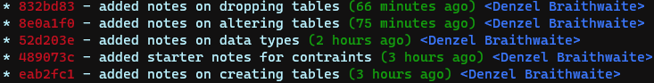

# **Git & GitHub**

> \_"It is easy to shoot your foot off with git, but also easy to revert to a previous foot and merge it with your current leg."
>
> —Jack William Bell"\_

<br>
<br>

## Overview

In this guide we'll review some of the most common and need-to-know git commands that are used in real life everyday projects. Commands such as `pull`, `push` and `status` should be second nature to any developer. I'll also include some quick tips and tricks and some more solid fundamentals below with links to read more.

<br>

The material I've found is a mixture of:

-   [git-scm.com](https://git-scm.com/doc)

-   [Github Git Guide](https://github.com/git-guides)

-   Stackoverflow

-   Other various websites

---

<br>
<br>

## **Quick tips & tricks**

##### _P.S. the vast majority of the time, `<remote>` is **`origin`** for **GitHub**_

<br>

-   When working in a team, use `git status` before starting to work for the day. This will avoid the chance of conflicts.
-   Copy and past the following code into your terminal for a more readable git log.

```
git config --global alias.lg "log --color --graph --pretty=format:'%Cred%h%Creset -%C(yellow)%d%Creset %s %Cgreen(%cr) %C(bold blue)<%an>%Creset' --abbrev-commit"
```



-   Delete remote(_GitHub_) repo in local cli: `git push <remote> --delete <branch-name>` or `-d`.

-   Change local branch name: `git branch -m <new-branch-name>`

- Check remote branches: `git branch -a`

- If the remote branch is deleted but showing in terminal, prune them: `git remote prune <remote>`

- Set upstream: `git branch --set-upstream-to=<remote>/<branch>`

<br>
<br>

---

## **Common Commands**

<br>
<br>

### **Undoing the last commit**

It will definitely happen where you want to undo the last commit and start fresh, in that case the `git reset` is what you'll need, but you'll also have to pay attention to the options you pass afterwards.

```sh
$ git commit -m "Something terribly misguided" # (0: Your Accident)
$ git reset --soft HEAD~                              # (1)
[ edit files as necessary ]                    # (2)
$ git add .                                    # (3)
$ git commit -c ORIG_HEAD                      # (4)
```

<br>

> `git reset --soft`, will keep your files, and stage all changes back automatically. `git reset --hard`, will completely destroy any changes and remove them from the local directory. <mark>Only use this if you know what you're doing.</mark>

<br>
<br>

#### **Cancel a Git Merge**

To stop a merge in Git, use the `git merge --abort` command. This will reset your repository to the state it was in before you started the merge. You can also use the `git reset --merge` command which does the same thing, but it also resets any changes made **during** the merge. The commands cannot be undone, so exercise caution.

<br>
<br>

#### **Revert to a previous state**

Here's a scenario I've run into a few times, you create a feature branch and then accidentally pull that feature branch into one of your main/dev/production branches by mistakes, merging everything. In this instance, you can revert to a specific version of your project, undoing that accidental merge.

1. First navigate to the branch you want to undo the merge.
2. Use `git reflog` to get a list of all the recent changes to the repo.
3. Each commit has a hash(commit ID), take note of the one you'd like to return to.
4. Use `git reset --hard <HASH_HERE>` to reset the branch to the state before the merge.

<br>
<br>

#### **How to delete remote branch from terminal**

You can delete a branch on your remote repo but sometimes it will remain in your terminal as a remote branch. To fix this, simply remove the remote branch with the `r` option.

```
git branch -d -r origin/repo-name
```

[Read more](https://stackoverflow.com/questions/927358/how-do-i-undo-the-most-recent-local-commits-in-git)

<br>
<br>

### **Rename a Remote Repo URL**

When you decide to change the name of your repo, there's actually a few places you'll need to make the change for it to fully reflect the new name everywhere. That being said, if you simply go to Github and rename a repo like that, that's perfectly fine. No code will break, but it will not update locally so you'll have to do those changes in your terminal (or perhaps the Github GUI app but I'm not too familiar with that).

<br>

Imagine you have a repo called `personal_profile`, but after a few weeks of working on it, you realize you should've called it `portfolio` instead. To make the change you have to check a few places.

<br>

1. Github (or whatever remote repo you use, such as [bitbucket](https://bitbucket.org/)).
2. Your local repo/folder.
3. Your remote repo url name.

#### **Renaming GitHub Repo**

Renaming a repo on Github is pretty straight forward. You simply navigate to the desired repo and click settings. **Make sure you're logged in or you won't see the settings button**, then you can rename it under the `General` tab.

<br>
<br>

#### **Renaming local Repo/Folder**

Another simply procedure, just navigate to the folder and rename it. It's as simple as that, you can do so in the CLI or GUI, it doesn't have any affect really but for consistency it's a good idea.

<br>
<br>

#### **Changing the remote repo url name**

When you want to check your remote repo, you use the `remote -v` command. But even after changing the local and remote repo name, the **remote repo url** will still not update(but will still work fine). To rename it, look at the code snippet below.

```bsh

// Check remote repo url
git remote -v
// Syntax: origin  git@github.com:USERNAME-HERE/REPO-NAME-HERE.git (fetch/fetch)
origin  git@github.com:DenzelBraithwaite/personal_profile.git (fetch)
origin  git@github.com:DenzelBraithwaite/personal_profile.git (push)

// Update url
// Syntax: git remote set-url origin git@github.com:USERNAME-HERE/NEW-REPO-NAME-HERE.git
git remote set-url origin git@github.com:DenzelBraithwaite/portfolio.git

// Verify if the change was made
git remote -v
origin  git@github.com:DenzelBraithwaite/portfolio.git (fetch)
origin  git@github.com:DenzelBraithwaite/portfolio.git (push)
```

<br>
<br>

**also**

<br>

-   [20 Common Git commands](https://dzone.com/articles/top-20-git-commands-with-examples)

-   Learn how to style your `git log` [here](https://coderwall.com/p/euwpig/a-better-git-log).

-
