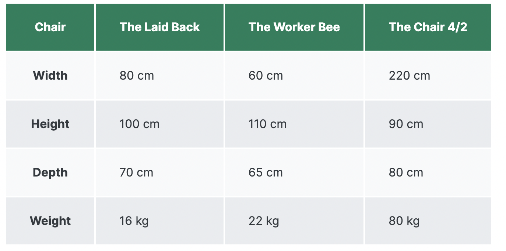

# **HTML**

_Fundamentals, common tags and best practices_

<br>

## Overview

This study guide will hold a list of commonly use tags, along with best practices and examples.

<br>
<br>

---

## **Quick notes**

This section is a quick reference point for certain HTML guidelines that I'll need to review often, such as which semantic tags to use where, and other best practices to keep in mind.

<br>
<br>

#### **Empty elements**

Instead of leaving an element empty, you can leave a space in there. But a better practice would be to use an `html entity` such as `&nbsp;` _(`N`on `B`reaking `Sp`ace)_.

```html
<button class="dot">&nbsp;</button>
```

<br>
<br>

#### **Creating a card**

When creating a card, it's very common to use a `<figure>` tag to wrap the contents. Also acceptable could be an `<article>` tag.

<br>
<br>

#### **Images**

Use the `<picture>` tag to specify which image (_``_) should be loaded, depending on the screen size. This will not load all images and then hide some, this also isn't the same as creating a media query (although similar), this simply only displays the specified source (_`<src>`_) depending on the user's screen size.

<br>

Example:

```html
<picture>
    <source media="(min-width: 650px)" srcset="img_food.jpg" />

    <source media="(min-width: 465px)" srcset="img_car.jpg" />

    
</picture>
```

<br>
<br>

---

## **HTML Elements Reference**

<br>
<br>

## Main root

<br>

#### `<html>`

The _\<html>_ HTML element represents the root (top-level element) of an HTML document, so it is also referred to as the root element. All other elements must be descendants of this element.

<br>
<br>

## Document metadata

Metadata contains information about the page. This includes information about styles, scripts and data to help software (search engines, browsers, etc.) use and render the page. Metadata for styles and scripts may be defined in the page or link to another file that has the information.

<br>

#### `<head>`

The _\<head>_ HTML element contains machine-readable information (metadata) about the document, like its title, scripts, and style sheets.

<br>

#### `<link>`

The _\<link>_ HTML element specifies relationships between the current document and an external resource. This element is most commonly used to link to CSS, but is also used to establish site icons (both "favicon" style icons and icons for the home screen and apps on mobile devices) among other things.

<br>

#### `<meta>`

The _\<meta>_ HTML element represents Metadata that cannot be represented by other HTML meta-related elements, like base, link, script, style or title.

<br>

#### `<style>`

The _\<style\>_ HTML element contains style information for a document, or part of a document. It contains CSS, which is applied to the contents of the document containing the \<style\> element.

<br>

#### `<title>`

The _\<title>_ HTML element defines the document's title that is shown in a Browser's title bar or a page's tab. It only contains text; tags within the element are ignored.

<br>
<br>

## Sectioning root

#### `<body>`

The _\<body>_ HTML element represents the content of an HTML document. There can be only one \<body> element in a document.

<br>
<br>

## Content sectioning

Content sectioning elements allow you to organize the document content into logical pieces. Use the sectioning elements to create a broad outline for your page content, including header and footer navigation, and heading elements to identify sections of content.

<br>

#### `<address>`

The _\<address>_ HTML element indicates that the enclosed HTML provides contact information for a person or people, or for an organization.


<br>

#### `<article>`

The _\<article>_ HTML element represents a self-contained composition in a document, page, application, or site, which is intended to be independently distributable or reusable (e.g., in syndication). Examples include: a forum post, a magazine or newspaper article, or a blog entry, a product card, a user-submitted comment, an interactive widget or gadget, or any other independent item of content.

> "The \<article> element is used to represent something that could be plucked out of your page and dropped into another and still make sense on its own. This might be a literal article or blog post, but could also be used for a social media post like a tweet or a Facebook wall post."

<br>

#### `<aside>`

The _\<aside>_ HTML element represents a portion of a document whose content is only indirectly related to the document's main content. Asides are frequently presented as sidebars or call-out boxes.

<br>

#### `<footer>`

The _\<footer>_ HTML element represents a footer for its nearest ancestor sectioning content or sectioning root element. A _\<footer>_ typically contains information about the author of the section, copyright data or links to related documents. You should use the _\<address>_ tag to store author info. Also worth noting, there can be multiple footer tags in a file, as it usually denotes the end of a section; however, you cannot use a _\<footer>_ tag inside of another _\<footer>_.

<br>

#### `<header>`

The _\<header>_ HTML element represents introductory content, typically a group of introductory or navigational aids. It may contain some heading elements but also a logo, a search form, an author name, and other elements. The _\<header>_ tag is usually used at the top of a section and holds the heading (_\<h1-6>_) inside of it. You can have more than one _\<header>_ tag in a file, but you can't nest a _\<header>_ in a _\<header>_.

<br>

#### `<h1>, <h2>, <h3>, <h4>, <h5>, <h6>,`

The _\<h1>_ to _\<h6>_ HTML element represent six levels of section headings. \<h1> is the highest section level and \<h6> is the lowest.

<br>

#### `<main>`

The _\<main>_ HTML element represents the dominant content of the body of a document. The main content area consists of content that is directly related to or expands upon the central topic of a document, or the central functionality of an application. There must not be more than one visible \<main> element in a document. If more than one \<main> element is present in a document, all other instances must be hidden using the `hidden` attribute.

> "So \<main> is where you put the good stuff, the important parts of a page, the reason the user came to this page in particular, not your site in general. In other words, the main content.😯😲🤯
>
> All that other stuff, logos and search forms and navigation and such, can go in a \<header> or \<footer> within the \<body> but outside of \<main>."

<br>

#### `<nav>`

The _\<nav>_ HTML element represents a section of a page whose purpose is to provide navigation links, either within the current document or to other documents. Common examples of navigation sections are menus, tables of contents, and indexes.

<br>

#### `<section>`

The _\<section>_ HTML element represents a generic standalone section of a document, which doesn't have a more specific semantic element to represent it. Sections should always have a heading, with very few exceptions.

> "Structurally speaking, it's basically just a <div> with special semantic meaning. A _\<section>_ begins a new "sectioning content" region, so it can have its own \<header> and/or \<footer>."

<br>
<br>

## Text content

Use HTML text content elements to organize blocks or sections of content placed between the opening \<body> and closing \</body> tags. Important for accessibility and SEO, these elements identify the purpose or structure of that content.

<br>

#### `<blockquote>`

The _\<blockquote>_ HTML element indicates that the enclosed text is an extended quotation. Usually, this is rendered visually by indentation (see Notes for how to change it). A URL for the source of the quotation may be given using the cite attribute, while a text representation of the source can be given using the cite element.

<br>

#### `<div>`

The _\<div>_ HTML element is the generic container for flow content. It has no effect on the content or layout until styled in some way using CSS (e.g. styling is directly applied to it, or some kind of layout model like Flexbox is applied to its parent element).

<br>

#### `<figcaption>`

The _\<figcaption>_ HTML element represents a caption or legend describing the rest of the contents of its parent figure element.

<br>

#### `<figure>`

The _\<figure>_ HTML element represents self-contained content, potentially with an optional caption, which is specified using the figcaption element. The figure, its caption, and its contents are referenced as a single unit.

<br>

#### `<hr>`

The _\<hr>_ HTML element represents a thematic break between paragraph-level elements: for example, a change of scene in a story, or a shift of topic within a section.

<br>

#### `<menu>`

The _\<menu>_ HTML element is described in the HTML specification as a semantic alternative to ul, but treated by browsers (and exposed through the accessibility tree) as no different than ul. It represents an unordered list of items (which are represented by li elements).

<br>

#### `<ol>`

The _\<ol>_ HTML element represents an ordered list of items — typically rendered as a numbered list.

<br>

#### `<ul>`

The _\<ul>_ HTML element represents an unordered list of items, typically rendered as a bulleted list.

<br>

#### `<li>`

The _\<li>_ HTML element is used to represent an item in a list. It must be contained in a parent element: an ordered list (ol), an unordered list (ul), or a menu (menu). In menus and unordered lists, list items are usually displayed using bullet points. In ordered lists, they are usually displayed with an ascending counter on the left, such as a number or letter.

<br>

#### `<p>`

The _\<p>_ HTML element is used to represent an item in a list. It must be contained in a parent element: an ordered list (ol), an unordered list (ul), or a menu (menu). In menus and unordered lists, list items are usually displayed using bullet points. In ordered lists, they are usually displayed with an ascending counter on the left, such as a number or letter.

<br>

#### `<pre>`

The _\<pre>_ HTML element represents preformatted text which is to be presented exactly as written in the HTML file. The text is typically rendered using a non-proportional, or monospaced, font. Whitespace inside this element is displayed as written.

<br>
<br>

## Inline text semantics

Use the HTML inline text semantic to define the meaning, structure, or style of a word, line, or any arbitrary piece of text.

<br>

#### `<a>`

The _\<a>_ HTML element (or anchor element), with its href attribute, creates a hyperlink to web pages, files, email addresses, locations in the same page, or anything else a URL can address.

<br>

#### `<br>`

The _\<br>_ HTML element produces a line break in text (carriage-return). It is useful for writing a poem or an address, where the division of lines is significant.

<br>

#### `<cite>`

The _\<cite>_ HTML element element is used to describe a reference to a cited creative work, and must include the title of that work. The reference may be in an abbreviated form according to context-appropriate conventions related to citation metadata.

<br>

#### `<code>`

The _\<code>_ HTML element displays its contents styled in a fashion intended to indicate that the text is a short fragment of computer code. By default, the content text is displayed using the user agent default monospace font.

<br>

#### `<em>`

The _\<em>_ HTML element marks text that has stress emphasis. The \<em> element can be nested, with each level of nesting indicating a greater degree of emphasis.

<br>

#### `<i>`

The _\<i>_ HTML element represents a range of text that is set off from the normal text for some reason, such as idiomatic text, technical terms, taxonomical designations, among others. Historically, these have been presented using italicized type, which is the original source of the \<i> naming of this element.

<br>

#### `<mark>`

The _\<mark>_ HTML element represents text which is marked or highlighted for reference or notation purposes, due to the marked passage's relevance or importance in the enclosing context.

<br>

#### `<small>`

The _\<small>_ HTML element represents side-comments and small print, like copyright and legal text, independent of its styled presentation. By default, it renders text within it one font-size smaller, such as from small to x-small.

<br>

#### `<span>`

The _\<span>_ HTML element is a generic inline container for phrasing content, which does not inherently represent anything. It can be used to group elements for styling purposes (using the class or id attributes), or because they share attribute values, such as lang. It should be used only when no other semantic element is appropriate. \<span> is very much like a div element, but div is a block-level element whereas a \<span> is an inline element.

<br>

#### `<strong>`

The _\<strong>_ HTML element indicates that its contents have strong importance, seriousness, or urgency. Browsers typically render the contents in bold type.

<br>

#### `<q>`

The _\<q>_ HTML element indicates that the enclosed text is a short inline quotation. Most modern browsers implement this by surrounding the text in quotation marks. This element is intended for short quotations that don't require paragraph breaks; for long quotations use the blockquote element.

<br>
<br>

## Image and multimedia

HTML supports various multimedia resources such as images, audio, and video.

<br>

#### `<audio>`

The _\<audio>_ HTML element is used to embed sound content in documents. It may contain one or more audio sources, represented using the src attribute or the source element: the browser will choose the most suitable one. It can also be the destination for streamed media, using a MediaStream.

<br>

#### ``

The _\_ HTML element embeds an image into the document.

<br>

#### `<video>`

The _\<video>_ HTML element element embeds a media player which supports video playback into the document. You can use \<video> for audio content as well, but the audio element may provide a more appropriate user experience.

<br>

#### `<track>`

The _\<track>_ HTML element is used as a child of the media elements, audio and video. It lets you specify timed text tracks (or time-based data), for example to automatically handle subtitles. The tracks are formatted in WebVTT format (.vtt files) — Web Video Text Tracks.

<br>
<br>

## Embedded content

In addition to regular multimedia content, HTML can include a variety of other content, even if it's not always easy to interact with.

<br>

#### `<embed>`

The _\<embed>_ HTML element embeds external content at the specified point in the document. This content is provided by an external application or other source of interactive content such as a browser plug-in.

<br>

#### `<picture>`

The _\<picture>_ HTML element contains zero or more source elements and one img element to offer alternative versions of an image for different display/device scenarios.

<br>

#### `<source>`

The _\<source>_ HTML element specifies multiple media resources for the picture, the audio element, or the video element. It is an empty element, meaning that it has no content and does not have a closing tag. It is commonly used to offer the same media content in multiple file formats in order to provide compatibility with a broad range of browsers given their differing support for image file formats and media file formats.

<br>
<br>

## SVG

You can embed SVG content directly into HTML documents, using the _\<svg>_ element.

<br>

#### `<svg>`

The \<svg> element is a container that defines a new coordinate system and viewport. It is used as the outermost element of SVG documents, but it can also be used to embed an SVG fragment inside an SVG or HTML document.

<br>
<br>

## Scripting

In order to create dynamic content and Web applications, HTML supports the use of scripting languages, most prominently JavaScript. Certain elements support this capability.

<br>

#### `<canvas>`

Use the HTML \<canvas> element with either the canvas scripting API or the WebGL API to draw graphics and animations.

<br>

#### `<noscript>`

The _\<noscript>_ HTML element defines a section of HTML to be inserted if a script type on the page is unsupported or if scripting is currently turned off in the browser.

<br>

#### `<script>`

The _< script>_ HTML element is used to embed executable code or data; this is typically used to embed or refer to JavaScript code. The < script> element can also be used with other languages, such as WebGL's GLSL shader programming language and JSON.

<br>
<br>

## Table content

The elements here are used to create and handle tabular data.

<br>

#### `<table>`

The _\<table>_ HTML element represents tabular data — that is, information presented in a two-dimensional table comprised of rows and columns of cells containing data.

<br>

#### `<thead>`

The _\<thead>_ HTML element defines a set of rows defining the head of the columns of the table.

<br>

#### `<tbody>`

tbodye _\<th>_ HTML element encapsulates a set of table rows (tr elements), indicating that they comprise the body of the table (table).

<br>

#### `<tfooter>`

The _\<tfooter>_ HTML element defines a set of rows summarizing the columns of the table.

<br>

#### `<th>`

The _\<th>_ HTML element defines a cell as header of a group of table cells. The exact nature of this group is defined by the scope and headers attributes.

<br>

#### `<tr>`

The _\<tr>_ HTML element defines a row of cells in a table. The row's cells can then be established using a mix of td (data cell) and th (header cell) elements.

<br>

#### `<td>`

The _\<td>_ HTML element defines a cell of a table that contains data. It participates in the table model.

<br>

#### `<col>`

The _\<col>_ HTML element defines a column within a table and is used for defining common semantics on all common cells. It is generally found within a colgroup element.

<br>

#### `<colgroup>`

The _\<colgroup>_ HTML element defines a group of columns within a table.

<br>

#### `<caption>`

The _\<caption>_ HTML element specifies the caption (or title) of a table.

<br>
<br>

#### **Removing table inner border**

The `border-collapse` CSS property sets whether cells inside a `<table>` have shared or separate borders.

<br>

```css
border-collapse: collapse;
```


<br>
<br>

```css
border-collapse: separate;
```



<br>
<br>

## Forms

HTML provides a number of elements which can be used together to create forms which the user can fill out and submit to the Web site or application. There's a great deal of further information about this available in the HTML forms guide.

<br>

#### `<form>`

The \<form> HTML element represents a document section containing interactive controls for submitting information.

<br>

#### `<label>`

The \<label> HTML element represents a caption for an item in a user interface.

<br>

#### `<input>`

The \<input> HTML element is used to create interactive controls for web-based forms in order to accept data from the user; a wide variety of types of input data and control widgets are available, depending on the device and user agent. The \<input> element is one of the most powerful and complex in all of HTML due to the sheer number of combinations of input types and attributes.

<br>

#### `<output>`

The \<output> HTML element is a container element into which a site or app can inject the results of a calculation or the outcome of a user action.

<br>

#### `<textarea>`

The \<textarea> HTML element represents a multi-line plain-text editing control, useful when you want to allow users to enter a sizeable amount of free-form text, for example a comment on a review or feedback form.

<br>

#### `<button>`

The <button>button</button> HTML element is an interactive element activated by a user with a mouse, keyboard, finger, voice command, or other assistive technology. Once activated, it then performs a programmable action, such as submitting a form or opening a dialog.

<br>

#### `<select>`

The \<select> HTML element represents a control that provides a menu of options.

<br>

#### `<option>`

The \<option> HTML element is used to define an item contained in a select, an optgroup, or a datalist element. As such, \<option> can represent menu items in popups and other lists of items in an HTML document.

<br>

#### `<optgroup>`

The \<optgroup> HTML element

<br>

#### `<datalist>`

The \<datalist> HTML element contains a set of option elements that represent the permissible or recommended options available to choose from within other controls.

<br>

#### `<fieldset>`

The \<fieldset> HTML element is used to group several controls as well as labels (label) within a web form.

<br>

#### `<legend>`

The \<legend> HTML element represents a caption for the content of its parent fieldset.

<br>

#### `<meter>`

The \<meter> HTML element represents either a scalar value within a known range or a fractional value.

<br>

#### `<progress>`

The \<progress> HTML element displays an indicator showing the completion progress of a task, typically displayed as a progress bar.

<br>
<br>

---

## **HTML entities**

<br>

An HTML entity is a piece of text (`"string"`) that begins with an ampersand _(`&`)_ and ends with a semicolon _(`;`)_. Entities are frequently used to display reserved characters _(which would otherwise be interpreted as HTML code)_, and invisible characters _(like non-breaking spaces)_. You can also use them in place of other characters that are difficult to type with a standard keyboard.

<br>


<br>

> <span style="color: #007ACC;">Note</span>: Many characters have memorable entities. For example, the entity for the copyright symbol (`©`) is `&copy;`. For less memorable characters, such as `&#8212;` or `&#x2014;`, you can use a [reference chart](https://html.spec.whatwg.org/multipage/named-characters.html#named-character-references)

<br>
<br>

---

## **Emmet plugin**

Emmet uses syntax similar to CSS selectors for describing elements’ positions inside generated tree and elements’ attributes. You can use elements’ names like `div` or `p` to generate HTML tags.

Emmet doesn’t have a predefined set of available tag names, you can write any word and transform it into a tag: div → `<div></div>`, foo → `<foo></foo>` and so on.

<br>
<br>

## Nesting operators

Nesting operators are used to position abbreviation elements inside generated tree: whether it should be placed inside or near the context element.

<br>
<br>

#### **`Child: >`**

You can use the `>` operator to nest elements inside each other:

```emmet
div>ul>li
```

<br>
Will produce...

```html
<div>
    <ul>
        <li></li>
    </ul>
</div>
```

<br>
<br>

#### **`Sibling: +`**

Use the `+` operator to place elements near each other, on the same level:

```emmet
div+p+bq
```

<br>

...will output

```html
<div></div>
<p></p>
<blockquote></blockquote>
```

<br>
<br>

#### **`Climb-up: ^`**

With the `^` operator, you can climb one level up the tree and change context where following elements should appear:

```
div+div>p>span+em^bq
```

<br>

...outputs

```html
<div></div>
<div>
    <p><span></span><em></em></p>
    <blockquote></blockquote>
</div>
```

<br>

You can use as many `^` operators as you like, each operator will move one level up:

```
div+div>p>span+em^^^bq
```

<br>

will output

```html
<div></div>
<div>
    <p><span></span><em></em></p>
</div>
<blockquote></blockquote>
```

<br>
<br>

#### **`Multiplication: *`**

With the `*` operator you can define how many times element should be outputted:

```emmet
ul>li\*5
```

<br>

...outputs

```html
<ul>
    <li></li>
    <li></li>
    <li></li>
    <li></li>
    <li></li>
</ul>
```

<br>
<br>

#### **`Grouping: ()`**

Parenthesises are used for grouping subtrees in complex abbreviations:

<br>

```emmet
div>(header>ul>li\*2>a)+footer>p
```

<br>

...expands to

```html
<div>
    <header>
        <ul>
            <li><a href=""></a></li>
            <li><a href=""></a></li>
        </ul>
    </header>
    <footer>
        <p></p>
    </footer>
</div>
```

<br>

You can nest groups inside each other and combine them with the multiplication `*` operator:

```emmet
(div>dl>(dt+dd)\*3)+footer>p
```

<br>

...produces

```html
<div>
    <dl>
        <dt></dt>
        <dd></dd>
        <dt></dt>
        <dd></dd>
        <dt></dt>
        <dd></dd>
    </dl>
</div>
<footer>
    <p></p>
</footer>
```

With groups, you can literally write full page mark-ups with a single abbreviation, but please don’t do that 😅.

<br>
<br>

#### **`Attribute operators`**

Attribute operators are used to modify attributes of outputted elements. For example, in HTML and XML you can quickly add class attributes to generated elements.

<br>

##### **ID and CLASS**

In CSS, you use elem`#id` and elem`.class` notation to reach the elements with specified id or class attributes. In Emmet, you can use the very same syntax to add these attributes to specified element:

```
div#header+div.page+div#footer.class1.class2.class3
```

<br>

...will output

```html
<div id="header"></div>
<div class="page"></div>
<div id="footer" class="class1 class2 class3"></div>
```

<br>
<br>

##### **Custom attributes**

You can use `[attr]` notation (as in CSS) to add custom attributes to your element:

```emmet
td[title="Hello world!" colspan=3]
```

<br>

...outputs

```html
<td title="Hello world!" colspan="3"></td>
```

<br>

You can place as many attributes as you like inside square brackets.
You don’t have to specify attribute values: `td[colspan title]` will produce

```html
<td colspan="" title=""></td>
```

<br>

You can use single or double quotes for quoting attribute values.
You don’t need to quote values if they don’t contain spaces: `td[title=hello colspan=3]` will work.

<br>
<br>

#### **`Item numbering: $`**

With the multiplication `*` operator you can repeat elements, but with `$` you can number them. Place the `$` operator inside element’s name, attribute’s name or attribute’s value to output current number of repeated element:

```emmet
ul>li.item$\*5
```

<br>

...outputs to

```html
<ul>
    <li class="item1"></li>
    <li class="item2"></li>
    <li class="item3"></li>
    <li class="item4"></li>
    <li class="item5"></li>
</ul>
```

<br>

You can use multiple `$` in a row to pad number with zeroes:

```emmet
ul>li.item$$$\*5
```

<br>

...outputs to

```html
<ul>
    <li class="item001"></li>
    <li class="item002"></li>
    <li class="item003"></li>
    <li class="item004"></li>
    <li class="item005"></li>
</ul>
```

<br>
<br>

#### **`Changing numbering base and direction`**

With the `@` modifier, you can change numbering direction (ascending or descending) and base (e.g. start value).

<br>

For example, to change direction, add `@-` after `$`:

```emmet
ul>li.item$@-\*5
```

<br>

…outputs to

```html
<ul>
    <li class="item5"></li>
    <li class="item4"></li>
    <li class="item3"></li>
    <li class="item2"></li>
    <li class="item1"></li>
</ul>
```

<br>

To change the counter base value, add `@N` modifier to `$`:

```emmet
ul>li.item$@3\*5
```

<br>

…transforms to

```html
<ul>
    <li class="item3"></li>
    <li class="item4"></li>
    <li class="item5"></li>
    <li class="item6"></li>
    <li class="item7"></li>
</ul>
```

<br>

You can use these modifiers together:

```
ul>li.item$@-3\*5
```

<br>

…is transformed to

```html
<ul>
    <li class="item7"></li>
    <li class="item6"></li>
    <li class="item5"></li>
    <li class="item4"></li>
    <li class="item3"></li>
</ul>
```

<br>
<br>

#### **`Text: {}`**

You can use curly braces to add text to element:

```emmet
a{Click me}
```

<br>

...will produce

```html
<a href="">Click me</a>
```

<br>
<br>

Note that `{text}` is used and parsed as a separate element (like, `div`, `p` etc.) but has a special meaning when written right after element. For example, `a{click}` and `a>{click}` will produce the same output, but `a{click}+b{here}` and `a>{click}+b{here}` won’t:

<br>

```html
<!-- a{click}+b{here} -->

<a href="">click</a><b>here</b>
```

<br>

```html
<!-- a>{click}+b{here} -->

<a href="">click<b>here</b></a>
```

In the second example, the `<b>` element is placed inside `<a>` element, and that’s the difference. When `{text}` is written right after an element, it doesn’t change its parent context.

<br>
<br>

#### **`Notes on abbreviation formatting`**

When you get familiar with Emmet’s abbreviations syntax, you may want to use some formatting to make your abbreviations more readable. For example, use spaces between elements and operators.

<br>

Like this:

```emmet
(header > ul.nav > li\*5) + footer
```

<br>

<mark>But it won’t work, because space is a stop symbol where Emmet stops abbreviation parsing.</mark> Many users mistakenly think that each abbreviation should be written in a new line, but they are **wrong**; you can type and expand abbreviation anywhere in the text:

[More complete guide here](https://docs.emmet.io/abbreviations/syntax/)

<br>
<br>

---

## **Resources**

<br>
<br>

### Documentation

For a more complete guide with more examples, visit:
https://developer.mozilla.org/en-US/docs/Web/HTML/Element_

<br>

Or

<br>

### Tools

-   HTML validator &rarr; [Validator](https://validator.w3.org/nu/#textarea)

-   Images &rarr; [Unsplash](https://unsplash.com/) | [Pexels](https://www.pexels.com/)

-   Image compressor &rarr; [Squoosh](https://squoosh.app/)

-   Icons &rarr; [Fontawesome](https://fontawesome.com/) | [Heroicons](https://heroicons.com/) | [Phosphoricons](https://phosphoricons.com/)_(science icons)_

<br>
<br>

---
