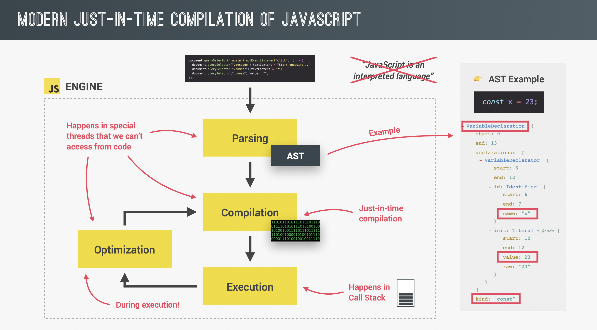
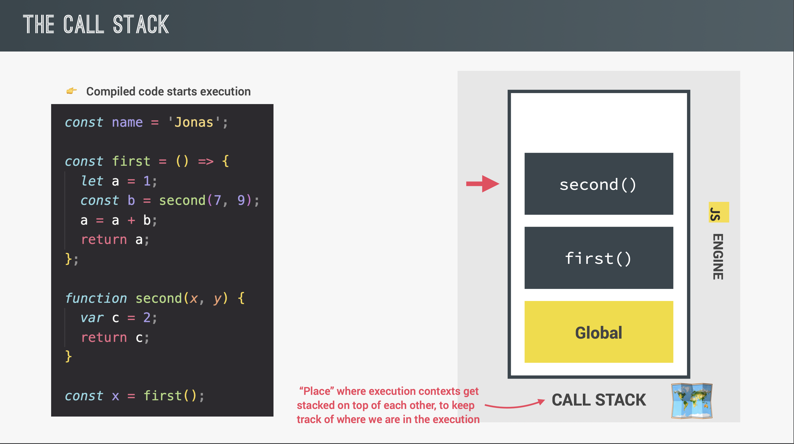
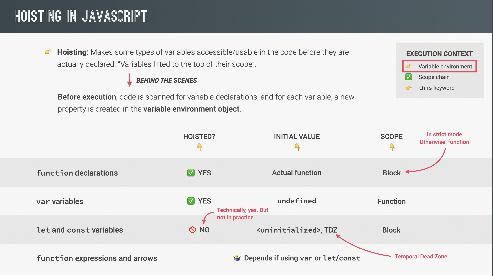
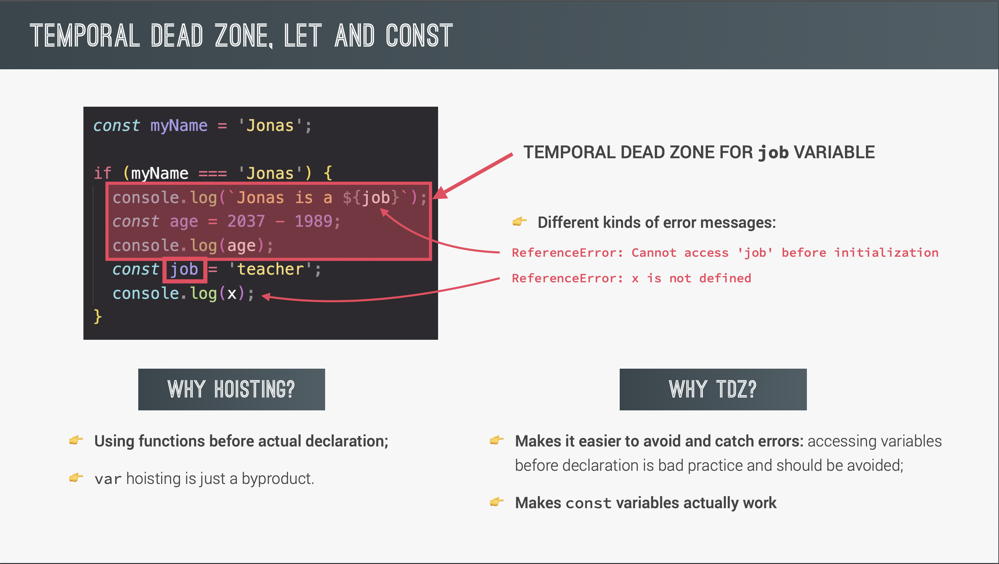
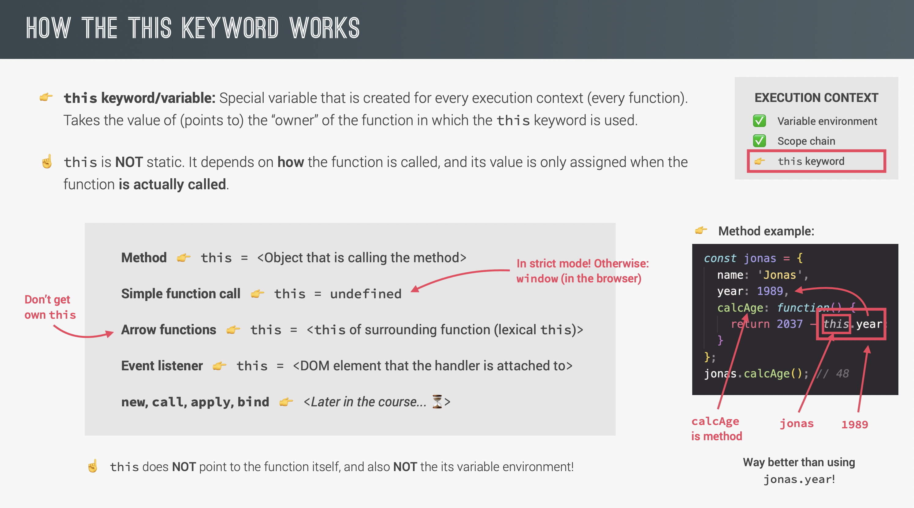

# JavaScript

> _JavaScript: Don't judge me by my bad parts, learn the good stuff and stick with that!_
>
> -Eric Freeman

> _"There's almost nothing that you can't build after getting really good at JavaScript, inside or outside of the browser."_
>
> -Jonas Schmedtmann

<br>
<br>

## Overview

This guide will serve as a reference point for JavaScript fundamentals, syntax, tips, tricks and best practices. For quick testing, you can use the console or one of many free websites that allow you to write and test code.

<br>

The material I've found is a mixture of:

-   Udemy - [The Complete JavaScript Course](https://www.udemy.com/course/the-complete-javascript-course/)

-   [MDN docs](https://developer.mozilla.org/en-US/)

-   [Stackoverflow](https://stackoverflow.com/)

-   [JS bin](https://jsbin.com/?js,console) _(For quickly testing code snippets)_

-   Other various websites

<br>
<br>

---

## **Notes to be sorted later**

Comment out code with `//` for a single line comment, or a multi-line code with `/**/`, like `CSS`

<br>
<br>

Use `typeof` to deterine a data type's value.

<br>
<br>

Creating an undefined variable:

```js
let variableName;
```

<br>
<br>

If you `typeof null` the console will tell you it's an `object`, but this is a bug in JavaScript that's not corrected for legacy reasons.

If you use `typeof NaN` the console outputs 'Number', so "_Not a number_" is technically a number.

<br>
<br>

`var` vs `let` vs `const`:
`var` is the old way with function scope<mark>**finish this**</mark>

`let` is a new way to declare a variable with a smaller scope. let creates a variable that can be reassigned.<mark>**finish this**</mark>

`const` is a new way to declare a variable with a smaller scope. You cannot reassign a `const` variable. a `const` variable cannot be empty, it needs an initial value. Always decalre variables with `const` unless you know the variable will change, this can reduce the risk of potential bugs.<mark>**finish this**</mark>

Extra: You could also technically write `phoneType = 'iPhone'` without the use of a `keyword` such as `let` or `const` and it would seem like it still worked, but this would create a property on the `global object` and not a variable in your local scope.

<br>
<br>

## **Dom Manipulation**

**How to select a class and ID**

```js
document.querySelector('.className'); // Only matches first occurence, not all elements with the class.

document.querySelectorAll('.className'); // Matches all occurences.

document.querySelector('#IDName');
```

**How to listen for events and add event handlers, starting with clicks.**

```js
// Syntax: document.querySelector('.className').addEventListener('which event to listen to', function (event object) {});

// A use case example, the event argument is useless here though.
document.querySelector('.modal').addEventListener('click', function (event) {
    openModal();
});

// So we could refactor it like this:

document.querySelector('.modal').addEventListener('click', openModal); // A use case example, the 'openModal' is a pointer at a function that would open the modal window.
```

<br>

**But what about keystrokes?**

You can listen for the `keypress`, `keydown` or `keyup` event, which are all similar with small changes. One notable difference is that they `keyup` event will only occur **after** you release the key, the other 2 will occur immediately when you press the key, and will continue to trigger as you hold down on the key.

```js
document
    .querySelector('.className')
    .addEventListener('keystroke / keydown / keyup', function (event) {
        console.log(event.key); // Outputs the key that you pressed in the console.
    });
```

<br>
<br>

Here's a bigger and more complete example of opening and closing a modal window using JavaScript to manipulate classes based on click and keystroke events.

```js
'use strict'; // Enable strict mode, this is recommended to avoid silent errors.

const modal = document.querySelector('.modal'); // modal window that will appear and disappear on click.
const overlay = document.querySelector('.overlay'); // Makes the rest of the screen darker to focus on the modal(pop-up) window.
const btnOpenModal = document.querySelectorAll('.open-modal'); // Buttons that will open the modal when clicked.
const btnCloseModal = document.querySelector('.close-modal'); // Button that will close the modal when clicked.

// Function to close the modal window
const closeModal = () => {
    modal.classList.add('hidden');
    overlay.classList.add('hidden');
};

// Function to open the modal window
const openModal = function () {
    modal.classList.remove('hidden');
    overlay.classList.remove('hidden');
};

// Loops through each button that opens the modal and adds an event listener for clicks.
for (let i = 0; i < btnOpenModal.length; i++) {
    btnOpenModal[i].addEventListener('click', openModal);
}

// Adds an event listener on the 'x' or close button, to use the closeModal function to close the modal when clicked.
btnCloseModal.addEventListener('click', closeModal);
overlay.addEventListener('click', closeModal);

// Adds an event listener on the entire 'document' to call the closeModal function to close the modal.
// This will only happen if the escape key is released AND the modal DOES NOT contain a class named 'hidden'.
// Notice the 'not' operator in the if statement, reversing 'contains' to 'does not contain'.
document.addEventListener('keyup', event => {
    if (event.key === 'Escape' && !modal.classList.contains('hidden'))
        closeModal();
});
```

<mark>**finish these:**</mark>

-   Add notes on classList.toggle

<br>
<br>

## **Theory, understanding JS**

what happens under the hood... this section will be 100% theory lessons on how JavaScript works.

<br>
<br>

## JavaScript engine

A JavaScript engine is what allows JS code to run in or outside of the browser. Every browser has their own JS engine, but the most popular is the V8 engine used in Chrome and Node.js.

<br>
<br>

#### **`Compilation VS Interpretation`**

Computers only understand 0s and 1s, what we write is "human" code that must then be translated for the cpu to understand. This can be done with either `compilation` or `interpretation`.

<br>
<br>

**Compilation:**

he entire code is converted into machinde code and written to a binary file that a computer can understand and execute. But technically, you can compile that code and execute it at a later date, that's where `interpretation` differs.

<br>
<br>

**Interpretation:**

There's an interpreter that runs through the source code and executes it line by line. It still gets converted to machine code, but it only happens right before it's executed and not earlier.

<br>

JavaScript used to be an interpreted language, but the problem is that interpreted languages are much slower than compiled languages. With modern JS, low performance is no longer acceptable, so it uses a mix of compilation and interpretation.

<br>
<br>

**Just-in-time(JIT) compilation:**

The entire code is convereted into machine code and then executed right away, as opposed to line by line or compiling all the code in a binary file and executing it later. This is a mixture of interpretation and compilation, but there's no portable binary file to execute later.

<br>
<br>

**Back to the JavaScript engine**

So how does the JS engine read our code? There are a few steps the engine takes to translate and read/execute our code.

<br>

1. Parsing
2. Compilation
3. Execution
4. Optimization

<br>
<br>

**Parsing**

Reads the code and translates it into the `Abstract Syntax Tree(AST)` data structure. Splits up each line of code into pieces and saving them in tree in a structured way. This also checks for error. This has nothing to do with the `DOM` tree, It's simply a representation of the code we write, inside of the engine.

Eample: 

<br>
<br>

**Compilation**

Takes the generated `AST` and compiles it into machine code(011101010011), then executes that code immediately because of `JIT compilation`.

<br>
<br>

**Execution**

Runs the code in the `call stack` immiediately after compilation.

<br>
<br>

**Optimization**

Modern JS engines will execute a _first draft_ version of your code which isn't really optimized. But then, behind the scenes it's optimizing your code and then swapping the executed code with the optimized verstion of that code. It can do this a few times without ever interrupting your executed code.

This allows the code to load faster and run smoothly afterwards, and it happens in a completely separate place than the main thread in the call stack executing our code.

<br>
<br>

## **JS Runtime in the browser**

A runtime is like a box that contains all the JS related stuff we need. At the heart of a runtime is a JS engine, but there's more than just that.

<br>

1. `JS engine`
2. `Web APIs`
3. `Callback Queue`
4. `Event loop`

<br>
<br>

**JS engine**

the Js engine consists of several parts, but it can be simplified to 2 core functions: the `memory heap` and the `call stack`. The memory heap stores our data(variables, objects, etc) and the call stack determines which code should be run in what order.

<br>

**The Execution Context**

Before talking about the execution context, we need to understand what `top-level` code is. Top-level code is code that's **outside** of any function. Top-level code will be executed before any code **inside** of functions.

<br>

So why is that important? Well, JavaScript code **always** runs inside an execution context, an execution context is like a box or a room which holds a piece of code and the necessary information to execute it, such as arguments or local variables passed in a function. No matter how large your file, there's only ever 1 **global** execution context which executes your top-level code.

<br>

> "Imagine you order a pizza... Usually that pizza comes in a box, and it might also come with some other stuff like cuttlery or a receipt... So in this analogy, the pizza is the JS code to be executed and the box is the execution context for our pizza..."
>
> -Jonas Schmedtmann

<br>

Each execution context has a variable environment(holds let, const and var declarations, functions and an arguments object), a scope chain and a `this` keyword. There is an exception however, arrow functions don't have the `this` keyword nor an `arguments object`.
<mark>Finish this...</mark>

<br>
<br>

**The Call Stack**

Once the code is compiled, top-level code will start executing. First a `global execution context` will be created to run all the top-level code, which is code outside of any functions. After that, for every function call, a new execution context will be created containing all the necessary info to execute that function. The same goes for methods(functions attached to objects).

<br>

Now when all of the code has been executed, the engine will wait for callback functions such as a `click` event. This is possible thanks to the event loop which will provide these callback functions.

<mark>Finish this...</mark>


<br>

**Web APIs**

<mark>Finish this...</mark>

<br>

**Callback Queue**

<mark>Finish this...</mark>

<br>

**Event Loop**

The event loop takes callback functions from the callback queue and puts them in the call stack so they can be executed.
<mark>Finish this...</mark>

<br>

**JS Runtime in Node.js**

The runtime in Node is similar to the browser runtime but since it's not in the browser it does not have web API, since those are provided by the browser. Instead, there are C++ bindings and a thread pool.

<br>
<br>

## **Scopes**

Scopes determine where variables can be accessed from depending on where they were declared, and in JavaScript we use `lexical scoping`. That means the scope is determined by where you place functions and code blocks. In JavaScript we have the `global`, `function` and `block` scope.

<br>

All scopes can access variables of their parent scope as well. If you have a variable declared with a global scope, then a function(_`A`_), then another function inside that function(_`B`_), that last nested function(_`B`_) will still have access to variables in the global scope **through** its parent function(_`A`_). This is what we call the `scope-chain`.

<br>
<br>

#### `Global scope`

Variables declared in the global scope are accessible from anywhere in the file.

```js
const name = 'Denzel';

console.log(name); // Outputs: 'Denzel'
```

<br>

#### `Function scope`

Variables declared in a function scope(also called local scope) are only available in that function. In `strict mode`, functions are also block scoped.

```js
const dogSpeak = () => {
    const dog = {
        speak: 'bark'
    };
};

console.log(dog.speak); // ReferenceError
```

<br>

#### `Block scope(ES6)`

Variables declared in a block scope are only available in that block. That is, code between curly braces, but only variables declared with `let` or `const`. If you use `var` to declare your variable, that variable will be accessible outside of the block. So we say `let` and `const` are `block scoped` while `var` is `function scoped`

```js
if (10 - 5 > 10) {
    const calculator = 'broken';
    var protractor = true;
}

console.log(calculator); // ReferenceError
console.log(protractor); // Outputs: true
```


<br>
<br>

## **Hoisting and TDZ**

Hoisting makes certain variables and functions available to use before they are declared, as long as they're in the same scope. The temporal dead zone (`TDZ`) is the space between the start of a scope and the beginning of the variable declaration where a variable **cannot** be accessed, because it was not declared yet. So if a variable is hoisted, it does not have a `TDZ`, since it's available even in the "_temporal dead zone_".

<br>




So but function **declarations** and variables defined with `var` are hoisted, but function **expressions**, arrow functions and variables defined with `const` or `let` are not. If you attempt to use a variable defined with `var` before it's defined though, it's value will be `undefined`. If you try to use a function declaration before it's defined, it will still work.

<br>

That being said, it's best to avoid writing code like that. Avoid `var` at all costs and use `const` always unless the variable will change, in which case use `let`. No matter how you define a function, do it before you call it for cleaner code, and declare your variables at the top of their scope.

<br>
<br>

## **The `this` keyword**


<mark>finish this...</mark>

<br>
<br>

## **Fundamentals**

<br>

### **Primitive data types**

...<mark>**finish this**</mark>

<br>
<br>

#### **`Values & Variables`**

In JavaScript, every value is either an object or a primitive value. A value is only primitive if it's not an object.

There are 7 types of primitive data in JavaScript:

1. Number (Floating point numbers, always have decimals)
2. String (Sequence of characters in single or double quotes)
3. Boolean (true or false)
4. Undefined (variable declared with an empty value)
5. Null (no valuem similar to undefined)
6. Symbol (unique value that can't be changed)
7. BigInt (ES2020, supports larger integers than the `number` type)

<br>

### **Linking a JS file**

There are a few ways to link a...<mark>**finish this**</mark>

1. Using `<script>` tags.

2. Using a `style.js` file and linking it in your `html` file at the bottom of the `<body>`.

```js
<script src="script.js"></script>
```

<br>
<br>

**operators**

Arithmetic operators: `+ - * / **` also `+= -+ *= /= **= ++ --` and `> < >= <= ===`

`+`

`-`

`*`

`/`

`**`

`---`

<br>

`==` and `!=` vs `===` and `!==`

`==` is the loose loose operator, `===` is the strict equality operator. `==` does type coercion, so it should be avoided. `===` does not perform type coercion so it's less liekly to introduce a bug.

```js
if ('18' == 18) Console.log('Looks the same!');
// This will be treated as 'true'

if ('18' === 18) Console.log('Looks the same!');
// This will be treated as 'false'
```

`!=` and `!==` are the **opposite** of the equality operator, these are `different` operators. In plain English, it means "is not equal to" as opposed to "Is equal to"

<br>

[JS operator precedence, scroll down and reference table](https://developer.mozilla.org/en-US/docs/Web/JavaScript/Reference/Operators/Operator_Precedence)

<br>
<br>

**The `&&(and), ||(or)` and `!`**

```js
const hasVision = true;
const hasHearing = true;
const hasLegs = false;

console.log(hasVision && hasHearing);
// Outputs: true

console.log(hasVision && hasLegs);
// Outputs: false

console.log(hasVision || hasLegs);
// Outputs: true

console.log(hasVision && hasHearing && !hasLegs);
// Outputs: true
```

**String concatenation** <mark>**finish this**</mark>

```js
const num = 5;
console.log('Hey ' + "I'm" + num + ' years old.');
```

**String template literals** <mark>**finish this**</mark>
Use template literals to create multi-line strings. Template literals expect `expressions` not `statements`.

```js
const num = 5;
console.log(`Hey I'm ${num} years old.`);

console.log(`${let num = 5}`) // Don't use a statement, this will raise an error.
```

<br>
<br>

**Conditionals**

if statements:

```js
if (4 >= 5) {
    const magicNumber = 4;
    console.log(magicNumber);
    // Output: 4, but this code won't execute.
} else {
    const magicNumber = 5;
    console.log(magicNumber);
    // Output: 5, this code WILL run
}

if (true === true) console.log('This is also valid syntax');

if (true === false) {
    console.log("This won't run");
} else if (true) {
    console.log('This will run');
} else {
    console.log("This won't run");
}
```

The `conditional ternary operator (?)` is used to write a conditional statement in one line.

```js
const numOfBeers = 6;
numOfBeers <= 3 ? console.log('Drive home safely') : console.log('Take a cab');
```

<br>
<br>

`Type conversion vs coercion`

Conversion is when you explicitly want to convert one data type to another. Like changing a string to a number.

```js
const year = '2022';
console.log(typeof Number(year));
// Outputs
```

Coercion is when JavaScript implicitly converts a data type for you, such as concatenating strings and numbers turns numbers into a string.

```js
console.log(`This is a random number ${5}5`);
//  Outputs: 'This is a random number 55', JS converts the number to a string

console.log('5' - 5);
// Outputs: 0, JS converts the string to a number

console.log(1 + 2 + 3 + '4');
// Outputs: 64, when it reaches the string, it converts it.
```

<br>
<br>

**Falsy values**

1. false (boolean)
2. 0 (number type 0)
3. '' (empty string)
4. undefined
5. null
6. NaN

All other values are **_truthy_**

<br>
<br>

**Switch statement** <mark>**finish this**</mark>

```js
const food = 'salad';

switch (food) {
    case 'spaghetti': // if (food === 'spaghetti')
        console.log('Yay, spaghetti for supper today!');
        break;
    case 'burgers':
        console.log('Yay, burgers for supper today!');
        break;
    case 'salad':
        console.log('Aww, salad for supper today...');
        break;
    default:
        console.log("I gotta figure out what I'm eating today");
}
```

<br>
<br>

**`Expression` vs `Statements`**

An expression is a piece of code that produces a value.

```js
3 + 4; // This is an expression
2020; // This is an expression
true && true; // This is an expression
```

If declarations are complete senteces, expressions are like words that make-up that sentence.

```js
if (true) {
    const variableName = "Doesn't matter"; // This is a statement, doesn't produce any value.
}
```

<br>
<br>

**Strict mode**
Use strict mode by adding one line to the top of you js file. It must be the very first line (excluding comments, since they're ignore). This will forbid you from doing certain things and it will also raise visible errors in the console instead of failing silently.

Strict mode will also forbid the use of certain variable names if those names are reserved for future features / keywords that might be released.

```js
'use strict';
```

<mark>**finish this**</mark>

<br>
<br>

**Functions**
Leave notes on all ways to create a function, how to call a function, what higher functions are, the return keyword, etc.

Functions are not a data type, they're a value. That's why we can store them in variables and use them in places that expect a value.

Function delcaration vs expression:

```js
// function declaration
function functionName(parameter) {
    // do something and or return something
}

// function expression
const functionName = function (parameter) {
    // do something and or return something
};

// Arrow functions
const functionName = parameter => {
    // Do something or return something
};
```

Function declarations are hoisted, so they can be used before they were declared, as opposed to function expression which requires the function to be defined before you can call it.

<mark>**finish this**</mark>

<br>
<br>

**Arrays**

<mark>**finish this**</mark>

<br>
<br>

**Array methods**

Arrays are zero indexed, meaning when you count the index of each item, you start at 0.

```js
const teaMenu = ['black', 'green', 'oolong', 'white', 'herbal'];

teaMenu.pop(); // Will remove the last item('herbal') from the array

teaMenu.push('yellow'); // Will add an item('yellow') to the end of the array

teaMenu.shift(); // Will remove the first item('black') from the array

teaMenu.unshift('black'); // Will add an item('black') to the beginning of the array

teaMenu.indexOf('oolong'); // outputs 2, black = 0, green = 1, oolong = 2

teaMenu.indexOf('guayusa'); // outputs -1 since the item does not exist in the array

teaMenu.includes('green'); // outputs true since the item exists in the array

teaMenu.length; // This is actually a property and not a method, it will return the length
```

<mark>**finish this**</mark>

<br>
<br>

## **Objects**

Objects have key - value pairs, the keys are also referred to as properties. The easiest way to create an object is by using the curly braces, this is called object literal notation.

```js
const denzel = {
    // Order doesn't matter, so the browser will display it in the console alphabetically, like this.
    age: 26,
    favoritecolors: ['teal', 'pink', 'purple']
    firstName: Denzel,
    friendly: true,
    lastname: Braithwaite,
};
```

<mark>**finish this**</mark>

<br>
<br>

### **Bracket notation vs dot notation**

You can access a property from an object by using either bracket or dot notation. The main difference is, when using square brackets, you can put any expression _(something that produces a value)_ between the brackets and it will work, but the same is not true for dot notation.

```js
const burger = {
    tomato: true,
    lettuce: true,
    onions: false,
    cheese: true,
    doublePatty: false,
    buns: true
};

const patty = 'Patty';

console.log(burger.tomato); // Outputs true
console.log(burger['double' + patty]); // Outputs false
console.log(burger.'double' + patty); // raises error: Unexpected String
```

<mark>**finish this**</mark>

<br>
<br>

**Adding properties**

```js
const burger = {
    buns: true,
    patty: true
};

// Adds the key/property tomato with a value of true.
burger.tomato = true;

// Adds the key/property onions with a value of false.
burger['onions'] = false;
```

<mark>**finish this**</mark>

<br>
<br>

**Adding a function to an object**

Any function that is attached to an object is called a `mthod`. You can create an object method by add a function expression as a value for an object's property. This works since a property expects a value, and an expression produces a value.

```js
const computer = {
    mouse: 'Awesome mouse',
    keyboard: 'gaing keyboard',
    speakers: 'broken speakers',

    repairSpeakers: function () {
        return (this.speakers = 'Brand new speakers');
    },

    addHardware: function () {
        this.ram = '16GB ram';
        return;
    }
};

console.log(computer.repairSpeakers()); // Updates speakers property and outputs the value: 'Brand new speakers'.

console.log(computer['repairSpeakers']()); // Updates speakers property and outputs the value: 'Brand new speakers'.

computer.addHardware(); // Adds ram property with a value of '16GB ram'.
console.log(computer.ram); // Outputs the ram property.
```

<mark>**finish this**</mark>

<br>
<br>

## **Loops**

Loops are useful when you want to iterate or '_loop_' over data a certain number of times.

#### **`For loop`**

The `for` loop will keep running while the condition is true. If the code block is only 1 line, you can omit the curly braces.

syntax:

```js
for (let counter = 1; counter <= 10; counter++) {
    if (counter === 10) {
        console.log(`${counter} chubby bunny 🐰🐰!!!`);
    } else {
        console.log(`${counter} chubby bunny 🐰!`);
    }
}

/*
Outputs:
"1 chubby bunny 🐰!"
"2 chubby bunny 🐰!"
"3 chubby bunny 🐰!"
"4 chubby bunny 🐰!"
"5 chubby bunny 🐰!"
"6 chubby bunny 🐰!"
"7 chubby bunny 🐰!"
"8 chubby bunny 🐰!"
"9 chubby bunny 🐰!"
"10 chubby bunny 🐰!!!"
*/

// Simple for loop
for (let i = 0; i > 3; i++) console.log(i);
```

<mark>**finish this**</mark>

<br>
<br>

**`Continue` and `Break` statement**

Continue is used to exit the current iteration of the loop, and continue to the next one. Break is used to completely stop the loop.

`Continue:`

```js
// Using 'if (x % 2 === 0)' will determine if a number is even.
for (let i = 0; i <= 20; i++) {
    if (i % 2 === 0) {
        console.log(i);
    }
}

/*
Outputs:
0
2
4
6
8
10
12
14
16
18
20
*/

// Using the keyword 'continue' skips a number if it is NOT cleanly divisible by 2, meaning, if the number is odd.
for (let i = 0; i <= 20; i++) {
    if (i % 2 > 0) {
        continue;
    }
    console.log(i);
}

/*
Outputs:
0
2
4
6
8
10
12
14
16
18
20
*/
```

`Break:`

```js
// Using the keyword 'break' breaks the iteration/loop if the condition is met.
for (let i = 0; i <= 10; i++) {
    if (i === 5) {
        break;
    }
    console.log(i);
}

// Outputs 0, 1, 2, 3, 4
```

<mark>**finish this**</mark>

<br>
<br>

**Loops inside of loops**

Nesting loops inside of loops is pretty simple, the difficult part is wrapping your head around the logic, but once that sinks in, it's really quite simple.

```js
const letters = ['a', 'b', 'c'];
const numbers = [1, 2, 3, 4, 5];

for (
    let letterCounter = 0;
    letterCounter <= letters.length - 1;
    letterCounter++
) {
    for (let numIndex = numbers.length - 1; numIndex >= 0; numIndex--) {
        console.log(
            `current letter: ${letters[letterCounter]} and the current number is ${numbers[numIndex]}`
        );
    }
}
```

I may have slightly overcomplicated this, but it was to show the flexibility of nesting loops inside of loops, such as having one counter that increments(`++`) and another that decrements(`--`).

<mark>**finish this**</mark>

<br>
<br>

**While loops**

```js
let pushups = 0;

while (pushups <= 9) {
    pushups++;
    console.log(`${pushups} pushups! 💪🏽`);
}

/*
Outputs:
"1 pushups! 💪🏽"
"2 pushups! 💪🏽"
"3 pushups! 💪🏽"
"4 pushups! 💪🏽"
"5 pushups! 💪🏽"
"6 pushups! 💪🏽"
"7 pushups! 💪🏽"
"8 pushups! 💪🏽"
"9 pushups! 💪🏽"
"10 pushups! 💪🏽"
*/
```

<mark>**finish this**</mark>

<br>
<br>

---

## **Resources**

<br>

Udemy - [The Complete JavaScript Course](https://www.udemy.com/course/the-complete-javascript-course/)
