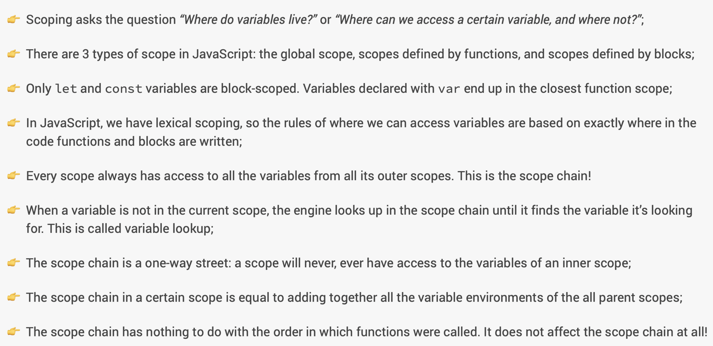

# JavaScript

> _JavaScript: Don't judge me by my bad parts, learn the good stuff and stick with that!_
>
> -Eric Freeman

> _"There's almost nothing that you can't build after getting really good at JavaScript, inside or outside of the browser."_
>
> -Jonas Schmedtmann

<br>
<br>

## Overview

This guide will serve as a reference point for JavaScript fundamentals, syntax, tips, tricks and best practices. For quick testing, you can use the console or one of many free websites that allow you to write and test code. Keep in mind that all notes here assume you are using `strict mode`.

<br>

The material I've found is a mixture of:

-   Udemy - [The Complete JavaScript Course](https://www.udemy.com/course/the-complete-javascript-course/)

-   [MDN docs](https://developer.mozilla.org/en-US/)

-   [Stackoverflow](https://stackoverflow.com/)

-   [JS bin](https://jsbin.com/?js,console) _(For quickly testing code snippets)_

-   Other various websites

<br>
<br>

---

## **Quick tips**

<br>

-Comment out code with `//` for a single line comment, or a multi-line code with `/**/`.

-Use `typeof` to deterine a data type's value.

-Iterables are arrays, strings, maps, sets but **not** objects.

<br>
<br>

## **Dom Manipulation**

<br>

Selecting a class or ID.

```js
document.querySelector('.className'); // Only matches first occurence, not all elements with the class.

document.querySelectorAll('.className'); // Matches all occurences.

document.querySelector('#IDName');
```

<br>

Listening for events and adding event handlers

```js
// Syntax: document.querySelector('.className').addEventListener('event', function (event object) {});

// The event argument is useless here though.
document.querySelector('.modal').addEventListener('click', function (event) {
    openModal();
});

// So we could refactor it like this:

// The 'openModal' is a pointer at a function that would open the modal window.
document.querySelector('.modal').addEventListener('click', openModal);
```

<br>

You can listen for keystrokes with the `keypress`, `keydown` or `keyup` event, which are all similar with small changes. One notable difference is that they `keyup` event will only occur **after** you release the key, the other 2 will occur immediately when you press the key, and will continue to trigger as you hold down on the key.

```js
document
    .querySelector('.className')
    .addEventListener('keystroke / keydown / keyup', function (event) {
        console.log(event.key); // Outputs the key that you pressed in the console.
    });
```

<br>
<br>

Here's a bigger and more complete example of opening and closing a modal window using JavaScript to manipulate classes based on click and keystroke events.

```js
'use strict'; // Enable strict mode, this is recommended to avoid silent errors.

// modal window that will appear and disappear on click.
const modal = document.querySelector('.modal');

// Makes the rest of the screen darker to focus on the modal(pop-up) window.
const overlay = document.querySelector('.overlay');

// Buttons that will open the modal when clicked.
const btnOpenModal = document.querySelectorAll('.open-modal');

// Button that will close the modal when clicked.
const btnCloseModal = document.querySelector('.close-modal');

// Function to close the modal window
const closeModal = () => {
    modal.classList.add('hidden');
    overlay.classList.add('hidden');
};

// Function to open the modal window
const openModal = function () {
    modal.classList.remove('hidden');
    overlay.classList.remove('hidden');
};

// Loops through each button that opens the modal and adds an event listener for clicks.
for (let i = 0; i < btnOpenModal.length; i++) {
    btnOpenModal[i].addEventListener('click', openModal);
}

// Adds an event listener on the 'x' or close button, to use the closeModal function to close the modal when clicked.
btnCloseModal.addEventListener('click', closeModal);
overlay.addEventListener('click', closeModal);

// Adds an event listener on the entire 'document' to call the closeModal function to close the modal.
// This will only happen if the escape key is released AND the modal DOES NOT contain a class named 'hidden'.
// Notice the 'not' operator in the if statement, reversing 'contains' to 'does not contain'.
document.addEventListener('keyup', event => {
    if (event.key === 'Escape' && !modal.classList.contains('hidden'))
        closeModal();
});
```

<mark>**finish these:**</mark>

-   Add notes on classList.toggle

<br>
<br>

## **Copying an object**

Simply creating a new object and assigning it the value of another object, will not **copy** that object, instead it will create 2 variables that <mark>point to the same object</mark> in memory. Here's how you can create a real copy of an object using `Object.assign`.

<br>
<br>

### **Using Object.assign**

<br>

The `Object.assign` function merges 2 objects and then returns a new one. So if we merge an empty object with the desired object, this will create an entirely new object.

```js
const charizard = {
    height: '1.7m',
    type: 'fire'
};

const ditto = Object.assign({}, charizard);
ditto.type = 'normal';
console.log(charizard.type); // Outputs "fire"
console.log(ditto.type); // Outputs "normal"
```

<br>
<br>

But this only creates a **_shallow_** copy, meaning if that object had another object nested inside, it would only copy the top level object, meaning the nested object would be lost.

```js
const charizard = {
    height: '1.7m',
    type: 'fire',

    // This example works because Arrays are a special type of object.
    moves: ['flamethrower', 'fly', 'fire spin']
};

const ditto = Object.assign({}, charizard);
ditto.moves.push('transform');

// Outputs: ['flamethrower', 'fly', 'fire spin', 'transform']
console.log(charizard.moves);
// Outputs: ['flamethrower', 'fly', 'fire spin', 'transform']
console.log(ditto.moves);
```

<br>
<br>

As you can see above, Charizard was indeed copied, but the moves array(_object_) inside was not copied, it still points to the same object in memory. So although Ditto and Charizard are unique, their **moves** are the same. This is what we mean by a _shallow_ copy. Creating a **_deep_** copy is actually more complex and usually requires the use of a 3rd party library.

<br>
<br>

## **Destructuring**

Destructuring is a JavaScript(ES6) expression that makes it possible to unpack values from arrays, or properties from objects, into distinct variables.

<br>

Old way

```js
const flavours = ['strawberry', 'banana', 'blueberry'];
const strawberry = flavours[0];
const banana = flavours[1];
const blueberry = flavours[2];
```

<br>

With destructuring

```js
const flavours = ['strawberry', 'banana', 'blueberry'];
const [strawberry, banana, blueberry] = flavours;
```

<br>

Similarly, if you want to grab only specific elements in an Array, you can just skip the ones you don't want by leaving a blank space.

```js
const testResults = {
    math: 'B',
    science: 'A',
    english: 'A',
    history: 'C',
    subjects: ['math', 'science', 'english', 'history']
};

// We skip the first element here and don't include the last one.
const [, award1, award2] = testResults.subjects;
// Outputs 'science' then 'English'
console.log(award1, award2);

// We skip english and science here.
const [math, , , history] = testResults.subjects;
// Outputs 'math' and 'history'
console.log(math, history);
```

<br>
<br>

### **Swapping values with Destructuring**

Without destructuring, if you wanted 2 variables to trade values, you would need to create a temporary variable.

```js
let goodLunch = 'pizza';
let badLunch = 'sandwhich';
let paperBag = badLunch; // Temporary variable

let badLunch = goodLunch; // pizza
let goodLunch = paperBag; // sandwhich
```

<br>

With destructuring we no longer need to create a temporary variable. This is a great trick to easily swap values. But keep in mind when [destructuring objects](#destructuring-objects), we need to wrap the expression in parentheses.

```js
let goodLunch = 'pizza';
let badLunch = 'sandwhich';

[goodLunch, badLunch] = [badLunch, goodLunch];
console.log(goodLunch); // Outputs sandwhich
console.log(badLunch); // Outputs pizza
```

<br>
<br>

### **Destructuring nested Arrays**

Destructuring arrays that are nested in arrays is the same process, you just have to destructure the inner array as well. So yes, destructuring inside of destructuring.

```js
const friends = ['bob', 'henry', ['carla', 'sam']];
const [bob, , [carla, sam]] = friends; // Skips henry and destrucures carla and sam

console.log(bob, carla, sam); // Outsputs 'bob' 'carla' and 'sam'
```

<br>
<br>

### **Destructuring Objects**

To destructure with objects, we no longer use the **square brackets**, instead we use the **curly braces**. And since objects don't have any order, we don't need to skip over elements, instead what's important is making sure we use the **property names** when destructuring.

<br>

If we want to create unique variable names, then you must write the property name with a colon, and then the desired variable name.

```js
const hospital = {
    name: 'General hospital',
    staff: ['doctors', 'nurses', 'clerical'],
    hours: {
        mon: '24hrs',
        tue: '24hrs',
        wed: '24hrs',
        thu: '24hrs',
        fri: '24hrs',
        sat: '24hrs',
        sun: '24hrs'
    }
};

// changing hours to availability
const { name, hours: availability, staff } = hospital;
console.log(name, availability, staff);

/*
"General hospital"
{
  fri: "24hrs",
  mon: "24hrs",
  sat: "24hrs",
  sun: "24hrs",
  thu: "24hrs",
  tue: "24hrs",
  wed: "24hrs"
}
["doctors", "nurses", "clerical"]
*/
```

<br>

You can also provide default values in case the object doesn't have the property you're trying to access.

```js
const hospital = {
    staff: ['doctors', 'nurses', 'clerical'],
    hours: {
        mon: '24hrs',
        tue: '24hrs',
        wed: '24hrs',
        thu: '24hrs',
        fri: '24hrs',
        sat: '24hrs',
        sun: '24hrs'
    }
};

const {
    // name does not exist so the default value will be used.
    name = 'Unknown hospital',

    // we create a variable called availability which holds the value of the hours property, and if there were no hours property, it would have a default value of the object {everyday: '24hrs'}
    hours: availability = { everyday: '24hrs' },

    // We grab the staff property as usual, no changes.
    staff
} = hospital;
console.log(name, availability, staff);

/*
"Unknown hospital"
{
  fri: "24hrs",
  mon: "24hrs",
  sat: "24hrs",
  sun: "24hrs",
  thu: "24hrs",
  tue: "24hrs",
  wed: "24hrs"
}
["doctors", "nurses", "clerical"]
*/
```

<br>
<br>

### **Updating Values with Object Desctructuring**

Updating multiple values at once with object destructuring is possible and similar to array destructuring, the only difference is that if a line begins with curly braces, JavaScript expects a code block. So we need to wrap the expression in parentheses.

```js
let a = 0;
let b = 1;

const object = {
    a: 10,
    b: 20,
    c: 30
};

// This won't work since a and b are already defined.
let {a, b} = object

// This won't work because JS expects a code block.
// Uncaught SyntaxError: Unexpected token '='
{a, b} = object

// Valid syntax
({a, b} = object)

console.log(a, b) //Outputs 10, 20
```

<br>
<br>

### Destructuring nested objects

```js
const house = {
    windows: 4,
    door: 1,
    satellite: false,
    rooms: {
        bathrooms: 1,
        bedrooms: 2,
        kitchen: 1,
        basement: 'In construction'
    },
    floors: 1
};

// fetching the value for house.rooms.kitchen and naming it 'chefRoom'
const {
    rooms: { basement: manCave }
} = house;

console.log(manCave); // Outputs 'In construction'
```

<br>
<br>

## **The Spread Operator**

<br>

The spread operator (`...`) is denoted by using 3 dots. It takes all values out of an array and **_spreads_** the individual values out where desired.

```js
const array = [4, 5, 6];
const oldWay = [1, 2, 3, array[0], array[1], array[2]];
const withSpread = [1, 2, 3, ...array];

// Both output [1, 2, 3, 4, 5, 6]
console.log(oldWay, withSpread);
```

<br>
<br>

This also works with nested arrays.

```js
const hospital = {
    patients: 286,
    doctors: ['Dr. House', 'Dr. Apt.', 'Dr. Seuss', 'Dr. Pepper'],
    ambulances: 4
};

const lifeSavers = [...hospital.doctors, 'Dr. Octopus'];

// Outputs ['Dr. House', 'Dr. Apt.', 'Dr. Seuss', 'Dr. Pepper', 'Dr. Octopus']
console.log(lifeSavers);
```

<br>
<br>

You might be thinking that the `spread` operator is similar to `destructuring`, since both help us get elements out of arrays. The difference is, the `spread` operator takes **all** elements out of an array, and it does not create new variables. Also, we can only use it in places where we would write values seperated by a comma.

<br>

So we can only use the `spread` operator when building an array or when passing multiple values into a function.

```js
const string = 'ABC123';
const usingSpread = [...string];

// Array, outputs ['A', 'B', 'C', '1', '2', '3', ]
console.log(usingSpread);

// Function, outputs 'A' 'B' 'C' '1' '2' '3'
console.log(...string);
```

<br>
<br>

### **Using the Spread Operator with Objects(ES2018)**

```js
const supper = {
    main: 'pasta',
    side: 'salad',
    appetizer: ['bread', 'butter'],
    drink: 'wine',
    getBill: function () {
        console.log('Cheque please!');
    }
};

supper.getBill();

const sameAsShesHaving = {
    ...supper,
    drink: 'water'
};

console.log(sameAsShesHaving.drink);
console.log(supper.drink);
```

<br>
<br>

## **The Rest Pattern**

The rest pattern has the same syntax as the `spread` operator (`...`) but it does the opposite of what the spread operator does. The rest pattern will take the remaining elements and put them in an array, as opposed to taking elements out of an array.

<br>

```js
const [a, b, ...restOfArray] = [1, 2, 3, 4, 5];

/*
a = 1
b = 2
restOfArray = [3, 4, 5]
*/
```

<br>
<br>

### **Rest parameters**

You can also use the rest pattern in a function's parameters. This will allow the user to use as many arguments as desired when calling the function.

<br>

```js
const repeatAfterMe = function (...strings) {
    console.log(...strings);
};
const test = [3, true, { test: 'test' }]; // Random array

// Outputs all arguments to the console.
repeatAfterMe('test', 'test2', test, 5);
```

<br>
<br>

## **Understanding JS** _(theory)_

This section will hold notes on how JavaScript actually functions _under the hood_. There will be code examples and pictures to explain the concepts, but these aren't tips or syntax guides for writing code, this is to better understand the code we write and execute daily.

<br>
<br>

### **The JavaScript Engine**

A JavaScript engine is what allows JS code to run in or outside of the browser. Every browser has their own JS engine, but the most popular is the V8 engine used in Chrome and Node.js.

<br>
<br>

### **Compilation VS Interpretation**

Computers only understand 0s and 1s, what we write is "human" code that must then be translated for the cpu to understand. This can be done with either `compilation` or `interpretation`.

<br>
<br>

### **Compilation**

The entire code is converted into machinde code and written to a binary file that a computer can understand and execute. But technically, you can compile that code and execute it at a later date, that's where `interpretation` differs.

<br>
<br>

### **Interpretation**

There's an interpreter that runs through the source code and executes it line by line. It still gets converted to machine code, but it only happens right before it's executed and not earlier. JavaScript used to be an interpreted language, but the problem is that interpreted languages are much slower than compiled languages. With modern JS, low performance is no longer acceptable, so it uses a mix of compilation and interpretation.

<br>
<br>

### **Just-in-time** _(JIT)_ **compilation**

The entire code is convereted into machine code and then executed right away, as opposed to line by line or compiling all the code in a binary file and executing it later. This is a mixture of interpretation and compilation, but there's no portable binary file to execute later.

<br>
<br>

### **JavaScript engine** _(cont.)_

So how does the JS engine read our code? There are a few steps the engine takes to translate and read/execute our code.

1. Parsing
2. Compilation
3. Execution
4. Optimization

<br>
<br>

### **Parsing**

First it reads the code and translates _(or **parses**)_ it into the `Abstract Syntax Tree`_`(AST)`_ data structure. This splits up each line of code into pieces and saves them in a structured tree, but it has nothing to do with the `DOM` tree, it's simply a representation of the code we write inside inside of the engine. It also checks for errors during the process.

<br>


<br>

### **Compilation**

During compilation the engine compiles the generated `AST` code into machine code(_011101010011_), then executes that code immediately because of [JIT compilation](#just-in-time-jit-compilation).

<br>
<br>

### **Execution**

Execution is when the code is finally run(_or **executed**_) in the `call stack` immediately after compilation.

<br>
<br>

### **Optimization**

Modern JS engines will execute a _first draft_ version of your code which isn't really optimized. But behind the scenes, it's optimizing your code and then swapping the executed code with the optimized version of that code. It can do this a few times without ever interrupting your executed code. This allows the code to load faster and run smoothly afterwards, and it happens in a completely separate place than the main thread in the call stack executing our code.

<br>
<br>

## **JS Runtime in the browser**

A runtime is like a box that contains all the JS related stuff we need. At the heart of a runtime is a JS engine, but there's more than just that.

<br>

1. `JS engine`
2. `Web APIs`
3. `Callback Queue`
4. `Event loop`

<br>
<br>

### **JS engine**

the Js engine consists of several parts, but it can be simplified to 2 core functions: the `memory heap` and the `call stack`. The memory heap stores our data(variables, objects, etc) and the call stack determines the order in which code should be executed.

<br>
<br>

### **The Execution Context**

Before talking about the execution context, we need to understand what `top-level` code is. Top-level code is code that's **outside** of any function. Top-level code will be executed before any code **inside** of functions.

<br>

JavaScript code **always** runs inside an execution context. An execution context is like a box or a room which holds a piece of code and the necessary information to execute it, such as arguments or local variables passed in a function. But no matter how large your file, there's only ever 1 **global** execution context which executes your top-level code.

<br>

> "Imagine you order a pizza... Usually that pizza comes in a box, and it might also come with some other stuff like cuttlery or a receipt... So in this analogy, the pizza is the JS code to be executed and the box is the execution context for our pizza..."
>
> -Jonas Schmedtmann

<br>

Each execution context has a variable environment (_which holds [const, let and var](#const-vs-let-vs-var) declarations, [functions](#functions) and an arguments object_), a [scope chain](#scopes) and a [this keyword](#the-this-keyword). There is an exception however, [arrow functions](#arrow-function-and-this) don't have the `this` keyword nor an `arguments object`.

<br>
<br>

### **The Call Stack**

Once the code is compiled, top-level code will start executing. First a `global execution context` will be created to run all the top-level code, which is code outside of any functions. After that, for every function call, a new execution context will be created containing all the necessary info to execute that function. The same goes for [methods](#adding-a-function-to-an-object)(_functions attached to objects_).

<br>

When all of the code has been executed, the engine will wait for callback functions such as a `click` event. This is possible thanks to the event loop which will provide these callback functions.

<mark>Finish this...</mark>


<br>
<br>

**Web APIs**

<mark>Finish this...</mark>

<br>
<br>

**Callback Queue**

<mark>Finish this...</mark>

<br>
<br>

**Event Loop**

The event loop takes callback functions from the callback queue and puts them in the call stack so they can be executed.
<mark>Finish this...</mark>

<br>
<br>

**JS Runtime in Node.js**

The runtime in Node is similar to the browser runtime but since it's not in the browser it does not have web API, since those are provided by the browser. Instead, there are C++ bindings and a thread pool.

<br>
<br>

## **Scopes**

Scopes determine where variables can be accessed from, depending on where they were declared. In JavaScript we use `lexical scoping`. That means the scope is determined by where you place functions and code blocks. In JavaScript we have the `global`, `function` and `block` scope.

<br>

All scopes can access variables of their parent scope. If you have a variable declared with a global scope, then a function(_`A`_), then another function inside that function(_`B`_), that last nested function(_`B`_) will still have access to variables in the global scope **through** its parent function(_`A`_). This is what we call the `scope-chain`.

<br>
<br>

### **Global scope**

Variables declared in the global scope are accessible from anywhere in the file.

```js
const name = 'Denzel';

console.log(name); // Outputs: 'Denzel'
```

<br>
<br>

### **Function scope**

Variables declared in a function scope(also called local scope) are only available in that function. In `strict mode`, functions are also block scoped.

```js
const dogSpeak = () => {
    const dog = {
        speak: 'bark'
    };
};

console.log(dog.speak); // ReferenceError
```

<br>
<br>

### **Block scope(ES6)**

Variables declared in a block scope are only available in that block. That is, code between curly braces, but only variables declared with `let` or `const`. If you use `var` to declare your variable, that variable will be accessible outside of the block. So we say `let` and `const` are `block scoped` while `var` is `function scoped`

<br>

```js
if (10 - 5 > 10) {
    const calculator = 'broken';
    var protractor = true;
}

console.log(calculator); // ReferenceError
console.log(protractor); // Outputs: true
```

<br>



<br>
<br>

## **Hoisting and TDZ**

Hoisting makes certain variables and functions available to use before they are declared, as long as they're in the same scope. The temporal dead zone (`TDZ`) is the space between the start of a scope and the beginning of the variable declaration where a variable **cannot** be accessed, because it was not declared yet. So if a variable is hoisted, it does not have a `TDZ`, since it's available even in the "_temporal dead zone_".

<br>


<br>


So function **declarations** and variables defined with `var` are hoisted, but function **expressions**, arrow functions and variables defined with `const` or `let` are not. If you attempt to use a variable defined with `var` before it's defined though, it's value will be `undefined`. If you try to use a function declaration before it's defined, it will still work.

<br>

That being said, it's best to avoid writing code like that. Avoid `var` at all costs and use `const` always unless the variable will change, in which case use `let`. No matter how you define a function, do it before you call it for cleaner code, and declare your variables at the top of their scope.

<br>
<br>

## **The `this` keyword**


<br>

Here are some examples:

```js
'use strict';

// Declared in the global scope, points at the "window" object.
console.log(this);

const nameLogger = function (name) {
    console.log(name);
    console.log(this);
};
// Undefined, it has a "this" keyword, but nothing to point to.
nameLogger('Denzel');

const nameLoggerArrow = name => {
    console.log(name);
    console.log(this);
};
// Arrow functions don't get "this" keyword, so it uses its parent scope "this" keyword, resulting in the "window" object.
nameLoggerArrow('Denzel');

const denzel = {
    fName: 'Denzel',
    lName: 'Braithwaite',
    nameLogger: function () {
        console.log(this.fName + ' ' + this.lName);
    }
};
// Points to the object in which it was called, its "owner".
denzel.nameLogger();
```

<br>
<br>

## **Primitive vs Reference types**

Everything in JS is either a [primitive data type](#values--variables) or an object. When talking about memory, we refer to primitives as `primitive types` and objects as `reference types`. This is because they're stored differently in memory in the [JavaScript engine](#the-javascript-engine).

<mark>Primitive types are stored in the call stack and reference types are stored in the memory heap.</mark>

<br>
<br>

### **Primitive types**

<br>

When you declare a variable, it seems as if the variable name is tied to the value, but that's not entirely true. Instead, the identifier points to an address and that address is what stores the value. So if we save a variable called age with a value of **30**, that variable points to the address **0001** for example, and **0001** holds the value of **30**.

```js
// Name is the identifier and 'Denzel' is the value.
const name = 'Denzel';
```

<br>

If we declare a new variable and assign it the value of the first variable, then they're both pointing to the **same address in memory**, but if we change our initial variable then a new address must be created.

```js
let age = 30; // memory address 0001
const oldAge = age; // memory address 0001
age = 31; // memory address 0002
```

<br>

Both variables are pointing to the address **0001** which holds the value **30**, but when our first variable **age** gets a new value, it needs to get a new address. Instead of changing the value of address **0001**(_which would reassign **all identifiers** values as well_) it instead creates a new address with a new value.


<br>
<br>

### **Reference types**

<br>

Reference types are similar but have a few key differences. If we create an object called **me**, the identifier is **me**, the address could be **0003** in this example, but the value in the **call stack** will actually be another address in memory, and that value will point to an address in the **memory heap** which holds the value of the **me** object; that's why we say they're _reference types_.

```js
const me = {
    name: 'Denzel',
    age: 26
};
```

<br>

So now if we create a new object called **friend** and assign it the value of the **me** object, then both will be pointing to the same address in the call stack memory, which points to the address in the memory heap, which of course holds the object. So what happens when we update a property on the **friend** object?

```js
const me = {
    name: 'Denzel',
    age: 26
};

const friend = me;
friend.age = 27; // Updates both objects
```

<br>

As far as the **call stack** is concerned, nothing really changed, they both point to the same address which points to the same value. In the memory heap, the address still does not change, only the value does.


<br>

This is why we can _update_ the object even though it was defined with `const`. The address never changes, only the value. However, the same would not be true for primitive values, which is why we can't reassign them if they're declared with `const`. So whenever you think you're **copying** an object, you're really just creating a new variable that **points to the same value** in memory.

<br>
<br>

## **Fundamentals**

<br>

### **Primitive data types**

...<mark>**finish this**</mark>

<br>
<br>

### **Values & Variables**

In JavaScript, every value is either an object or a primitive value. A value is only primitive if it's not an object.

<br>

There are 7 types of primitive data in JavaScript:

1. Number (Floating point numbers, always have decimals)
2. String (Sequence of characters in single or double quotes)
3. Boolean (true or false)
4. Undefined (variable declared with an empty value)
5. Null (no valuem similar to undefined)
6. Symbol (unique value that can't be changed)
7. BigInt (ES2020, supports larger integers than the `number` type)

<br>

### **Linking a JS file**

There are a few ways to link a...<mark>**finish this**</mark>

1. Using `<script>` tags.

2. Using a `style.js` file and linking it in your `html` file at the bottom of the `<body>`.

```js
<script src="script.js"></script>
```

<br>
<br>

### **`const` vs `let` vs `var`**

`const` is a modern(ES6) way to declare a variable with a block scope and no hoisting. You cannot reassign a `const` variable but you can update it if it's an array or an object for example _([read more](#reference-types))_. A `const` variable cannot be empty, it needs to be initialized with a value. Always decalre variables with `const` unless you know the variable will change, this can reduce the risk of potential bugs.

<br>

`let` is a modern(ES6) way to declare a variable with a block scope. `let` creates a variable that **can** be reassigned and is not hoisted. Only use `let` if you plan on reassigning your variable, otherwise use `const`.

<br>

`var` is the old way of declaring variables and it has a function scope. Variables declared with var in the global scope will add properties to the window(_global_) object as well, in general we should never use var anymore because it could lead to accidents. Var is als hoisted but if you call it before it's declared the value will be `undefined`.

<br>

Extra: You could also technically write `phoneType = 'iPhone'` without the use of a `keyword` such as `let` or `const` and it would seem like it still worked, but this would create a property on the `global object` and not a variable in your local scope.

<br>
<br>

## **operators**

There are many operators in the JavaScript language so it can be confusing to understand their purpose and when to use which. All operators fall into an operator category, which helps us understand where and when to use them.

[JS operator precedence reference table](https://developer.mozilla.org/en-US/docs/Web/JavaScript/Reference/Operators/Operator_Precedence#table)

<br>

**Types of operators**

-   Assignment Operators.
-   Arithmetic Operators.
-   Comparison Operators.
-   Logical Operators.
-   Bitwise Operators.
-   String Operators.
-   Other Operators.

<br>

### **Assignment operators**

-   `=`

-   `+=`

-   `-=`

-   `*=`

-   `/=`

-   `%=`

-   `**=`

<mark>finish this...</mark>

<br>
<br>

### **Arithmetic operators**

-   `+`

-   `++`

-   `-`

-   `--`

-   `*`

-   `**`

-   `/`

-   `%`

<mark>finish this...</mark>

<br>
<br>

### **Comparison Operators**

A comparison operator is something that compares 2 values(_called `operands`_) and determines if they are equal to each other or not. This is extremely common when determining if something is greater than, less than or equal to a value.

<br>

-   `==` is the _loose_ equality operator, it should be avoided since it's isn't as reliable as the _strict_ equality operator.

```js
console.log('1' == 1); // Outputs true.
```

-   `===` is the _strict_ equality operator, it compares 2 expressions and returns true if they're the same.

```js
console.log('1' === 1); // Outputs false, also checks type.
```

-   `!=` **loosely** checks if 2 values are **not** equal to eachother, but this should be avoided and the _strict_ operator should be used instead.

-   `!==` **strictly** checks if 2 values are **not** equal to eachother, also verifying they are the same **type**.
-   `>=` returns true if the left **operand** is greater than or equal to the right operand.
-   `<=` returns true if the left **operand** is less than or equal to the right operand.
-   `>` returns true if the left **operand** is greater than the right operand.
-   `<` returns true if the left **operand** is less than the right operand.

<br>
<br>

### **Logical Operators**

A logical operator is a symbol or word used to connect two or more expressions. If we wanted to perform an action, but **only** if certain conditions were true or false, logical operators make our lives much easier. The **AND** operator is represented by 2 ampersands `&&`, the **OR** operator uses 2 pipes `||` and the **bang** operator uses an exclamation point `!`.

<br>

-   `&&` compares 2 expressions, if both are `truthy`, it will return `true`, otherwise it returns `false`.
-   `||` compares 2 expressions, if at least 1 is `truthy`, it will return `true`, otherwise it returns `false`.
-   `!` Reverses a boolean value, something `truthy` will become `falsy` and vice versa.

<br>

```js
const hasVision = true;
const hasHearing = true;
const hasLegs = false;

console.log(hasVision && hasHearing);
// Outputs: true

console.log(hasVision && hasLegs);
// Outputs: false

console.log(hasVision || hasLegs);
// Outputs: true

console.log(hasVision && hasHearing && !hasLegs);
// Outputs: true
```

<br>
<br>

## **Short Circuit Evaluation**

Short circuiting is the use of logical operators in a different way than simply returning true or false. Short circuiting can technically return any value, and this is how it works.

It will look at the first `operand`(_value on the side of the operator_) and if it's `true`, it will skip the rest and simply return that value. But if both(_or all_) values are `false`, it will simply return the last `operand`.

```js
// Outputs 5, doesn't execute the rest
console.log(5 || 'the meaning of life' || false);

// Outputs 'the meaning of spice', doesn't execute the rest
console.log(0 || 'the meaning of spice' || false);
```

<br>

This is useful for writing less code when you want to check if a value exists. For instance, if this data exists, use it. If this data does not exist, do something else.

```js
let secretData = '1337TEEL';

// Outputs '1337TEEL'
console.log(secretData || 'You do not have access.');

secretData = '';

// Outputs 'You do not have access.'
console.log(secretData || 'You do not have access.');
```

<br>

It's also useful for assigning values condtionally. It can sometimes be a better approach than using a ternary operator to assign a value.

```js
const tip = 4;

// Using ternary operator
const bonus = tip ? tip : 0; // bonus = 4

// Using short circuit evaluation
bonus = tip || 0; // bonus = 4
```

<br>
<br>

### **The nullish coalescine operator `??`**

Added in **ES2020**, the weirdly named `nullish coalescine` operator is almost identical to using the logical **OR**(`||`) operator for short circuiting. The main difference is that the `??` will treat `0` and empty strings(`' '`) as **truthy** values. It will only treat **_NULLish_** values as `false`.

<br>

```js
let dailyTips;

// dailyTips will equal 5
dailyTips = 0 || 5;
dailyTips = null || 5;
dailyTips = undefined || 5;

// dailyTips will equal 0
dailyTips = 0 ?? 5;

// dailyTips will equal 5
dailyTips = null ?? 5;
dailyTips = undefined ?? 5;
```

<br>
<br>

However it should be noted that it works a little different in terms of precedence. Here's a quote from **MDN Docs**:

<br>

> The operands of nullish coalescing ?? (precedence 3) cannot be a logical OR || (precedence 3) or logical AND && (precedence 4). That means you have to write `(a ?? b) || c` or `a ?? (b || c)`, instead of `a ?? b || c`.
>
> [Read more](https://developer.mozilla.org/en-US/docs/Web/JavaScript/Reference/Operators/Operator_Precedence#table)

<br>
<br>

### **Short Circuiting with `&&`**

Short circuiting with `&&` works the exact opposite way short circuiting with `||` works. The logic is the same, but instead it will begin to _short circuit_ at the first negative value, instead of the first. If all values are **truthy** then it will return the last `operand`.

<br>

```js
// Outputs 'this' since it's the only truthy value.
console.log(0 || '' || 'this');

// Outputs 0 since it's the last truthy value.
console.log('' || '' || 0);

// Outputs true since it's the last value.
console.log(7 && 'ye' && true);

// Outputs false since it's the first falsy value
console.log(7 && false && 0);
```

<br>

This can also be a very useful replacement for writing small `if` statements. Say you only want to exececute a command based on a condition, you could write something like this.

```js
let hungry = true;
function orderPoutine() {
    console.log('Your order is on the way!!');
    hungry = false;
}

// With if statement
if (hungry) orderPoutine();

// with short circuiting
hungry && orderPoutine();
```

<br>
<br>

### **Short Circuiting with `||` and `&&`**

Although unlikely, there's aways a chance that one day you'll want to try using both the `||` and `&&` operators in one evaluation. When this is the case, if a value is between two different operators, the operator will evaluate the `operand` on the **left**.

<br>

```js
// The parentheses were added by my VS Code Prettier extension.
// Outputs false
console.log('' || (true && 1 && 0) || (false && 4));
```

-   In the example above we start with a **falsy** empty string `' '` which is on the left side of the `||` operator, so it does not get executed.

-   Next we have **true** on the left side of the `&&`, so it does not get executed.

-   Then we have a **truthy** `1` on the left side of the `&&`, so it does not get executed.

-   Next up we have a **falsy** `0` on the left side of the `||`, so it does not get executed.

-   Next we have `false` on the left side of the `&&` operator, **this will get executed.**

-   Lastly, we have a 4, but this will not execute due to [_short circuiting_](#short-circuit-evaluation)

<br>
<br>

## **Optional Chaining(`?.`)**

<mark>**finish this**</mark>

<br>
<br>

## **Working with Strings**

There are many methods we can use to work with strings, the reason why this is possible is because JavaScript works behind the scenes to turn your string into a string object with the same content, and the methods are actually called on **that** object, this concept is called **boxing**. Here are some common operations we perform on strings.

<br>

**Accessing an element in a string.**

```js
const myString = '1A2BA';

console.log(myString[0]); // Outputs '1'.
console.log('B2A1'[0]); // Outputs 'B'.
```

<br>

**Accessing String properties**

```js
const myString = '1A2BA';

console.log(myString.length); // Outputs 5.
console.log('B2A1'.length); // Outputs 4.
```

<br>

**Finding the index of a character**

```js
const myString = '1A2BA';

console.log(myString.indexOf('A')); // Outputs 1, the first occurence.
console.log(myString.lastIndexOf('A')); // Outputs 4, the last occurence.
console.log(myString.indexOf('A2B')); // Outputs 1, beginning of first occurence.
```

<br>

**Extracting parts of a String**

You can extract parts of a string using the `slice()` method. You must provide an index as an argument. If you provide 1 index, it will slice from that character (_inclusive_) until the end of the string. If you provide 2 arguments, it will slice from the first index to the second index, but the second index is **_exclusive_**. Meaning it starts at the first argument but **does not** include the last argument.

You can also provide negative values, in which case the index will begin counting from the end, where **-1** is the last character, as opposed to the first character which starts at 0, since strings are **zero indexed**.

<br>

```js
const myString = 'Ready player 1';

console.log(myString.slice(6)); // Outputs 'player 1'.
console.log(myString.slice(6, 12)); // Outputs 'player'.
console.log(myString.slice(-8)); // Outputs 'player 1'.
console.log(myString.slice(6, -2)); // Outputs 'player'.
```

<br>

**Changing Strings to lower or upper case, no argument needed.**

```js
const myString = 'Ready player 1';

console.log(myString.toLowerCase()); // Outputs 'READY PLAYER 1'
console.log(myString.toUpperCase()); // Outputs 'ready player 1'
```

<br>

### **Concatenation**

```js
// Concatenation
const num = 5;
console.log('Hey ' + "I'm" + num + ' years old.');
```

<br>

### **Template literals**

Use template literals to create multi-line strings. Template literals expect `expressions` not `statements`.

```js
const num = 5;
console.log(`Hey I'm ${num} years old.`);

// Don't use a statement, this will raise an error.
console.log(`${let num = 5}`)
```

<br>
<br>

**Conditionals**

if statements:

```js
if (4 >= 5) {
    const magicNumber = 4;
    console.log(magicNumber);
    // Output: 4, but this code won't execute.
} else {
    const magicNumber = 5;
    console.log(magicNumber);
    // Output: 5, this code WILL run
}

if (true === true) console.log('This is also valid syntax');

if (true === false) {
    console.log("This won't run");
} else if (true) {
    console.log('This will run');
} else {
    console.log("This won't run");
}
```

The `conditional ternary operator (?)` is used to write a conditional statement in one line.

```js
const numOfBeers = 6;
numOfBeers <= 3 ? console.log('Drive home safely') : console.log('Take a cab');
```

<br>
<br>

`Type conversion vs coercion`

Conversion is when you explicitly want to convert one data type to another. Like changing a string to a number.

```js
const year = '2022';
console.log(typeof Number(year));
// Outputs
```

Coercion is when JavaScript implicitly converts a data type for you, such as concatenating strings and numbers turns numbers into a string.

```js
console.log(`This is a random number ${5}5`);
//  Outputs: 'This is a random number 55', JS converts the number to a string

console.log('5' - 5);
// Outputs: 0, JS converts the string to a number

console.log(1 + 2 + 3 + '4');
// Outputs: 64, when it reaches the string, it converts it.
```

<br>
<br>

**Falsy values**

1. false (boolean)
2. 0 (number type 0)
3. '' (empty string)
4. undefined
5. null
6. NaN

All other values are **_truthy_**

<br>
<br>

**Switch statement** <mark>**finish this**</mark>

```js
const food = 'salad';

switch (food) {
    case 'spaghetti': // if (food === 'spaghetti')
        console.log('Yay, spaghetti for supper today!');
        break;
    case 'burgers':
        console.log('Yay, burgers for supper today!');
        break;
    case 'salad':
        console.log('Aww, salad for supper today...');
        break;
    default:
        console.log("I gotta figure out what I'm eating today");
}
```

<br>
<br>

**`Expression` vs `Statements`**

An expression is a piece of code that produces a value.

```js
3 + 4; // This is an expression
2020; // This is an expression
true && true; // This is an expression
```

If declarations are complete senteces, expressions are like words that make-up that sentence.

```js
if (true) {
    const variableName = "Doesn't matter"; // This is a statement, doesn't produce any value.
}
```

<br>
<br>

**Strict mode**
Use strict mode by adding one line to the top of you js file. It must be the very first line (excluding comments, since they're ignore). This will forbid you from doing certain things and it will also raise visible errors in the console instead of failing silently.

Strict mode will also forbid the use of certain variable names if those names are reserved for future features / keywords that might be released.

```js
'use strict';
```

<mark>**finish this**</mark>

<br>
<br>

### **Functions**

Leave notes on all ways to create a function, how to call a function, what higher functions are, the return keyword, etc.

Functions are not a data type, they're a value. That's why we can store them in variables and use them in places that expect a value.

Function delcaration vs expression:

```js
// function declaration
function functionName(parameter) {
    // do something and or return something
}

// function expression
const functionName = function (parameter) {
    // do something and or return something
};

// Arrow functions
const functionName = parameter => {
    // Do something or return something
};
```

Function declarations are hoisted, so they can be used before they were declared, as opposed to function expression which requires the function to be defined before you can call it.
<mark>**finish this**</mark>

**Arguments**

When writing a function, you have the option to add `parameters`, these parameters will allow you to call the function and pass `arguments` in as values, which take the place of the `parameters`.

```js
const myFunction = function (parameter) {
    console.log(parameter);
};
myFunction('argument'); // Outputs: 'argument'
```

But you can actually provide more arguments than parameters and depending on the function, less arguments than parameters. The only problem is that you won't have a local variable defined in your function to access their values, so how do you use them, and what's the point?

Well, there is a keyword called `arguments` that functions have access to, just like how functions have the `this` keyword. This represents an array of arguments passed to that function, and you iterate through that value to access them all. This is useful if you ever have more arguments than parameters. However remember, <mark>the arguments keyword does not exist in arrow functions, only regular function expression and declaration.</mark>

<br>
<br>

**Arrays**

<mark>**finish this**</mark>

<br>
<br>

**Array methods**

Arrays are zero indexed, meaning when you count the index of each item, you start at 0.

```js
const teaMenu = ['black', 'green', 'oolong', 'white', 'herbal'];

teaMenu.pop(); // Will remove the last item('herbal') from the array

teaMenu.push('yellow'); // Will add an item('yellow') to the end of the array

teaMenu.shift(); // Will remove the first item('black') from the array

teaMenu.unshift('black'); // Will add an item('black') to the beginning of the array

teaMenu.indexOf('oolong'); // outputs 2, black = 0, green = 1, oolong = 2

teaMenu.indexOf('guayusa'); // outputs -1 since the item does not exist in the array

teaMenu.includes('green'); // outputs true since the item exists in the array

teaMenu.length; // This is actually a property and not a method, it will return the length
```

<mark>**finish this**</mark>

<br>
<br>

## **Objects**

Objects have key - value pairs, the keys are also referred to as properties. The easiest way to create an object is by using the curly braces, this is called object literal notation.

```js
const denzel = {
    // Order doesn't matter, so the browser will display it in the console alphabetically, like this.
    age: 26,
    favoritecolors: ['teal', 'pink', 'purple']
    firstName: Denzel,
    friendly: true,
    lastname: Braithwaite,
};
```

<mark>**finish this**</mark>

<br>
<br>

### **Bracket notation vs dot notation**

You can access a property from an object by using either bracket or dot notation. The main difference is, when using square brackets, you can put any expression _(something that produces a value)_ between the brackets and it will work, but the same is not true for dot notation.

```js
const burger = {
    tomato: true,
    lettuce: true,
    onions: false,
    cheese: true,
    doublePatty: false,
    buns: true
};

const patty = 'Patty';

console.log(burger.tomato); // Outputs true
console.log(burger['double' + patty]); // Outputs false
console.log(burger.'double' + patty); // raises error: Unexpected String
```

<mark>**finish this**</mark>

<br>
<br>

**Adding properties**

```js
const burger = {
    buns: true,
    patty: true
};

// Adds the key/property tomato with a value of true.
burger.tomato = true;

// Adds the key/property onions with a value of false.
burger['onions'] = false;
```

<mark>**finish this**</mark>

<br>
<br>

### **Adding a function to an object**

Any function that is attached to an object is called a `method`. You can create an object method by add a function expression as a value for an object's property. This works since a property expects a value, and an expression produces a value.

```js
const computer = {
    mouse: 'Awesome mouse',
    keyboard: 'gaing keyboard',
    speakers: 'broken speakers',

    repairSpeakers: function () {
        return (this.speakers = 'Brand new speakers');
    },

    addHardware: function () {
        this.ram = '16GB ram';
        return;
    },
    // ES6+ can you this syntax instead for convenience
    addHardwareES6() {
        this.ram = '16GB ram';
        return;
    }
};

console.log(computer.repairSpeakers()); // Updates speakers property and outputs the value: 'Brand new speakers'.

console.log(computer['repairSpeakers']()); // Updates speakers property and outputs the value: 'Brand new speakers'.

computer.addHardware(); // Adds ram property with a value of '16GB ram'.
console.log(computer.ram); // Outputs the ram property.
```

But you should never use an <span id="arrow-function-and-this">arrow function</span> to create a method, that's because arrow functions don't have the `this` keyword, and will instead point to the parent. It's better to just use a function expression.

```js
const laptop = {
    brand: 'Windows',

    upgrade: function () {
        this.brand = 'Macbook Pro 2021';
        console.log('UPGRADED😤!!!');
    }
};
console.log(laptop.brand); // Outputs: Windows
laptop.upgrade(); // Outputs: UPGRADED😤!!!
console.log(laptop.brand); // Outputs: 'Macbook Pro 2021'

const desktop = {
    brand: 'Asus',

    downgrade: () => {
        this.brand = 'Acer';
        console.log('Downgraded😓...');
    }
};
console.log(desktop.brand); // Outputs: Asus
desktop.downgrade(); // Outputs: Downgraded😓...
console.log(desktop.brand); // Outputs: Asus

// Outputs: 'Acer', which is now a property on the global window object, NOT on the desktop object.
console.log(this.brand);
```

There is one situation where you could use an arrow function in a method, and that's if you add a function inside of a method. The function inside the method is technically just a normal function and therefore it doesn't have a `this` keyword. So in that case, it would be good to refer to the parent's `this` keyword.

```js
const laptop = {
    brand: 'HP',

    info: function () {
        const iAmAFunction = function () {
            console.log(this.brand);
        };
        iAmAFunction();
    }
};

// Outputs: Undefined, since there is no "brand" property on the window object.
laptop.info();

const desktop = {
    brand: 'Acer',

    info: function () {
        const iAmAFunction = () => {
            console.log(this.brand);
        };
        iAmAFunction();
    }
};

// Outputs: Acer, since the arrow function doesn't have a "this" keyword, it points to the parent.
desktop.info();
```

An alternative would be to create a variable called `self` or `that`(_name doesn't matter_) outside of that function's scope but still in the method scope, then assign the value of `this` to `self`, and call `self` in the function instead of `this`. But this was the pre ES6 solution.

<br>
<br>

## **Sets**

A set is a colleciton of unique values, so it can never have any duplicates. You create one by typing `new Set` and then passing in an iterable as an argument. Sets do not replace arrays, use sets when you want to work with unique values, but otherwise use arrays.

<br>

```js
const showSet = new Set([
    'Family Guy',
    'The Simpsons',
    'King of the Hill',
    'South Park',
    'American Dad',
    'Family Guy'
]);

// Outputs unique values, Family Guy will only print once.
console.log(...showSet);
```

The `set` above has **6** items, but its `size`(_not length with sets_) property is only **5**, since **1** is a duplicate. You could also pass a **string**(_also an iterable_) but not an **object**(_not iterable_). With sets it's important to remember that the order doesn't matter, unlike **arrays**.

<br>

Similar to the `.includes?()` method for arrays, sets have the `.has()` method to check if a value exists within the set, along with a few other similar methods. But there is no way to retrieve data from a set, unlike arrays that have indexes.

```js
const showSet = new Set(['Family Guy', 'The Simpsons', 'Family Guy']);

// Outputs false since the value doesn't exist within the set.
console.log(showSet.has('Futurama'));

// Adds Futurama to the set twice
showSet.add('Futurama');
showSet.add('Futurama');

// Outputs unique values only, Futurama is only added once.
console.log(showSet);

// Deletes an item in the set.
showSet.delete('Futurama');

// Deletes the entire set
showSet.clear();

// Looping works as normal since it's an iterable
for (const show of showSet) console.log(show);
```

<br>

Converting an array to a set and a set to an array can be achieved very easily, since both are iterables, both can use the **spread(_..._)** operator.

```js
let tvShows = ['Breaking Bad', 'Lost', 'Manifest', 'Lost'];
const tvShowSet = new Set(tvShows);
tvShows = [...tvShowSet];

// Both output 'Breaking Bad', 'Lost', 'Manifest' as a set / array.
console.log(tvShows);
console.log(tvShowSet);
```

<br>
<br>

## **Maps**

In JavaScript, a map is a data structure that's used to map values to keys, creating key-value pairs. The big difference between objects and maps is that map keys can be any type. In objects, the keys are always strings, but with maps the keys could be anything, even another map.

<br>

```js
// Syntax to create an empty map using a constructor
const mapExample = new Map();

// Adding a key-value pair to the map using the set method.
mapExample.set('I am the Key', 'I am the value');
mapExample.set(1337, 'LEET');

// Chaining the set method to add multiple entries at once.
mapExample
    .set('first chain', ['first', 'chain'])
    .set('second', 2)
    .set('Hello', 'World')
    .set(true, 'false');

console.log(mapExample);
/* Outputs
{
    "I am the Key" => "I am the value",
    1337 => "LEET",
    "first chain" => ["first", "chain"],
    "second" => 2,
    "Hello" => "World",
    true => "false"
}
*/

// Adding items to the map without using the set() method
const mapExample2 = new Map([
    // Every array is a new key-value pair
    ['I am the key', 'I am the value'],
    ['Key2', 'value2'],
    [131, true]
]);
```

<br>

If you want to read data from a map, you can do so using the `.get()` method, passing in the **key** name as an argument.

```js
const employees = new Map();
employees.set(154854868, 'Denzel Washington');

// Outputs 'Denzel Washington'
console.log(employees.get(154854868));
```

<br>

Just like sets have similar methods to arrays, maps also have similar methods to sets. For example, you can use the `.has()` method to check if a value exists within the map.

```js
const kfcMenu = new Map();
kfcMenu.set(1, 'fried chicken').set(2, 'fries');

// Outputs false since kfcMenu doesn't contain a 'drinks' key.
console.log(kfcMenu.has('drinks'));

// Deleting '2 => 'fries' pair using the key name.
kfcMenu.delete(2);

// Checking size(length) property, outputs 1 since fries were deleted.
console.log(kfcMenu.size);

// Clearing the entire map
kfcMenu.clear();
```

<br>
<br>

### **Iterating over Maps**

```js
const mapIteration = new Map([
    [1, 'a'],
    [2, 'b'],
    [3, 'c']
]);

// Using destructuring to loop over map keys and values
for (const [key, value] of mapIteration) {
    if (typeof (key === 'number')) {
        console.log(`The answer for ${key} is ${value}`);
    }
}

/* Outputs:
"The answer for 1 is a"
"The answer for 2 is b"
"The answer for 3 is c"
*/
```

<mark>finish this...</mark>

<br>
<br>

## Arrays vs Sets and Objects vs Maps


<br>
<br>

## **Loops**

Loops are useful when you want to iterate or '_loop_' over data a certain number of times.

### **`for` Loop**

The `for` loop will keep running while the condition is true. If the code block is only 1 line, you can omit the curly braces.

syntax:

```js
for (let counter = 1; counter <= 10; counter++) {
    if (counter === 10) {
        console.log(`${counter} chubby bunny 🐰🐰!!!`);
    } else {
        console.log(`${counter} chubby bunny 🐰!`);
    }
}

/*
Outputs:
"1 chubby bunny 🐰!"
"2 chubby bunny 🐰!"
"3 chubby bunny 🐰!"
"4 chubby bunny 🐰!"
"5 chubby bunny 🐰!"
"6 chubby bunny 🐰!"
"7 chubby bunny 🐰!"
"8 chubby bunny 🐰!"
"9 chubby bunny 🐰!"
"10 chubby bunny 🐰!!!"
*/

// Simple for loop
for (let i = 0; i > 3; i++) console.log(i);
```

<mark>**finish this**</mark>

<br>
<br>

### `for of` loop

The `for of` loop _(for each item of the array)_ will loop through the entire array and allow us to do something to each element. Just like the `for` loop, you can use **keywords** like `continue` and `break`.

```js
const menu = ['milk', 'cheese', 'eggs', 'bread'];
for (const item of menu) console.log(item);
```

<br>

To get the index of each array, you need to use the `.entries()` method.

```js
const menu = ['milk', 'cheese', 'eggs', 'bread'];
for (const item of menu.entries()) console.log(item);

/*
Outputs:
[0, "milk"]
[1, "cheese"]
[2, "eggs"]
[3, "bread"]
*/
```

<br>
<br>

### **Looping over object keys(_properties_)**

To loop over object keys, you can use the `Object.keys()` method.

```js
const languageTypes = {
    computer: ['JavaScript', 'Ruby', 'Python', 'PHP'],
    human: {
        french: ['France', 'Quebec', 'Africa'],
        english: ['America', 'England', 'Australia']
    },
    animal: ['Dog', 'Cat', 'Bird']
};

for (const type of Object.keys(languageTypes)) {
    console.log(type);
}
```

<br>

<mark>**finish this**</mark>

<br>
<br>

### **Looping over object values**

To loop over object values, you can use the `Object.values()` method.

```js
const languageTypes = {
    computer: ['JavaScript', 'Ruby', 'Python', 'PHP'],
    human: {
        french: ['France', 'Quebec', 'Africa'],
        english: ['America', 'England', 'Australia']
    },
    animal: ['Dog', 'Cat', 'Bird']
};

// Outputs all property values for the object.
for (const value of Object.values(languageTypes)) {
    console.log(value);
}

// Outputs all values for the object property.
for (const value of Object.values(languageTypes.computer)) {
    console.log(value);
}
```

<br>
<br>

### **Looping over an entire object**

To loop over an entire object, not **just** the properties or the values, you can use the `Object.entries()` method. When looping over **arrays**, we use a similar syntax `arrayName.entries()`, but we don't use the keyword `Object` and pass the object in as an argument.

```js

```

<mark>Finish this...</mark>

<br>
<br>

**`Continue` and `Break` statement**

Continue is used to exit the current iteration of the loop, and continue to the next one. Break is used to completely stop the loop.

`Continue:`

```js
// Using 'if (x % 2 === 0)' will determine if a number is even.
for (let i = 0; i <= 20; i++) {
    if (i % 2 === 0) {
        console.log(i);
    }
}

/*
Outputs:
0
2
4
6
8
10
12
14
16
18
20
*/

// Using the keyword 'continue' skips a number if it is NOT cleanly divisible by 2, meaning, if the number is odd.
for (let i = 0; i <= 20; i++) {
    if (i % 2 > 0) {
        continue;
    }
    console.log(i);
}

/*
Outputs:
0
2
4
6
8
10
12
14
16
18
20
*/
```

`Break:`

```js
// Using the keyword 'break' breaks the iteration/loop if the condition is met.
for (let i = 0; i <= 10; i++) {
    if (i === 5) {
        break;
    }
    console.log(i);
}

// Outputs 0, 1, 2, 3, 4
```

<mark>**finish this**</mark>

<br>
<br>

**Loops inside of loops**

Nesting loops inside of loops is pretty simple, the difficult part is wrapping your head around the logic, but once that sinks in, it's really quite simple.

```js
const letters = ['a', 'b', 'c'];
const numbers = [1, 2, 3, 4, 5];

for (
    let letterCounter = 0;
    letterCounter <= letters.length - 1;
    letterCounter++
) {
    for (let numIndex = numbers.length - 1; numIndex >= 0; numIndex--) {
        console.log(
            `current letter: ${letters[letterCounter]} and the current number is ${numbers[numIndex]}`
        );
    }
}
```

I may have slightly overcomplicated this, but it was to show the flexibility of nesting loops inside of loops, such as having one counter that increments(`++`) and another that decrements(`--`).

<mark>**finish this**</mark>

<br>
<br>

**While loops**

```js
let pushups = 0;

while (pushups <= 9) {
    pushups++;
    console.log(`${pushups} pushups! 💪🏽`);
}

/*
Outputs:
"1 pushups! 💪🏽"
"2 pushups! 💪🏽"
"3 pushups! 💪🏽"
"4 pushups! 💪🏽"
"5 pushups! 💪🏽"
"6 pushups! 💪🏽"
"7 pushups! 💪🏽"
"8 pushups! 💪🏽"
"9 pushups! 💪🏽"
"10 pushups! 💪🏽"
*/
```

<mark>**finish this**</mark>

<br>
<br>

## **Fun facts**

If you `typeof null` the console will tell you it's an `object`, but this is a bug in JavaScript that's not corrected for legacy reasons.

If you use `typeof NaN` the console outputs 'Number', so "_Not a number_" is technically a number.

---

## **Resources**

<br>

Udemy - [The Complete JavaScript Course](https://www.udemy.com/course/the-complete-javascript-course/)
