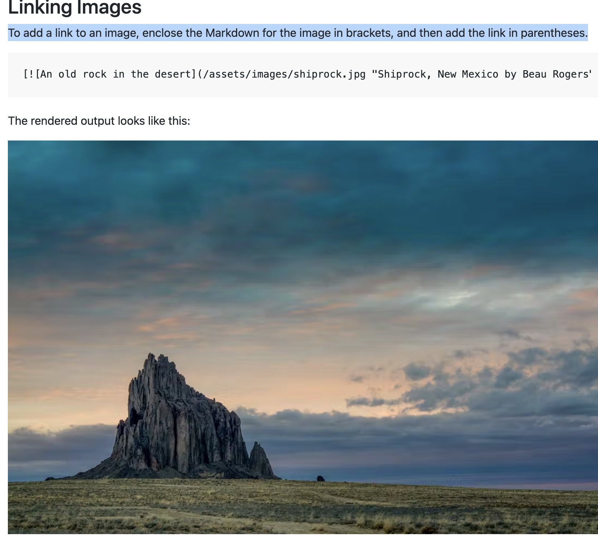
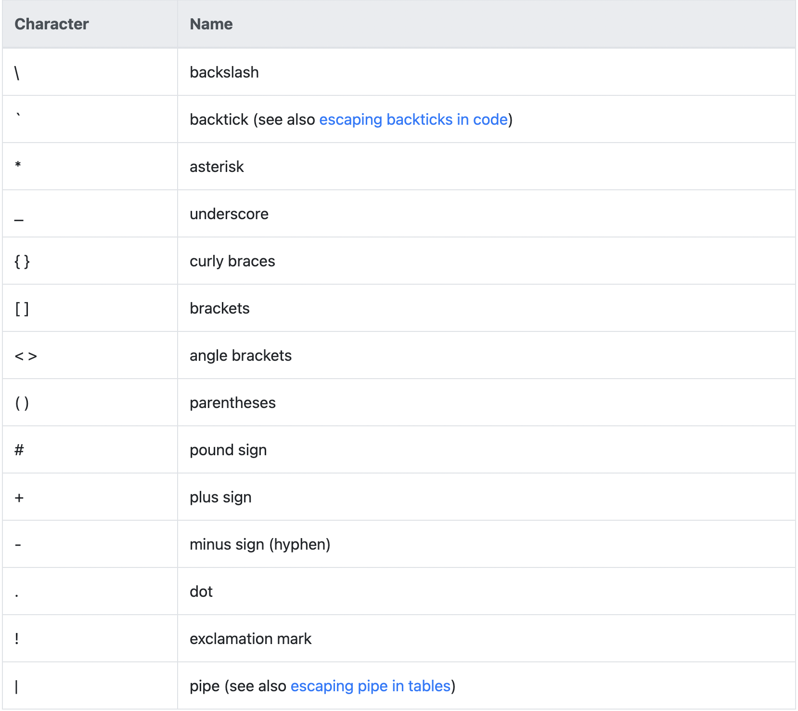

# **Markdown Language**

_Cheatsheet for .md syntax_

<br>

## **Overview**

Nearly all Markdown applications support the basic syntax outlined in the original Markdown design document. There are minor variations and discrepancies between Markdown processors — those are noted inline wherever possible.

<br>

## **Headings**

To create a heading, add number signs (#) in front of a word or phrase. The number of number signs you use should correspond to the heading level. For example, to create a heading level three (\<h3>), use three number signs (e.g., ### My Header).

<br>

# Heading level 1 <!-- Alt: <h1>Heading level 1</h1> -->

## Heading level 2 <!-- Alt: <h2>Heading level 2</h2> -->

### Heading level 3 <!-- Alt: <h3>Heading level 3</h3> -->

#### Heading level 4 <!-- Alt: <h4>Heading level 4</h4> -->

##### Heading level 5 <!-- Alt: <h5>Heading level 5</h5> -->

###### Heading level 6 <!-- Alt: <h6>Heading level 6</h6> -->

<br>

## Heading Best Practices

Markdown applications don’t agree on how to handle a missing space between the number signs (#) and the heading name. For compatibility, always put a space between the number signs and the heading name.

✅ Do this: `_# Heading_`  
❌ Don't do this: `_#Heading_`

<br>

___

## **Paragraphs**

To create paragraphs, use a blank line to separate one or more lines of text.

<!-- Or use <p> tags </p> -->

_Note: If you need to indent paragraphs in the output, see the section on how to indent (tab)._
_Don't put tabs or spaces in front of your paragraphs, keep them left-aligned._

<br>

✅ Do this: 'Hello World'  
❌ Don't do this: ' Hello World'

<br>

___

## **Line Breaks**

To create a line break or new line (\<br>), end a line with two or more spaces, and then type return.

<br>

## Line Break Best Practices

You can use two or more spaces (commonly referred to as “trailing whitespace”) for line breaks in nearly every Markdown application, but it’s controversial. It’s hard to see trailing whitespace in an editor, and many people accidentally or intentionally put two spaces after every sentence. For this reason, you may want to use something other than trailing whitespace for line breaks. If your Markdown application supports HTML, you can use the \<br> HTML tag.

_For compatibility, use trailing white space or the \<br> HTML tag at the end of the line._

<br>

✅ Do this: trailing 2 spaces`__` or `<br>`  
❌ Don't do this: ending sentence with `\`

<br>

___

## **Emphasis**

You can add **_emphasis_** by making text **bold** or _italic_.

<br>

## Bold

To bold text, add two asterisks or underscores before and after a word or phrase. To bold the middle of a word for emphasis, add two asterisks without spaces around the le**tt**ers.

### Bold Best Practices

Markdown applications don’t agree on how to handle underscores in the middle of a word. For compatibility, use asterisks to bold the middle of a word for emphasis.

<br>

## Italic

To italicize text, add one asterisk or underscore before and after a word or phrase. To italicize the middle of a word for emphasis, add one asterisk without spaces around the letters.

<br>

### Italic Best Practices

Markdown applications don’t agree on how to handle underscores in the middle of a word. For compatibility, use asterisks to italicize the middle of a word for emphasis.

✅ Do this: `A*cat*meow` --> A*cat*meow  
❌ Don't do this: `A_cat_meow` --> A_cat_meow

<br>

## Bold and Italic

To emphasize text with bold and italics at the same time, add three asterisks or underscores before and after a word or phrase. To bold and italicize the middle of a word for emphasis, add three asterisks without spaces around the letters.

_Note: The order of the em and strong tags might be reversed depending on the Markdown processor you're using._

<br>

### Bold and Italic Best Practices

Markdown applications don’t agree on how to handle underscores in the middle of a word. For compatibility, use asterisks to bold and italicize the middle of a word for emphasis.

✅ Do this: `This is really***very***important text.` --> This is really***very***important text  
❌ Don't do this: `This is really___very___important text.` --> This is really___very___important text.

<br>

___

## **Blockquotes**

To create a blockquote, add a > in front of a paragraph.

Example: `> I am a blockquote.`

Output:
> I am a blockquote.

<br>

## Blockquotes with Multiple Paragraphs

Blockquotes can contain multiple paragraphs. Add a > on the blank lines between the paragraphs.
```
> Dorothy followed her through many of the beautiful rooms in her castle.
>
> The Witch bade her clean the pots and kettles and sweep the floor and keep the fire fed with wood.
```

Output:
> Dorothy followed her through many of the beautiful rooms in her castle.
> 
>The Witch bade her clean the pots and kettles and sweep the floor and keep the fire fed with wood.

<br>

## Nested Blockquotes

Blockquotes can be nested. Add a >> in front of the paragraph you want to nest.
```
> Dorothy followed her through many of the beautiful rooms in her castle.
>
> > The Witch bade her clean the pots and kettles and sweep the floor and keep the fire fed with wood.
```
Output:  
> Dorothy followed her through many of the beautiful rooms in her castle.
>
> > The Witch bade her clean the pots and kettles and sweep the floor and keep the fire fed with wood.

<br>

## Blockquotes with Other Elements

Blockquotes can contain other Markdown formatted elements. Not all elements can be used — you’ll need to experiment to see which ones work.

```
> #### The quarterly results look great!
>
> -   Revenue was off the chart.
> -   Profits were higher than ever.
>
>     _Everything_ is going according to **plan**.
```

Output:
> #### The quarterly results look great!
>
> -   Revenue was off the chart.
> -   Profits were higher than ever.
>
>     _Everything_ is going according to **plan**.

<br>

## Blockquotes Best Practices

For compatibility, put blank lines before and after blockquotes.

✅ Do this:
```
Try to put a blank line before...

> This is a blockquote

...and after a blockquote. Without blank lines, this might not look right.
```

❌ Don't do this:
```
Without blank lines, this might not look right.
> This is a blockquote
Don't do this!
```

<br>

___

## **Ordered Lists**

To create an ordered list, add line items with numbers followed by periods. The numbers don’t have to be in numerical order, but the list should start with the number one.

<br>

✅ Do this:
```
1. First item
2. Second item
3. Third item
4. Fourth item
    1. Tab or 4 spaces, use '1.' to start at 1.
    9. Doesn't matter what number you use afterwards
    3. It will count in order
20. Then stop nesting by removing tab / space
```
Output:
1. First item
2. Second item
3. Third item
4. Fourth item
    1. Tab or 4 spaces, use '1.' to start at 1.
    9. Doesn't matter what number you use afterwards
    3. It will count in order
20. Then stop nesting by removing tab / space

<br>

✅ Or do this:

```
<ol>
  <li>First item</li>
  <li>Second item</li>
    <ol>
        <li>First nested list item</li>
        <li>Second nested list item</li>
    </ol>
  <li>Third item</li>
  <li>Fourth item</li>
</ol>
```

Output:
<ol>
  <li>First item</li>
  <li>Second item</li>
    <ol>
        <li>First nested list item</li>
        <li>Second nested list item</li>
    </ol>
  <li>Third item</li>
  <li>Fourth item</li>
</ol>

<br>

## Ordered List Best Practices

CommonMark and a few other lightweight markup languages let you use a parenthesis ()) as a delimiter (e.g., 1) First item), but not all Markdown applications support this, 
so it isn’t a great option from a compatibility perspective. For compatibility, use periods only.

<br>

✅ Do this:
```
1. First item
2. Second item
```

❌ Don't do this:
```
1) First item
2) Second item
```

<br>

## Unordered Lists

To create an unordered list, add dashes (-), asterisks (*), or plus signs (+) in front of line items. Indent one or more items to create a nested list.

✅ Do this:
```
- First item
- Second item
- Third item
- Fourth item
    - Tab or 4 spaces, use '1.' to start at 1
    - Doesn't matter what number you use afterwards
    - It will count in order
- Then stop nesting by removing tab / space
```

Output:
- First item
- Second item
- Third item
- Fourth item
    - Tab or 4 spaces to start nesting another list
    - Second item
- Then stop nesting by removing tab / space

<br>

✅ Or do this:
```
<ul>
  <li>First item</li>
  <li>Second item</li>
    <ul>
        <li>First nested list item</li>
        <li>Second nested list item</li>
    </ul>
  <li>Third item</li>
  <li>Fourth item</li>
</ul>
```
Output:
<ul>
  <li>First item</li>
  <li>Second item</li>
    <ul>
        <li>First nested list item</li>
        <li>Second nested list item</li>
    </ul>
  <li>Third item</li>
  <li>Fourth item</li>
</ul>

<br>

## Starting Unordered List Items With Numbers

If you need to start an unordered list item with a number followed by a period, you can use a backslash (\) to escape the period.
```
-   1968\. A great year!
-   I think 1969 was second best.
```
Or
```
<ul>
  <li>1968. A great year!</li>
  <li>I think 1969 was second best.</li>
</ul>
```
Output:
-   1968\. A great year!
-   I think 1969 was second best.

<br>

## Unordered List Best Practices

Markdown applications don’t agree on how to handle different delimiters in the same list. For compatibility, don’t mix and match delimiters in the same list — pick one and stick with it.

✅ Do this:
```
- First item
- Second item
- Third item
- Fourth item
```
Output:
- First item
- Second item
- Third item
- Fourth item

<br>

❌ Don't do this:
```
+ First item
* Second item
- Third item
* Fourth item
```

<br>

___

## **Images**

```
Syntax: 
Example: 
```
Output:  


<br>

## Linking Images

To add a link to an image, enclose the Markdown for the image in brackets, and then add the link in parentheses.

<br>

Example: 
```

```

Output:  


<br>

___

## **Horizontal Rules**

To create a horizontal rule, use three or more asterisks (***), dashes (---), or underscores (___) on a line by themselves.
The rendered output of all three looks identical:

<br>

## Horizontal Rule Best Practices

For compatibility, put blank lines before and after horizontal rules.

<br>

✅ Do this:
```
Try to put a blank line before...

---

...and after a horizontal rule.
```

<br>

❌ Don't do this:
```
Without blank lines, this would be a heading.
---
Don't do this!
```

<br>

___

## **Links**

To create a link, enclose the link text in brackets (e.g., [Duck Duck Go]) and then follow it immediately with the URL in parentheses (e.g., (https://duckduckgo.com)).

<br>

Example:
```
My favorite search engine is [Duck Duck Go](https://duckduckgo.com)
```

Output: My favorite search engine is [Duck Duck Go](https://duckduckgo.com).

<br>

## Adding Titles

You can optionally add a title for a link. This will appear as a tooltip when the user hovers over the link. To add a title, enclose it in quotation marks after the URL.

```
My favorite search engine is [Duck Duck Go](https://duckduckgo.com 'The best search engine for privacy').
```

Output: My favorite search engine is [Duck Duck Go](https://duckduckgo.com 'The best search engine for privacy').

<br>

## URLs and Email Addresses

To quickly turn a URL or email address into a link, enclose it in angle brackets.

<br>

Example:
```
<https://www.markdownguide.org>
<fake@example.com>
```

Output:
<https://www.markdownguide.org>
<fake@example.com>

<br>

___

## **Characters you can escape**



<br>

_For a more complete guide with more examples, visit: https://www.markdownguide.org/basic-syntax/_

___