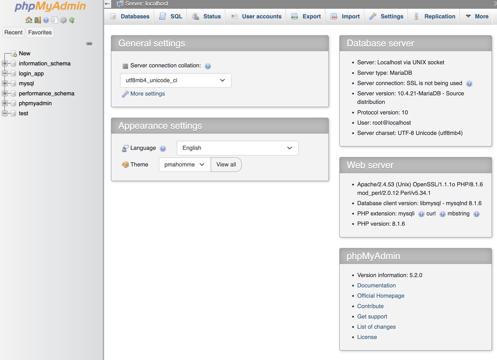

# **PHP**

> _"Quote"_
>
> -Anonymous

<br>
<br>

## Overview

This guide is for php.

1. A _knowledge base_ of all fundamentals

2. Reference points for best tips and practices

3. etc

<br>

The material I've found is a mixture of:

-   Udemy - PHP course [Check it out](https://www.udemy.com/course/php-for-complete-beginners-includes-msql-object-oriented/)

-   MDN docs

-   Stackoverflow

-   You.com [chatbot](https://you.com/search?q=who+are+you&tbm=youchat&cfr=chat).

-   Other various websites

---

<br>

## **Quick tips & tricks**

-   Make sure php code is between `<?php ?>` tags. If the entire file is **php**, you can omit the closing tag.

-   Semicolons(`;`) are very important in php, don't forget them.
-   `echo()` and `print` are almost identical, but echo has no return value and print has a return value of 1. echo can take multiple arguments but print can take only 1.
- Useful output constructs for debugging include:
    1. `echo`(_outputs strings, numbers, html, etc_)
    2. `print_r()`(_output single values or arrays_)
    3. `var_dump()`(_returns info such as data type and length_)
- more coming... 

<br>
<br>

---

## **Fundamentals**

White space does not matter in php. To write PHP code, you must enter it between an open and closing tag. There are a few formats that are accepted, but the most reliable is `<?php CODE_HERE; ?>`. Other opening and closing tag formats are not 100% guaranteed to work since the server would have to be configured to accept those formats, but `<?php?>` is understood and rendered on any server expecting php.

<br>

### **Starting a PHP file**

```php
<?php
echo "Hello Planet";
?>

/* These are also acceptable, but less reliable. Depends on server configuration.
<? ?>
<?= ?>
<% %>
*/
```

<mark>finish this...</mark>

<br>
<br>

### **Embedding PHP in HTML**

```php
<?php

$title = "Hello World of PHP";

// don't need the semicolon if it's followed by a closing php tag, but it's a good habit.
<h1><?php echo $title; ?></h1>

?>
```

<mark>finish this...</mark>

<br>
<br>

### **Working with Variables**

Variables are for storing data. In PHP, we declare a variable by prepending the variable name with a dollar sign, e.g. `$variableName`. The convention is to use **lowerCamelCase**, but there are many different ways to declare a variable; however, you can't start a variable name with a number and you should avoid putting dashes in the name so it doesn't get mistaken for subtraction. Variables are also case-sensitive.

```php
<?php

$string = "I am a variable"; // String
$number = 1234567890; // Number / Integer
$alsoNumber = 3.141592654; // Floating point number

?>
```

<br>
<br>

#### **Superglobals**

Superglobal is a term used to describe a **super global variable**, which is a variable in PHP that is predefined and always accessible, <mark>**regardless of the scope**</mark>. For instance, we use the `$_POST` superglobal when we want to acess data sent via the **POST** method (_such as forms_).

<br>
<br>

#### **Constants**

Constants are variables who's value never changes. Constants do not begin with a `$` sign like regular variables, and it's recommended to name a constant with uppercase letters. You can create a constant using the `define()` function, which takes 2-3 arguments.

<br>

1. **identifier:** set the name of your variable.
2. **value:** set the value of your variable.
3. **case-insensitive:** Determines if the name is case-insensitive, default is **false** **\***(_Optional_)**\***.

<br>

```php
<?php

// define("BIRTH_DATE", 1996, false);
define("BIRTH_DATE", 1996);
echo BIRTH_DATE; // Outputs 1996

?>
```

<br>

As of PHP 5.3, it's now possible to use the `const` keyword to define constants, and instead of it only being able to hold **scalar** data (_booleam, integer, floar and string_), as of PHP 5.6 it's now possible to create a constant array.

```php
<?php

// const COUNT_DRACULA = array(1, 2, 3, 'ah', 'ah', 'ah');
const COUNT_DRACULA = [1, 2, 3, 'ah', 'aahh', 'aaahhh'];
echo COUNT_DRACULA[3]; // Outputs 'ah'

?>
```

<mark>finish this...</mark>

<br>
<br>

### **Working with Strings**

<br>

#### **Concatenation & Interpolation**

You can concatenate data with the **dot**`.` operator. In other languages, you use the `+` operator, but that doesn't have the same effect in php. For instance, the strings `'5' + '5'` is `10`, but in **JavaScript** it would be `55`.

```php
<?php

$name = "Kaz";
$age = 26;


echo $name . " is " . $age; // Outputs Kaz is 26
echo 5 + 5; // Outputs 10
echo '5' + '5'; // Outputs 10

?>
```

<br>

You can interpolate data with double quotes and curly braces(_optional_).

```php
<?php

$name = "Kaz";
$age = 26;

echo "$name is {$age}"; // Outputs Kaz is 26

?>
```

<br>
<br>

### **Working with Numbers** <mark>Finish this...</mark>

Numbers...Add notes on math, same basic arithmetic operations (+, -, \*, /)

```php
<?php

echo 56 + 45; // 101
echo "<br>"; // Line breaks, otherwise results appear on same line
echo 56 - 45; // 11
echo "<br>";
echo 56 * 45; // 2520
echo "<br>";
echo 56 / 45; 1.244444444
echo "<br>";
echo 45 + 34 * 45 /421 - 45; 3.6342042755344
echo "<br>";

$number1 = 12;
$number2 = 24;
echo $number1 * $number2;

?>
```

<br>
<br>

### **Arrays**

Arrays are for storing different types of data in one variable. To access the data you need to use the element's array index.

```php
<?php

$olderArray = array(1, "2", "<h1>3</h1>");
$moreCommonArray = [1, "2", "<h1>3</h1>"];

echo $moreCommonArray[0];

?>
```

<br>
<br>

#### **Associative Arrays**

If you have big arrays and don't care about the order, but need to access data without remembering the element's index, you can use **associative arrays**. Associative arrays keep your data in **key-value** pairs, where the index is replaced with a key. This is the same concept as JavaScript **objects**, Ruby **hashes** and Python **dictionnaries**.

```php
<?php

$array = ["nickname" => "Kaz", "age" => 26];
echo $array["nickname"];

?>
```

<br>
<br>

### **Conditionals**

Conditional statements determine what code will be run based on a condition. A common example of this is the `if` statement, which will only execute code if the code evaluates to `true`.

<br>

#### **If statement**

```php
<?php

if (5 > 4) {
    // This code will run since the condition is true
    echo "5 is greater than 4";
} elseif (4 < 5) {
    // This is true but ignored since a condition was already met.
    echo "4 is less than 5";
} else {
    // This will only run of no conditions are true
    echo "Numbers confuse me";
};

?>
```

<br>

#### **If ternary statement**

You can also use ternary expressions if the condition statement fits in one line.

```php
<?php
$tired = true;

$awake = $tired ? false : true; // If tired, $awake is true, else $awake is false.
var_dump($awake); // bool(false)
```

The reason we use `var_dump` and not echo, is because false boolean values don't output anything. If it's `true`, it outputs a **1**. If it's false, then you'll need to use `var_dump` to see it's false.

<mark>Will add notes on the **nullish coalescing operator**</mark>

<br>
<br>

### **Switch Statements**

Switch statements are similar to if statements but depending on the situation, it might make more sense to use a switch statement instead of **multiple** if statements, for readability. They're especially useful when you want to test <mark>1 statement on multiple values.</mark>

When writing a switch statement, it's important to remember to use the `break` keyword after each condition, otherwise if it matches a condition, it will execute <mark>every line of code below it, within the switch statement.</mark>

```php
<?php

$meaningOfLife = 42;

switch ($meaningOfLife) {
    case 34:
        // This will not execute because 34 != 42
        echo "The meaning of life is 34? Is that right?";
        break;
    case 42:
        // This will execute since 42 == 42
        echo "The meaning of life, the universe and everything.";
        break;
    case 69:
        // This will not execute because 69 != 42
        echo "The meaning of life is certainly not 69...";
        break;
};

?>
```

<br>
<br>

### **Comparison and Logical Operators**

Comparison and logical operators are very useful when using conditional statements.

<br>

#### **Comparison Operators**

```php
<?php
/*
== is equal to
=== is identical to
!= is not equal to
*/
?>
```

<br>
<br>

#### **Logical Operators**

```php
<?php
/*
&& and
|| or
*/
?>
```

<br>
<br>

### **Loops**

Loops allow us to repeat code until a certain condition is met.

<br>

#### **While Loop**

The while loop will continue while a certain condition is true. To avoid infinite loops, typically you'd create a **counter** variable and increment it for each loop. What's important is that your condition will eventually become false.

```php
<?php
$lemonade = 5;
while ($lemonade <= 10) {
    echo "Give me some lemonade for {$lemonade} cents please.<br>";
    // $lemonade = $lemonade + 1;
    // $lemonade += 1;
    $lemonade ++;
};

/* Outputs:
Give me some lemonade for 5 cents please.
Give me some lemonade for 6 cents please.
Give me some lemonade for 7 cents please.
Give me some lemonade for 8 cents please.
Give me some lemonade for 9 cents please.
Give me some lemonade for 10 cents please.
*/

?>
```

<br>
<br>

#### **For Loop**

`while` loops and `for` loops essentially do the same thing, but difference lies in the arguments passed. In a `while` loop you're checking for a condition, but in a for loop you must provide 3 important things.

1. A counter variable
2. A condition for that counter
3. How much to increment or decrement the counter

So `for` loops are useful when you know how many times you'd like to iterate(loop).

```php
<?php

// I counted down here as an example, but I could've incremented.
echo "Count down commencing...<br>";
for ($counter = 10; $counter >= 0; $counter--) {
    echo "{$counter}<br>";
};
echo "! This message will now self-destruct !";

/* Outputs:
Count down commencing...
10
9
8
7
6
5
4
3
2
1
0
! This message will now self-destruct !
*/

?>
```

<br>
<br>

#### **Foreach Loop**

The `foreach` loop only works with arrays. It goes through the entire array and stops without us having to specify a condition for the loop to end.

```php
<?php

$animeList = ["Death Note", "One Piece", "Naruto", "Cowboy Bebop"];

foreach ($animeList as $anime) {
    echo $anime . "<br>";
};
/* Outputs:
Death Note
One Piece
Naruto
Cowboy Bebop
*/

?>
```

<br>
<br>

### **Functions**

Functions are a great way to reuse parts of your code instead of having to retype it over and over again. We create a function that has one job, and then we **_call_** that function whenever we need it. Functions may have parameters and may return a value, but these aren't necessary.

```php
<?php

// Let's say it takes 4 apples to make one drink.
function appleJuicer($amount) {
    echo "Thanks for the {$amount} apples<br>";
    $glasses = $amount / 4;
    if ($glasses < 1) {
        echo "This isn't enough to make a full glass of juice...<br>";
    } else {
        echo "With this I can make " . ceil($glasses) . " glasses of juice!<br>";
    };
};

appleJuicer(1); // This isn't enough to make a full glass of juice...
appleJuicer(4); // With this I can make 1 glasses of juice!
appleJuicer(8); // With this I can make 2 glasses of juice!


// Example of a function that returns a value
function square($number) {
    return $number * $number;
}

$numberSquared = square(2);
echo $numberSquared; // Outputs 4

$numberSquared = square(4);
echo $numberSquared; // Outputs 16

?>
```

<br>
<br>

### **Built-in Functions**

<br>

#### **Math**

Some examples of built-in math functions.

```php
echo pow(2, 10); // 2 to the power of 10 = 1024
echo rand(1, 100); // random number between 1-100
echo sqrt(100); // Square root of 100 = 10
echo floor(99.5); // 99.5 rounded down = 99
echo ceil(99.5); // 99.5 rounded up = 100
echo round(99.5); // 99.5 rounded = 100
echo round(99.4); // 99.4 rounded = 99
```

<br>

#### **String**

Some examples of built-in String functions.

```php
echo strlen("This calculates a string's lenth"); // strlen = String length
echo strtoupper("This return's a string uppercased."); // strtoupper = String to upper
ec
```

<br>

#### **Array**

Some examples of built-in Array functions. The `print_r` is a great way to print an array(_or single value_) with it's indexes or keys(_if it's an associative array_).

```php
$array = [1, 2, 3, 6, 5, 4, 7, 10, 8, 9];

print_r($array); // Outputs: Array ( [0] => 1 [1] => 2 [2] => 3 [3] => 6 [4] => 5 [5] => 4 [6] => 7 ...)
echo max($array); // 10
echo min($array); // 1
echo sort($array); // Array ( [0] => 1 [1] => 2 [2] => 3 [3] => 4 [4] => 5 [5] => 6 [6] => 7 ...)
in_array(6, $array) // returns true(1) or false(nothing)

```

<br>

<br>
<br>

### **Scope**

The scope determines where variables can be accessed from. There's global and local scope. In PHP, something declared in the global scope, cannot be accessed within a local scope unless we use the `global` keyword. A variable inside of the local scope can only be accessed from within its scope.

```php
<?php

$secretIdentity = "Superman";

function unmask () {
    global $secretIdentity; // Allows the variable to be accessed within the local scope
    $secretIdentity = "Clark Kent";
};

echo $secretIdentity . "<br>"; // Outputs "Superman"
unmask();
echo $secretIdentity; // Outputs "Clark Kent"

?>
```

Had we not used the `global` keyword, it would've created a new local scoped variable within the function. Then it would've never updated the global variable, so it would've echoed `"Superman"` twice.

<br>
<br>

## **Working with JSON**

When working with API's, you'll often need to convert data to and from the **JSON** format.

<br>

Example of converting **to** JSON
```php
<?php
$friends = [
    [
    'first_name' => 'Mikey',
    'last_name' => 'Robbinson',
    ],
    [
    'first_name' => 'Susan',
    'last_name' => 'Froth',
    ]
];

var_dump(json_encode($friends));

// Outputs:
// string(91) "[{"first_name":"Mikey","last_name":"Robbinson"},{"first_name":"Susan","last_name":"Froth"}]"
```

<br>

Example of converting **from** JSON
```php
<?php
$friends = '[{"first_name":"Mikey","last_name":"Robbinson"},{"first_name":"Susan","last_name":"Froth"}]';

var_dump(json_decode($friends));

/* Outputs:
array(2) {
  [0]=>
  object(stdClass)#1 (2) {
    ["first_name"]=>
    string(5) "Mikey"
    ["last_name"]=>
    string(9) "Robbinson"
  }
  [1]=>
  object(stdClass)#2 (2) {
    ["first_name"]=>
    string(5) "Susan"
    ["last_name"]=>
    string(5) "Froth"
  }
}
*/
```

<br>
<br>

## **Forms**

Forms are a crucial aspect of web development. They allow you to gather user data and analyze it for later use. In PHP, we have the [super global variable](#superglobals) `$_POST`. The **superglobal** `$_POST` is an [associative array](#associative-arrays) of variables containing data sent via an HTTP POST request, such as data from an HTML form.

<br>

### **Checking for Form Submission**

Sometimes we want to verify if the form was submitted, before trying to retrieve information from it. The first file code snippet is the form HTML code, the other is the file where the form is posting to.

```html
<html>
    <body>
        <!-- form-name-here.php has to be a valid file path -->
        <form action="form-name-here.php" method="POST">
            <label for="first-name">First Name:</label>
            <input name="first-name" type="text" placeholder="Ex: John" />
            <br />
            <label for="last-name">Last Name:</label>
            <input name="last-name" type="text" placeholder="Ex: Smith" />
            <br />
            <label for="password">Password:</label>
            <input name="password" type="password" />
            <br />
            <button name="submit" type="submit">Submit</button>
        </form>
    </body>
</html>
```

<br>

In the `form-name-here.php` file:

```php
    <?php
    // isset() is a function to see if a variable is 'set', meaning declared and not NULL
    // We're using it here to see if any form data has been submitted.
    if (isset($_POST['submit'])) {
        echo "Success";
    }

    ?>
```

<br>
<br>

### **Extracting Data From a Form**

In almost all cases, when a user fills out the form and presses submit, you want to retrieve that data and store it in a database. In PHP, we use the `$_POST` **superglobal** to retrieve that data and an **[RDBMS]()** (_such as sql server_) to store and fetch the data.

```html
<html>
    <body>
        <form action="form.php" method="POST">
            <label for="username">Username</label>
            <input name="username" type="text" placeholder="Ex: Kaz123" />
            <br />
            <label for="password">Password</label>
            <input name="password" type="password" />
            <br />
            <button name="submit" type="submit">Submit</button>
        </form>
    </body>
</html>
```

<br>

In the `form.php` file:

```php
    <?php
        if (isset($_POST['submit'])); {

            $username = $_POST['username']; // Value is what username you entered in the form
            $password = $_POST['password']; // Value is what password you entered in form
            echo "Your username is: " . $username . "<br>";
            echo "Your super secret password is " . $password;
        }
    ?>
```

<br>
<br>

### **Validating Form Values**

Often we'll want to perform client side validation to avoid submitted invalid data to our database, which can cause bugs. A simple way of doing this is making sure certain form fields give feedback if invalid info is entered, for instance if the password complexity is too low and the password needs to be longer.

```php

    <?php
        // If the username is too short, a message will appear above the form in this case.
        if (isset($_POST['submit'])) {
            $username = $_POST['username'];
            $password = $_POST['password'];

            if (strlen($username) < 3) {
                echo "Sorry, your username needs to be longer than 3    characters.";
            }
        }
    ?>
```

```html
<!-- You can use the current file name to post to the same page. -->
<form action="this_file.php" method="POST">
    <label for="username">Username</label>
    <input name="username" type="text" placeholder="Ex: Kaz123" />
    <br />
    <label for="password">Password</label>
    <input name="password" type="password" />
    <br />
    <button name="submit" type="submit">Submit</button>
</form>
```

<br>
<br>

## **Databases**

Databases are crucial for persisting(_saving_) information. There are many different databases available, but for this guide we will be focusing on **RDBMS** databases, which stands for **Relational DataBase Management Systems**. An RDBMS is software that allows you to manipulate data from your database. It uses tables with fields (_columns_) and records (_rows_) to store data. To retrieve and alter that data, we use a database querying language called **SQL**. But sql is quite a big topic of its own, so I'd suggest you read my **[sql guide](sql.md#overview)** to learn more on that.

**SQL** is used to **query** a database and retrieve data. One of the best(_free_) database options we have when working with php is **phpMyAdmin**.



_You can download and read more about it [here](https://www.phpmyadmin.net/downloads/)_

<br>
<br>

---

## **Resources**

<br>
<br>

#### **Tools**

- PHP playground - [onlinephp.io](https://onlinephp.io/)

#### **Documentation**

For a more complete guide with more examples, visit:

<br>

- Official php docs - [php.net](https://www.php.net/docs.php)

<br>
<br>

---
