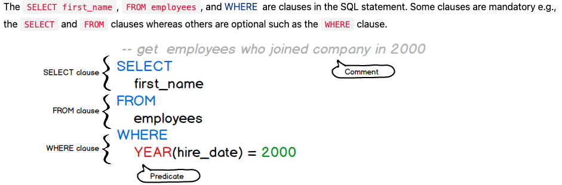

# **SQL**

> _"SQL is one of the most tested and proven languages in use, having been used in databases for over 40 years"_
>
> -Unknown

<br>
<br>

## Overview

Databases are for storing information, but in almost all cases we need to manipulate that data. We call these **CRUD** operations. The goal is to **create**, **read**, **update** and **delete** data. This guide will serve as a reminder for common SQL queries, as well as a knowledge base for SQL fundamentals.

<br>

The material I've found is a mixture of:

-   [sqltutorial.org](https://www.sqltutorial.org/)

-   Le Wagon(Kitt) Study Docs

-   Stackoverflow

-   [W3schools](https://www.w3schools.com/sql/exercise.asp)(They have some great exercises)

-   Other various websites

---

<br>

## **Quick tips & tricks**

-   To quickly view an entire table, use the `SELECT * FROM "TABLE_NAME"`
-   ...

<br>
<br>

---

## **Fundamentals**

SQL is a declarative language that was designed with non-technical people in mind. A declarative language syntax focuses on specifying the result of what you want as opposed to an imperative language which focuses on giving the computer an explicit sequence of commands to perform. It reads like a natural language ex: `SELECT first_name FROM employees` and always begins with a verb that describes the action, such as `UPDATE` or `DELETE`.


_Image from sqltutorial.org_

<br>

### **Database CRUD Operations**

<br>

#### **Creating a database**

finish me...

```sql

```

<br>
<br>

#### **Creating a Table**

finish me...

```sql

```

<br>
<br>

#### **SQL SELECT**

finish me...

```sql

```

<br>
<br>

#### **SQL WHERE**

finish me...

```sql

```

<br>
<br>

#### **SQL ORDER BY**

finish me...

```sql

```

<br>
<br>

#### **SQL INSERT**

finish me...

```sql

```

<br>
<br>

#### **SQL UPDATE**

finish me...

```sql

```

<br>
<br>

#### **SQL DELETE**

finish me...

```sql

```

<br>
<br>

#### **SQL LIKE**

finish me...

```sql

```

<br>
<br>

#### **SQL GROUP BY**

finish me...

```sql

```

<br>
<br>

#### **SQL JOIN**

finish me...

```sql

```

<br>
<br>

#### **SQL Wildcards**

finish me...

```sql

```

<br>
<br>

---

## **Resources**

<br>
<br>

#### **`Documentation`** <mark>finish this...</mark>

For a more complete guide with more examples, visit:

<br>

[website]()

<br>
<br>

---
