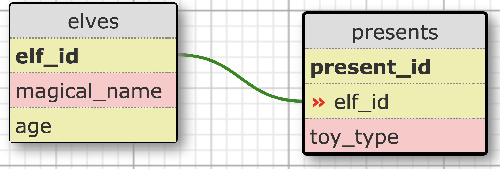

# **SQL**

> _"SQL is one of the most tested and proven languages in use, having been used in databases for over 40 years"_
>
> -Unknown

<br>
<br>

## Overview

Databases are for storing information, but in almost all cases we need to manipulate that data. We call these **CRUD** operations. The goal is to **create**, **read**, **update** and **delete** data. This guide will serve as a reminder for common SQL queries, as well as a knowledge base for SQL fundamentals. For many (_but not all_) examples in this guide, we'll use a sample database from [sqltutorial.org](https://www.sqltutorial.org/). This is a good cheat sheet or **reference point** for someone with basic sql knowledge but this guide shouldn't be used to **learn** the language and all of its intricacies.


<br>

The material I've found is a mixture of:

- [sqltutorial.org](https://www.sqltutorial.org/)

- Le Wagon (_Kitt_) Study Docs

- Stackoverflow

- [W3schools](https://www.w3schools.com/sql/exercise.asp) (_They have some great exercises_)

- [Oracle](https://www.oracle.com/ca-en/database/)

- Youtube videos

- Microsoft

- Other various websites

---

<br>

## **Quick tips & tricks**

- To quickly view an entire table, use the `SELECT * FROM "TABLE_NAME"`
- Software such as **[SQL Server](https://www.microsoft.com/en-ca/sql-server/sql-server-downloads)** will often have a **Query Designer**. Query designers allow you to create custom queries by simply clicking through a visual interface.


_Screenshot of SQL Server taken from Kevin Stratvert's SQL beginner tutorial Youtube video._

- You'll often hear the terms **field** (_column_) and **record** (_row_), they refer to tables.
- tip here...

<br>
<br>

---

## **Querying the Database**

<br>

### **SELECT Keyword**

We use the `SELECT` and `FROM` statement when we want to read data from the database. The `FROM` specifies which table to look at and the `SELECT` determines which column(s) to select. If there are multiple columns, you separate each column name with a comma(`,`). If you want all of the columns, you put an asterix(`*`). Each command is ended by a semicolon.

```sql
-- Query 1
SELECT * FROM table_name;

-- Query 2, same as above. Keywords are case-insensitive.
select * fRoM table_name;

-- Query 3
SELECT
    column_name,
    column_name2,
    column_name3,
FROM
    table_name;

-- Selecting top 5 results, taking all columns
SELECT TOP(5) * FROM table_name;
```

In the real world however, it's very rare that we want to query entire tables, usually we only want specific data. It's common to create **views** so we can query from a limited amount of tables and fields(_columns_).

<br>

It's also very common to want to count the amount of rows instead of reading the actual data. This can easily be done by adding the `COUNT()` [aggregate function](#aggregate-functions). The query below will select and count all rows in the table and return the number of rows found, even rows with `NULL` data are counted.

```sql
SELECT
  COUNT(*)
FROM
  table_name;
```

<br>
<br>

### **Arithmetic Operations while Querying**

It's also possible to perform certain math operations when retrieving data. For instance, if you want to calculate someone's salary if they receive a 5% raise.

```sql
SELECT
    first_name,
    last_name,
    salary * 1.05 -- 5% raise
FROM
    employees;
```

Which will return a modified salary column. The title of the column will specify how the results were changed, ex: `salary * 1.05`.

<br>
<br>

### **Creating an Alias**

You can also assign a cloumn an alias using the `AS` keyword. This doesn't actually change the table in the database schema, just renames the column in the result of the query. The original data isn't affected either.

```sql
SELECT
    first_name,
    last_name,
    salary * 1.05 AS new_salary -- multiples salary and renames it to new_salary
FROM
    employees;
```

<br>
<br>

### **ORDER BY clause**

`ORDER BY` is an optional clause of the `SELECT` statement. It allows you to sort the data returned by the `SELECT` clause in ascending or descending order. It's also possible to order by date.

```sql
SELECT
	employee_id,
	first_name,
	last_name
FROM
	employees
ORDER BY
	last_name, -- First sorts by last name (A-Z)
	employee_id; -- Then sorts by employee id (if 2 employees have the same last name for instance.)
```

<br>

If you don't specify if it should sort the data in **ascending** or **descending** order, the default is `ASC`.

```sql
SELECT
	employee_id,
	first_name,
	last_name
FROM
	employees
ORDER BY
	last_name DESC; -- sorts in descending order instead (Z-A).
```

<br>
<br>

### **DISTINCT Operator**

You can use the `DISTINCT` operator with the `SELECT` clause to filter out any duplicate data. This does not affect the acctual database data. If you selet more than one column, it will use that combination of selected columns when filtering out duplicate data.

```sql
SELECT DISTINCT
    -- If multiple people have the same job and salary, only 1 will be selected.
    job_id,
    salary,
FROM
    employees;
```

<br>
<br>

### **Group BY clause**

`GROUP BY` is an optional clause of the `SELECT` statement. It's usually used with [aggregate functions](#aggregate-functions) (_such as `min` and `sum`_) which is covered further below. Without an aggregate function, `GROUP BY` behaves just like `DISTINCT`. The goal is to group similar data together and remove duplicate info. For instance, you have a company and you want to know the minimum salary your employees are making by department. You don't need the name of every single employee who's making that minimum salary, you just want to know what that number is.

<br>

In this example, you'd like to find the **minimum** salary per department, that's all. But if the db (_database_) table only has a `salary` column, you'll need to use the `MIN()` [aggregate function](#aggregate-functions), which finds the minimum amount in the specified column. But a `departments` table wouldn't include the salary info of every employee (_think of one-to-many relationships, every employee belongs to a dept. but a dept. has many employees_), so you'll need to join the `departments` table on the `employees` table.

<br>

_Snippet from sample db_


```sql
SELECT
  d.department_name,
  MIN(salary) AS min_salary -- AS keyword optional, added for clarity
FROM
  employees e
INNER JOIN
  -- also valid: departments d ON e.department_id = d.department_id
  departments d ON d.department_id = e.department_id
GROUP BY
  department_name;
```

<br>

**Results:**


_This example was inspired by a **slightly** more complicated example found here on [sqltutorial.org](https://www.sqltutorial.org/sql-group-by/#:~:text=SQL%20GROUP%20BY%20with%20MIN%2C%20MAX%2C%20and%20AVG%20example) and was created using the [online sql db tool](https://www.sqltutorial.org/seeit/)_

<br>
<br>

### **LIMIT Clause**

Sometimes you only want to select a specific amount of columns, in which case you can use the `LIMIT` clause as well as the `OFFSET` clause to determine where to start counting and how many rows to show. `LIMIT` can be used alone but `OFFSET` can only be used with `LIMIT`.

```sql
SELECT
    min_salary,
    max_salary
FROM
    jobs
WHERE
    min_salary >= 5000
AND
	max_salary <= 15000
ORDER BY
	max_salary DESC
LIMIT
    5
OFFSET -- I'm not sure why OFFSET isn't being color coded here.
	  3;
```

<br>

Since the offset is **3**, the query will skip the first **3** results it would've returned and instead return the next **5** (since the limit is **5**) rows. You can also use the shorthand expression `LIMIT 3, 5` to set the `OFFSET` to **3** and the `LIMIT` to **5**.


_Image taken from sqltutorial.org_

<br>

`LIMIT` is widely supported by many database systems, however, it's not in SQL standard, so it's technically not 100% supported. For an alternative and more reliable option, use `FETCH`. You can read more on fetch [here](https://www.sqltutorial.org/sql-fetch/).

<br>
<br>

### **WHERE Clause**

The `WHERE` clause let's you set a condition for the data you want returned. For instance, what if you only wanted data **where** the salary is above a certain amount, or employees **where** their last name starts with a '**B**'. You can achieve this result by using comparison operators in your query.

`*` _Note that it's impossible to test if something is `= NULL` since the expression will always return false. Instead use `IS NULL` not `= NULL`._

<br>

#### **Comparison Operators**


_Image taken from sqltutorial.org_

<br>

```sql
SELECT
    employee_id,
    first_name,
    last_name,
    salary
FROM
    employees
WHERE
    salary <= 20000
AND
    -- LIKE is covered later in the guide
    last_name LIKE 'B%';
```

In the query above, we search in the **employees** table for employees who's salary is **less than or equal to** $20,000 **and** who's last name begins with the letter **B**. From those results we want to display 4 columns: **employee_id**, **first_name**, **last_name** and **salary**. It would also be possible to compare 2 columns against eachother, ex: `WHERE salary > min_salary`.

<br>
<br>

### **Logical Operators**

Logical operators allows you to test a condition and will return **true**, **false** or **unkown** like comparison operators.


<br>
<br>

#### **AND**

Returns true if both expressions are true.

```sql
-- Returns all columns in the restaurants table where the price is less than 5 and the calories are under 1000.
SELECT * FROM restaurants WHERE price >= 5 AND calories <= 1000;
```

<br>
<br>

#### **OR**

Returns true if at least 1 expression is true.

```sql
-- Returns all columns in the restaurants table where the price is less than 5 or the calories are under 1000.
SELECT * FROM restaurants WHERE price >= 5 OR calories <= 1000;
```

<br>
<br>

\* _**Note:** the queries below use [subqueries](#subqueries)_ \*

#### **ALL, ANY and SOME**

-   **ALL** - Compares a value to all values in another value set. It must be preceded by a [comparison operator](#comparison-operators) and followed by a subquery.

-   **ANY** - Returns true if any one of the comparisons is true.

-   **SOME** - Returns true if some of the expressions are true.

-   **Exists** - Returns true if a subquery contains one or more rows.

<br>

_This example comes from sqltutorial.org_

```sql
SELECT
    first_name, last_name, salary
FROM
    employees
WHERE
    salary >= ALL ( -- ALL, ANY and SOME have the same syntax
        SELECT
            salary
        FROM
            employees
        WHERE
            department_id = 8
    )
ORDER BY salary DESC;

-- Usually you wouldn't type these queries on one line, for readability.
SELECT first_name FROM employees WHERE EXISTS(
    SELECT salary FROM job_salaries WHERE salary >= 10000
);
```

<br>
<br>

#### **BETWEEN**

Returns true if the searched values are within a set of values. You must also provide the minimum and maximum value to search **between**.

```sql
-- Example 1
SELECT
    employee_id, first_name, last_name
FROM
    employees
WHERE
    hire_date BETWEEN '2019/12/01' AND '2022/12/01';

-- Example 2
SELECT first_name FROM employees WHERE salary BETWEEN 1000 AND 10000;
```

<br>
<br>

#### **IN**

Returns true if the compared value matches one or more in the list.

```sql
SELECT * FROM countries WHERE country_name IN ('Canada', 'USA', 'Brazil');
```

<br>
<br>

#### **LIKE**

SQLtutorial.org describes `LIKE` as follows:

> "_The LIKE operator compares a value to similar values using a **wildcard** operator. SQL provides two wildcards used in conjunction with the `LIKE` operator._
>
> 1. The percent sign (`%`) represents zero, one, or multiple characters.
> 2. The underscore sign ( `_`) represents a single character."

```sql
-- Returns countries who START with 'CA'. Ex: Canada
SELECT * FROM countries WHERE country_name LIKE 'CA%';

-- Returns countries who END with 'CA'. Ex: America
SELECT * FROM countries WHERE country_name LIKE '%CA';

-- Returns countries who contain 'CA'. Ex: America, Zambia
SELECT * FROM countries WHERE country_name LIKE '%AM%';

-- Returns the country name if it contains AM(any single letter here)R in the name. EX: America
SELECT country_name from countries WHERE country_name LIKE '%AM_R%';
```

<br>

#### **NOT**

Reverses the result of a Boolean operator.

```sql
-- This retrieves movie titles that are NOT Titanic.
SELECT title FROM movies WHERE NOT title = 'Titanic';
```

<br>
<br>

### **Joining Tables**(_theory_)

Often, you'll need to query data from multiple tables, the only way to accomplish this is to **join those tables** together. In a relational database, we store information in tables, and when some of those tables share information, we can join them together. There's a few ways to do this, but in this section we'll assume we're performing an **`INNER JOIN`**.

<br>
<br>

Imagine you have movie rental shop (_because those existed_), and you have a database that keeps track of all of the customers and movies. In one table you can have the customer information (_customer ID number, name, address, etc_) and in the other, all the info about movies.


In this example, the customer can rent many movies and a movie can be rented by many people(_but not at the same time of course_). We call this a **many-to-many** relationship.

<br>
<br>

When we have many-to-many relationships, we usually create an additional table that has the purpose of <mark>linking those 2 tables together</mark>. For instance, this new table would be the '**rentals**' table, which keeps track of each movie id rented and the customer id that rented it. So how do we connect these tables together?

<br>

We do so with [**foreign keys**](#foreign-keys). All tables have an auto-incrementing ID column, and we can tell the database that the `customer_id` column in the customers table is the same as the `customer_id` column in the rentals table. So what's the point of this? Well many-to-many relationships can be difficult to work with, <mark>what we want is a **one-to-many** or **many-to-one** relationship.</mark>


<br>
<br>

In a **one-to-many** or **many-to-one** relationship, the golden rule is it's always the <mark>**child's responsibility to carry the foreign key of the parent.**</mark> Imagine someone eating a hamburger, the hamburger can only be eaten by one person, but that person has probably eaten over 100 hamburgers in their life. It wouldn't make sense to have the **_parent_** remember all the food(**_child_**) when the food only has to remember the one person who ate it.


But if it was a **many-to-many** relationship, both tables would have to reference each-other and keep track of every relationship. That's why it's simple to have a **one-to-many** relationship and have the child carry the parent's foreign key, then join those tables if we ever need the extra data from the child's table.

<br>
<br>

### **Joining Tables**(_practical_)

When we want to join tables together, there's a few different kinds of **joins** we can do.

<br>

-   **INNER JOIN** - combines two tables based on a **shared key**.
-   **LEFT JOIN** - returns all rows from the first table and only the rows in the second table that match(_opposite of right_).
-   **RIGHT JOIN** - returns all rows from the second table and only the rows in the first table that match(_opposite of left_).
-   **FULL OUTER JOIN** - returns all rows from both tables, as long as there is at least one match between them(_combination of left and right_).
-   etc

For more information on LEFT, RIGHT and FULL OUTER JOINs, I'd suggest you visit either [sqltutorial.org](https://www.sqltutorial.org/) or [coursera.org](https://www.coursera.org/articles/sql-join-types).

<br>
<br>

#### **INNER JOINs**

An `INNER JOIN` joins 2 or more tables together by using `foreign keys`. Consider the following **one-to-many** relationship where elves make many christmas presents but a present can only be made by one elf. In this case, the elf is the parent and the present is the child.



```sql
SELECT
  elves.magical_name,
  toy_type
FROM
  presents
  INNER JOIN elves ON elves.elf_id = presents.elf_id;

-- Using aliases and JOIN instead of INNER JOIN
SELECT
  e.magical_name,
  toy_type
FROM
  presents p
  INNER JOIN elves e ON e.elf_id = p.elf_id;
```

You might've noticed above in the 2nd query we used `JOIN` instead of `INNER JOIN`. Although there are many types of **JOIN**s, if you simply type `JOIN`, it defaults to `INNER JOIN` since it's the most common **JOIN** used.

<br>
<br>

### **Subqueries**

A subquery is a query nested inside another query, such as a SELECT statement. Subqueries are always written between parentheses and generally run first since that info is needed in the main sql query (_read more about [order of operations below](#order-of-operations)_).

<br>

Consider the code snippet below, both queries are the same but they're just written a bit differently (_matter of preference_) for readability.

```sql
-- Version 1
SELECT first_name, last_name
FROM employees
WHERE department_id IN (
  SELECT department_id
  FROM departments
  WHERE location_id = 1700
);

-- Version 2
SELECT
  first_name, last_name
FROM
  employees
WHERE
  department_id IN (SELECT
    department_id
  FROM
    departments
  WHERE
    location_id = 1700);
```

To read more about subqueries and get a better idea of when and how they're used, visit the subquery section of sqltutorial.org [here](https://www.sqltutorial.org/sql-subquery/).

<br>
<br>

### **Aggregate Functions**

When we use the term **aggregate functions**, we're referring to functions such as `COUNT`, `MIN`, `AVG`, `MAX`, `SUM`, etc. The goal is to gather data, perform a calculation on that data, and then return a single value.

> An aggregate function performs a calculation on a set of values, and returns a single value. Except for COUNT(*), aggregate functions ignore null values. Aggregate functions are often used with the GROUP BY clause of the SELECT statement.
>
> \- _Microsoft article, 12 contributors_

<br>

#### **Count**

`COUNT()` returns the **number of rows returns by a query**. When we use the `COUNT(*)` function, it returns the number of rows in a table, including duplicate rows and rows that contain `NULL` values. By default, the `COUNT()` function uses the `ALL` operator during its query (_includes duplicates_), but you can use the `DISTINCT` operator instead to return only **unique** values.

```sql
-- COUNT( [ALL | DISTINCT] )
SELECT
  COUNT(*)
FROM
  employees
WHERE
  last_name = 'smith';
```

<br>

#### **MIN/MAX**

`MIN` and `MAX` are used to find the minimum and maximum value in a set of values. By default, they ignore `NULL` values so the `DISTINCT` option is not available, unlike with `SUM`, `COUNT` and `AVG`.

```sql
-- Finding your youngest or oldest friend
SELECT
  first_name,
  last_name,
  age
FROM
  friends
WHERE
  age = (
    SELECT
      MAX(age) -- or MIN(age)
    FROM
      friends
  );

-- Only returns age number
SELECT
  MAX(age)
FROM
  friends;
```

In the above query, had we only written the [subquery](#subqueries) we would've only retrieved the **age** of the youngest or oldest friend but no other information about them, that's why we grabbed the first and last name along with their age and then put the [aggregate function](#aggregate-functions) in a subquery.

<br>

#### **SUM/AVG**

The `SUM` and `AVG` functions are for **numeric** data only. They're used to find the sum or average value in a set of values. Just like [`COUNT()`](#count), by default they use the `ALL` option instead of `DISTINCT`, but you can use `DISTINCT` if you don't want any duplicate values. You can also use the `ROUND` function to round your results.

```sql
-- Using SUM to calculate the cash in your hopefully not empty wallets.
SELECT
  SUM(cash)
FROM
  wallets;


SELECT
  ROUND(AVG(points), 2) -- Rounding to 2 decimal places
FROM
  highschores;
```

<br>
<br>

---

## **SQL Server**

Although most sql language syntax is the same, different databases and applications will use different syntax to optimize their features. For instance, **MySQL** uses `AUTO_INCREMENT` but Microsoft's **SQL Server** (_SQLSRV_) uses `IDENTITY(1,1)` to create an auto-incrementing field (_column_). The sql language Microsoft server uses is called **Transact-SQL** (_T-SQL_). This section of the guide will focus on SQL Server Management Studio (_SSMS_), the visual / graphic interface that allows us to manipulate **SQLSRV** or **MSSQL** (_Microsoft SQL Server_). We will focus on connecting a **PHP** project using **XAMPP** to an **SQLSRV** server.

<br>

**Some sqlsrv functions to organize later**

```sql
sqlsrv_begin_transaction	-- Begins a transaction.
sqlsrv_cancel	-- Cancels a statement; discards any pending results for the statement.
sqlsrv_client_info	-- Provides information about the client.
sqlsrv_close	-- Closes a connection. Frees all resources associated with the connection.
sqlsrv_commit	-- Commits a transaction.
sqlsrv_configure	-- Changes error handling and logging configurations.
sqlsrv_connect	-- Creates and opens a connection.
sqlsrv_errors	-- Returns error and/or warning information about the last operation.
sqlsrv_execute	-- Executes a prepared statement.
sqlsrv_fetch	-- Makes the next row of data available for reading.
sqlsrv_fetch_array	-- Retrieves the next row of data as a numerically indexed array, an associative array, or both.
sqlsrv_fetch_object	-- Retrieves the next row of data as an object.
sqlsrv_field_metadata	-- Returns field metadata.
sqlsrv_free_stmt	-- Closes a statement. Frees all resources associated with the statement.
sqlsrv_get_config	-- Returns the value of the specified configuration setting.
sqlsrv_get_field	-- Retrieves a field in the current row by index. The PHP return type can be specified.
sqlsrv_has_rows	-- Detects if a result set has one or more rows.
sqlsrv_next_result	-- Makes the next result available for processing.
sqlsrv_num_rows	-- Reports the number of rows in a result set.
sqlsrv_num_fields	-- Retrieves the number of fields in an active result set.
sqlsrv_prepare	-- Prepares a Transact-SQL query without executing it. Implicitly binds parameters.
sqlsrv_query	-- Prepares and executes a Transact-SQL query.
sqlsrv_rollback	-- Rolls back a transaction.
sqlsrv_rows_affected	-- Returns the number of modified rows.
sqlsrv_send_stream_data	-- Sends up to eight kilobytes (8 KB) of data to the server with each call to the function.
sqlsrv_server_info	-- Provides information about the server.
```

_Source: [Microsoft's learning platform](https://learn.microsoft.com/en-us/sql/connect/php/sqlsrv-driver-api-reference?view=sql-server-ver15)_

<br>
<br>

## **Fundamentals**

SQL is a declarative language that was designed with non-technical people in mind. A declarative language syntax focuses on specifying the result of what you want as opposed to an imperative language which focuses on giving the computer an explicit sequence of commands to perform. It reads like a natural language ex: `SELECT first_name FROM employees` and always begins with a verb that describes the action, such as `UPDATE` or `DELETE`.

<br>


_Image from sqltutorial.org_

<br>
<br>

### **Schema**

Before diving in, one term that you should be familiar with is **schema**. The schema represents the layout of your database, meaning all of the tables and their columns. But the schema **does not** have anything to do with the user data in the table. For example, if we have a `users` table that holds information such as `user_id`, `username`, `email` and `password`, this is considered to be the schema, but the actual users themselves (_id=1, username='battle_bunny', etc_) is not included in the schema. Therefore, if we drop all the data from a table, the schema is not affected, but if we delete a table then the schema **and** the data is deleted.

<br>
<br>

### **Comments**

Comments, just like in any programming language, is code that is ignored by the computer. In SQL, you can create a comment by using 2 dashes(or hyphens) `--` which tells the database to ignore this. Comments are very useful for documentation.

```sql
-- This is a comment. This will be ignored by the database, like a ninja 🥷🏽.
```

<br>

You can also create a multi-line comment using 2 asterixs wrapped in forward slahes (`/**/`).

```sql
/*
All of this;
will be
-- ignored
*/
```

<br>
<br>

### **Commands**

We use commands to tell SQL what we want to do, at the end of each command we put a semicolon`;` to indicate the end of the command. When writing commands, it's common to add a new line (_since it won't affect the command_) after each verb for readability.

```sql
-- First command
SELECT *
FROM TABLE_NAME_HERE
WHERE first_name = 'Denzel';

-- Second command
DELETE * FROM TABLE_NAME_HERE WHERE last_name = 'Braithwaite';
```

Commands are composed of [literals](#literals), [keywords](#keywords), [identifiers](#identifiers) or [expressions](#expressions). We call all of these `tokens` and tokens can be separated by spaces, tabs or new lines.

<br>
<br>

### **Literals**

Literals (also called **constants**), are explicit values that are either string(`'wrapped in quotes'`), numeric or binary.

```sql
'John' -- string
'26' -- string
26 -- numeric
-26.9 -- numeric
x'01' -- Binary, using x'0000' notation
```

<br>
<br>

### **Keywords**

Keywords are reserved words that cannot be used as names for tables, columns, indexes or any other database object. Some common examples you'll see are the **verbs** that are at the beginning of commands, such as `SELECT`, `INSERT` and `DROP`. To make SQL commands more readable, it's common to type keywords uppercased, but this is not necessary.

<br>
<br>

### **Identifier**

Identifiers refer to specific objects in the database such as tables and columns.

```sql
SELECT first_name -- SELECT is the keyword, first_name is the identifier (column)
FROM users; -- FROM is the keyword, users is the identifier (table)
```

<br>
<br>

### **Aliases**

Aliases let you rename tables and columns temporarily to make your queries shorter and more understandable. If the alias contains spaces, you will need to wrap it in quotes.

<br>
<br>

#### **Assigning an alias to a column**

<br>

```sql
SELECT
-- Using the AS keyword
    department_id AS dept,
    region_id AS region
FROM
    departments;

-- Without the AS keyword
SELECT department_id dept FROM departments;

-- Without the AS keyword and with a space
SELECT department_id 'dep id' FROM departments;

-- Returns modified data and assigns the temporary column an alias.
SELECT age + 1 AS new_age FROM users;
```

<br>
<br>

Take a look at this great example of common mistakes when assigning column aliases. This is taken directly from [sqltutorial.org](https://www.sqltutorial.org/)


<br>
<br>

#### **Assigning an alias to a table**

<br>

Assigning an alias to a table has a similar syntax.

```sql
SELECT table_name AS alias_name ...
```

<br>

But you can also use a fully qualified name when querying a table which includes both the table and column name.

```sql
-- Syntax: SELECT table_name.column_name FROM table_name
SELECT games.title FROM games ...
```

<br>

This may seem pointless since you still have to specify the `FROM` clause with the table name, but this can be very useful when working with [joined tables](#joining-tables). It's also a good way to save keystrokes and improve readability.

<br>

_Here's an edited code snippet taken from stackexchange.com. View the [full article here](https://dba.stackexchange.com/questions/5989/is-table-aliasing-a-bad-practice)_

```sql
FROM
  billing.financial_transactions  ft_cdi   -- alias required here
INNER JOIN
  billing.cash_application_links  cal
ON  ft_cdi.key_num = cal.applied_ft_key_num
INNER JOIN
  billing.financial_transactions  ft_pmt   -- alias required here
ON  cal.owner_key_num = ft_pmt.key_num
LEFT OUTER JOIN
  billing.invoice_lines           invl
ON  ft_cdi.key_num = invl.invoice_key_num
INNER JOIN
  billing.billers                 bil
ON  ft_cdi.biller_account_key_num = bil.biller_account_key_num
INNER JOIN
  billing.formal_entities         fe
ON  bil.frml_key_num = fe.key_num
WHERE
  ft_cdi.transaction_type <> 'Payment'   -- alias tells me this table is not for payments
AND
  ft_pmt.transaction_type =  'Payment';  -- alias tells me this table is for payments
```

<br>
<br>

### **Order of operations**

In any programming language, it's crucial to understand the order of operations (_which line of code will be executed first_) to avoid running into confusing errors. Take the following code snippet for example.

<br>

```sql
SELECT
  first_name,
  last_name,
  age
FROM
  students
WHERE
  age < 18
ORDER BY
  last_name, first_name;
```

In the example above, we first write `SELECT` and then later tell it `FROM` where, but the database can't select a column if it doesn't know which table it's in. So it will actually evaluate the `FROM` clause first, then when it has the table it will look at the `SELECT` to get the column. Finally it will take that column and evaluate the `WHERE` clause to filter out unwanted results. Lastly, it will order it alphabetically (`ASC` by default) by last name, and then by first name.

<br>

Here's another great example from [sqltutorial.org](https://www.sqltutorial.org/sql-alias/) in the *SQL Alias* section. It shows a common mistake when assigning a table column an alias.


<br>
<br>

### **Data Types**

There are many data types in SQL, including `VARCHAR`, `INT` and `TEXT`. It's important to have the correct data type for your columns to insure you don't inject invalid data into your db. For a more complete list of all data types, visit this chart on [w3schools.com](https://www.w3schools.com/sql/sql_datatypes.asp).

<br>
<br>

### **Primary Keys**

All tables **should** have **only one** primary key. A primary key is a column of unique data that helps identify each row of a table, meaning it can't be a duplicate and it cant be `NULL` (_or non-existent_) either. Very commonly, tables will have an `ID` column which auto-increments making it a perfect primary key since the values are always unique.

<br>
<br>

### **Foreign Keys**

A foreign key is a reference to another table's primary key. Foreign keys are used when we want to [join tables](#joining-tablestheory) together. For instance in a one-to-many relationship, the child will carry the foreign key of the parent table. By default, an auto-incrementing column will begin at 1.

<br>


In the example above, each elf can make **many** presents, but a present can only be made by **one** elf, so it's the elf's (_child_) responsibility to carry the foreign key of the parent. In this case that's the `elf_id`. Notice how that's the same as the `elf_id` primary key in the elves tables.

<br>
<br>

### **Creating a Table**

The minimum requirements for creating a table is a **table name and 1 named column**. There can be no duplicate tables in the database or it will raise an error. When you create a column, you have to specify its **name** and its **type**, but you can also **optionally** specify **default values** and column [**constraints**](#constraints) (_such as a length limit_). Every table **should** absolutely have a [**`PRIMARY KEY`**](#primary-keys) and although it's **very** common that we use the `ID` column as a primary key, it's not necessary.

```sql
-- Syntax
CREATE TABLE table_name_here(
  -- If no default value for an auto-incrementing column is specified, it will start at 1.
  primary_key_column data_type_here default value column_constraints,
  column_name_here data_type_here
);

CREATE TABLE soldiers(
  soldier_id INT AUTO_INCREMENT PRIMARY KEY,
  first_name VARCHAR(25) NOT NULL,
  last_name VARCHAR(30) NOT NULL,
  age INT
);
```

<br>
<br>

### **Altering a Table**

The `ALTER TABLE` statement allows you to add new columns, modify column attributes (_such as constraints_) and remove columns. By default, if you add a column it will appear as the last column of the table. You can specify where it's inserted by using the `AFTER` clause.

```sql
ALTER TABLE soldiers
-- Then use a clause such as ADD, MODIFY or DROP.
ADD date_of_birth DATE [AFTER soldier _id];
```

<br>

Now let's change `date_of_birth` to `birth_year` and the type to `year`. Then finally, we'll drop the new column all together. Remember, when modifying columns it's entirely possible to lose data if you aren't careful. For instance, if you change a column from `INT` to `VARCHAR` **after** data is already in the table, that can cause errors during conversion.

```sql
-- Renaming column.
ALTER TABLE soldiers
RENAME COLUMN date_of_birth TO birth_year;

-- Making birth year mandatory
ALTER TABLE soldiers
MODIFY birth_year YEAR NOT NULL; -- Sql ServerMS uses ALTER COLUMN

-- Deleting the column and all of its data.
ALTER TABLE soldiers
DROP COLUMN birth_year;
```

<br>
<br>

### **Dropping a Table**

To delete a table and all of its data from the database, we use the `DROP TABLE` statement. Best practice is to use that with the `IF EXISTS` clause to avoid raising errors. If the table exists, it will be deleted; otherwise, nothing will happen. The `IF EXISTS` clause is support by MySQL, PostgreSQL, and SQL Server 2016+.


<br>


_Image taken [here](https://www.sqltutorial.org/sql-drop-table/) from sqltutorial.org_


<br>

```sql
DROP TABLE [IF EXISTS] soldiers;
```

<br>
<br>

### **Inserting data into a Table**

The `INSERT INTO` statement lets you insert rows into a table. It's also possible to copy rows from one table and insert it into another. To clarify, we will be injecting **rows** (also known as records) which hold data, not **columns**, which affect the database [schema](#schema).

```sql
-- Syntax
INSERT INTO table_name(
  column1,
  column2,
  column3
)
VALUES (
  value_for_column1,
  value_for_column2,
  value_for_column3
);

-- Example
INSERT INTO chess_pieces(
  -- In this example the primary key auto-increments so no need to decalre its value.
  piece_type,
  point_value,
  color
)
-- Inserting multiple entries
VALUES
  ('queen', 9, 'white'),
  ('king', NULL, 'white'),
  ('rook', 5, 'black');
```

For each column you add in the `INSERT INTO` statement, you must add a value in the `VALUE` statement. Therefore if there are 5 columns, you must specify 5 values. The new data must of course comply with **existing restraints**.a

<br>

You can copy rows from anoter table using the `FROM` and `WHERE` clause.

```sql
INSERT INTO table1(column_name)
SELECT
	column_name,
FROM
	table2
WHERE
	condition;
```

<br>
<br>

### **Updating Data(_rows_)**

The `UPDATE` statement allows you to modify existing table rows. To do so, you use the `SET` clause and pick which row(**s**) should be affected. You can also add optional conditions with the `WHERE` clause.

<br>

```sql
UPDATE
  chess_pieces
SET
  -- COLUMN_name = new_VALUE,
  point_value = 0
WHERE
  piece_type = 'king'; -- Changes King's value to 0 from NULL
```

Above, we continued from our previous example where we created a **`chess_pieces`** table and added the king piece worth `NULL` points. It's new value will be 0 now. Had we not provided a `WHERE` clause, all pieces would now have a 0 point value.

<br>
<br>

### **Deleting Data(_rows_)**

The `DELETE` statement allows you to remove existing table rows based on a condition, if no condition is provided then all of the table data (**not the table itself**) will be deleted.

```sql
DELETE FROM
  chess_pieces -- table name
WHERE
  color = 'white'; -- condition
```

<br>
<br>

### **Constraints**

Constraints are **rules** that your table or column data has to abide by to be considered valid. This avoids having bad data in a database that can't be used; for instance, imagine if someone's first and last name could be `NULL` (_non-existent_). What would be the point of retrieving their data if we don't even know who they are? There are a few constraints out there but I'll only cover `UNIQUE` and `NOT NULL` here.

<br>

##### **UNIQUE**

The `UNIQUE` constraint ensures that no duplicate data can be entered. It's okay if 2 people have the same name, but they should never have the same employee ID or email (_otherwise how would we identify or differentiate them_). We don't need to specify the `UNIQUE` constraint for `PRIMARY KEYS` though since they're unique by default and often auto-incrementing.

<br>


Screenshot taken [here](https://www.sqltutorial.org/sql-unique-constraint/) from sqltutorial.org.

<br>

```sql
email_address VARCHAR(60) UNIQUE
```

<br>
<br>

##### **NOT NULL**

The `NOT NULL` constraint makes it so a column's data **MUST** exist and cannot be left blank (_or NULL_) to be considered valid. `NOT NULL` is the equivalent of `CHECK` which ensures the data be present as well.

```sql
-- Syntax
column_name data_type NOT NULL
CHECK (column_name IS NOT NULL)
```

<br>
<br>

**List of commonly used constraints**


_Screenshot from [mygreatlearning.com](https://www.mygreatlearning.com/blog/sql-constraints/#what)_

<br>
<br>

### **Adding Foreign Key**

When you want to enforce a relationship between 2 tables, you create a `FOREIGN KEY`. A  foreign key is a column that references a `PRIMARY KEY` on another table. For example, if we have a heroes table and in that table we have the `class_id` column, that references the **classes** table **primary key**. The rows or **records** in table will hold information on each class, so when we look at a hero's class ID, we can make the connection to the classes table and retrieve data on that class.

```sql
CREATE TABLE heroes(
hero_id INT AUTO_INCREMENT PRIMARY KEY, -- sql server uses IDENTITY(1,1)
name VARCHAR(24) NOT NULL,
class_id INT NOT NULL,
FOREIGN KEY (class_id) REFERENCES classes (class_id)
);
```

<br>
<br>

## **Optimization and Efficiency**

When your database grows to be quite large with thousands or hundreds of thousands of entries, querying the db can become very slow, and the more tables or views you are fetching data from, the more you will experience a decrease in performance. Most tables are created using a **primary key** and often that primary key is an auto-incrementing ID field. In sql servers such as MS sql srv(_Microsoft's sql server_), they will automatically treat the primary key as a **clustered index**(_more on that below_) to improve the speed of which the db can query table rows.

There are 2 main types of indexes a table could have, **clustered and non clustered**. SQL databases also have something called the **"query execution plan"** or query plan which essentially allows it to always select the most efficient path to retrieve data. Think of a GPS when you're driving, you can see multiple routes and select the fastest one.

<br>

### Heap

A table with no indexes at all, the db engine has no idea where to look for data, so it will **scan** the entire table row by row. Even when it finds a match, it will continue to scan the entire table because it isn't sure if there are other matches. This is the most inefficient option but not a huge deal in smaller databases.

<br>
<br>

### Clustered

When you create a clustered index, you select one or more fields/columns and use that as the **index** for the table. It's exactly like a book's page of contents, the first few or last pages of the book will show you where to find the pages you are looking for in the book. Without this, it would be like a **heap** and you would quite literally, have to read every page to find what you're looking for.

So if you have a db with many entries and you are often fetching data from the db such as **first_name** or **last_name** of a client, you could use those columns as a clustered index for your table. What this does is essentially organizes your table by (_in this case_) first_name and last_name (_the order of which you define the index matters, it will first search by either first or last name, and then if 2 people have the same last name, it will sort by first name._) so that whenever a query is made containing one of these 2 columns, it can search much quicker **and** stop searching after it finds the result. It knows there are no more entries that will match since it's indexed and it knows if it's scanned all of the 'B' names, there's no need to look at every other letter if the name we want begins with a B!

Since a clustered index effectively changes the order of the table, it's possible to have a grouped clutered index, but it's impossible to have **multiple clustered indexes**. Because you would need another table sorted in a different way!

<br>
<br>

### Non-clustered

As opposed to the limit of 1 clustered index by table, you can create multiple non-clustered indexes for your table. Instead of reorganizing your original table, it instead creates another (_usually smaller_) table in memory where the db will look first. This is useful when you query certain fields more than others and want a **smaller** table for your db to look up. Keep in mind, this might help the DB find data faster, but it will still go back to the original table to fetch the data after it's found the correct record/row. So this is one extra little step as opposed to just fetching it from the db directly, so there's always a balance you must find to not overdo it with indexes as it could negatively affect your database.

<br>
<br>

---

## **Resources**

<br>
<br>

### **Documentation**

-   For a more complete guide with more examples, visit [sqltutorial.org](https://www.sqltutorial.org/)

-   If you want to test certain queries or view syntax examples, check out [w3schools](https://www.w3schools.com/sql/).

-   For info on relational databases, check out [oracle](https://www.oracle.com/ca-en/database/)

-   For info on SQL joins, check out [coursera.org](https://www.coursera.org/articles/sql-join-types)

- More documentation from Microsoft [here](https://learn.microsoft.com/en-us/sql/sql-server/educational-sql-resources?view=sql-server-ver16).

<br>

### **Syntax Validator**

-   Use the [EverSQL validator](https://www.eversql.com/sql-syntax-check-validator/) to check your query syntax.

<br>
<br>

### **Videos**

- Great SQL and SQL server tutorial on Youtube by Kevin Stratvert [here](https://www.youtube.com/watch?v=h0nxCDiD-zg).

<br>
<br>

---
