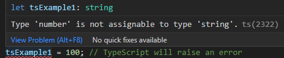
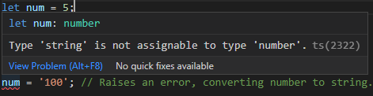

# **Typescript**

> _"TypeScript is a typed superset of JavaScript that compiles to plain JavaScript."_
>
> -TypeScript Documentation

> _"TypeScript is like adding training wheels to your JavaScript programming."_
>
> -John Papa

<br>
<br>

## **Overview**

This guide is created as a reference point for TypeScript syntax, tips and best practices.

<br>

The material I've found is a mixture of:

- Udemy, [TypeScript course](https://www.udemy.com/course/learn-typescript/) by Colt Steele

- You.com [youchat](https://you.com/search?q=who+are+you&tbm=youchat&cfr=chat), an A.I. that helps you research the web.

- StackOverflow

- YouTube

- Other various websites...

---

<br>

## **Quick tips & tricks**

- Quickly test out TypeScript in an [online playground](https://www.typescriptlang.org/play).

- In your terminal (with Node.js and TypeScript installed) type `tsc <file_name>` to compile to `JS`.

<br>
<br>

---

## **Fundamentals**

This section will hold the core fundamentals of ...

<br>

#### **Type Annotation**

In TypeScript, you should avoid implicit type coercion, meaning when you declare a variable as a specific type (_eg: string or number_), it should remain that type. If you try to change a `string` to a `number`, it will raise an error. It will **not** prevent the code from running, as long as it's valid **JavaScript**. But will give you a warning in your editor and during compilation in your terminal. It's also worth noting that the **type** should be written in lowercase, such as `string`.

<br>

```ts
let jsExample1 = 'Hello World!';
let tsExample1: string = 'test'; // Annotating the variable type as string.

jsExample1 = 100; // JavaScript has no problem with this.
tsExample1 = 100; // TypeScript will raise an error
```



<br>

```ts
let tsExample2: number = 5; // Annotating the variable type as number.
tsExample2 = '100'; // Raises an error, converting number to string.

let tsExample3: boolean = true;
tsExample3 = false; // No issues here
tsExample3 = 'true'; // Raises an error, converting boolean to string.
```

<br>
<br>

#### **Type Inference**

TypeScript is pretty smart, so you won't always have to explicitly declare your data type. Meaning it's not always necessary to use `let <variableName>: <type> = <value>`. Instead, you could simply declare the variable the same way you would in regular JavaScript syntax, and TypeScript will use **type inference** to determine what the correct type is.

<br>

```ts
let num = 5;
num = '100'; // Raises an error, converting number to string.
```



<br>
<br>

---

## **Resources**

<br>
<br>

#### **Tools**

- [TypeScript Playground](https://www.typescriptlang.org/play), for quickly testing and practicing TypeScript (_also has examples_).

<br>
<br>

#### **Documentation**

For a more complete guide with more examples, visit:

<br>

- [Typescriptlang.org](https://www.typescriptlang.org/docs/) - Official TypeScript documentation.

<br>
<br>

---
